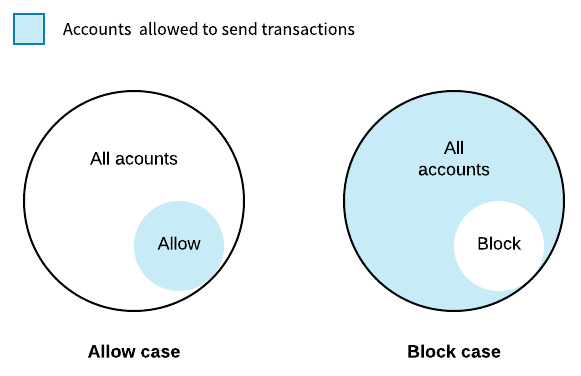
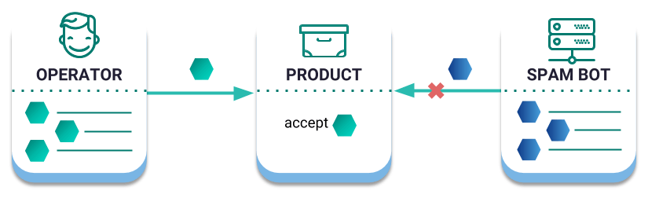

##############
Account Filter
##############

.. note:: Account filters feature is not implemented in the SDK yet.

:doc:`Accounts<account>` may configure a set of smart rules to block announcing or receiving transactions given a series of constraints.

The editable on-chain constraints are called filters. Accounts can configure the following types:

**************
Address filter
**************

An account can decide to receive transactions only from an allowed list of :doc:`addresses <account>`. Similarly, an account can specify a list of addresses that don’t want to receive transactions from.

    Address filter diagram

.. note:: Allow and block filters are mutually exclusive. In other words, an account can only configure a block or an allow list per type of filter.

By default, when there is no filter set, all the accounts in the network can announce transactions to the stated account.

*************
Mosaic filter
*************

An account can configure a filter to permit incoming transactions only if all the :doc:`mosaics <mosaic>` attached are allowed. On the other hand, the account can refuse to accept transactions containing a mosaic listed as blocked.

*****************
EntityType filter
*****************

An account can allow/block announcing outgoing transactions with a :ref:`determined type <transaction-types>`. By doing so, it increases its security, preventing the announcement by mistake of undesired transactions.

********
Examples
********

Blocking spam transactions
==========================

A company is using the public chain to certify the quality of their products.

When the quality verification process concludes, an operator sends a :doc:`quality seal<mosaic>` to the product account.

The final customers can review the product mosaics scanning a QR code. For that reason, the company only wants to show related transactions, avoiding others to spam their products with non-related information.

    Blocking spam transactions

The company opts to configure their product accounts filters, enabling only to receive transactions containing ``company.quality:seal`` mosaics.

Enhancing the account security
==============================

Lately, Alice is only using her main account to cosign aggregate transactions where a :doc:`multisig<multisig-account>` she is a cosignatory is involved.

As a temporary measure, Alice opts to disable announcing transfer transactions from her main account, double checking that any of the funds she owns will be transferred.

*******
Schemas
*******

.. note:: Configuration parameters are `editable <https://github.com/nemtech/catapult-server/blob/master/resources/config-network.properties>`_ . Public network configuration may differ.

.. _account-properties-address-transaction:

AccountPropertiesAddressTransaction
===================================

Configure filters to prevent receiving transactions from undesired addresses.

**Version**: 0x01

**Entity type**: 0x4150

**Inlines**:

* :ref:`Transaction <transaction>` or :ref:`EmbeddedTransaction <embedded-transaction>`

.. csv-table::
    :header: "Property", "Type", "Description"
    :delim: ;

    propertyType; :ref:`PropertyType<property-type>` ; The property type.
    modificationsCount; uint8; The number of modifications.
    modifications; array(:ref:`AddressModification <address-modification>`, modificationsCount); The array of modifications.

.. _account-properties-mosaic-transaction:

AccountPropertiesMosaicTransaction
===================================

Configure filters to prevent receiving transactions containing a specific mosaic.

**Version**: 0x01

**Entity type**: 0x4250

**Inlines**:

* :ref:`Transaction <transaction>` or :ref:`EmbeddedTransaction <embedded-transaction>`

.. csv-table::
    :header: "Property", "Type", "Description"
    :delim: ;

    propertyType; :ref:`PropertyType<property-type>` ; The property type.
    modificationsCount; uint8; The number of modifications.
    modifications; array(:ref:`MosaicModification <mosaic-modification>`, modificationsCount); The array of modifications.

.. _account-properties-entity-type-transaction:

AccountPropertiesEntityTypeTransaction
======================================

Configure filters to prevent announcing transactions by :ref:`type <transaction-types>`.

**Version**: 0x01

**Entity type**: 0x4350

**Inlines**:

* :ref:`Transaction <transaction>` or :ref:`EmbeddedTransaction <embedded-transaction>`

.. csv-table::
    :header: "Property", "Type", "Description"
    :delim: ;

    propertyType; :ref:`PropertyType<property-type>` ; The property type.
    modificationsCount; uint8; The number of modifications.
    modifications; array(:ref:`EntityTypeModification <entity-type-modification>`, modificationsCount); The array of modifications.

.. _address-modification:

AddressModification
===================

**Inlines**:

* :ref:`AccountPropertiesModification<account-properties-modification>`

.. csv-table::
    :header: "Property", "Type", "Description"
    :delim: ;

    value; 25 bytes (binary); The address to allow/block.

.. _mosaic-modification:

MosaicModification
==================

**Inlines**:

* :ref:`AccountPropertiesModification<account-properties-modification>`

.. csv-table::
    :header: "Property", "Type", "Description"
    :delim: ;

    value; uint64; The mosaic id to allow/block.

.. _entity-type-modification:

EntityTypeModification
======================

**Inlines**:

* :ref:`AccountPropertiesModification<account-properties-modification>`

.. csv-table::
    :header: "Property", "Type", "Description"
    :delim: ;

    value; uint16; The :ref:`entity type<transaction-types>` to allow/block.

.. _account-properties-modification:

AccountPropertiesModification
=============================

.. csv-table::
    :header: "Property", "Type", "Description"
    :delim: ;

    modificationType; :ref:`PropertyModificationType<property-modification-type>` ; The modification type.

.. _property-type:

PropertyType
============

Enumeration: uint8

.. csv-table::
    :header: "Id", "Description"
    :delim: ;

    0x01; The property type is an address.
    0x02; The property type is mosaic id.
    0x03; The property type is a transaction type.
    0x04; Property type sentinel.
    0x80 + type; The property is interpreted as a blocking operation.

.. _property-modification-type:

PropertyModificationType
========================

Enumeration: uint8

.. csv-table::
    :header: "Id", "Description"
    :delim: ;

    0x00; Add property value.
    0x01; Remove property value.
