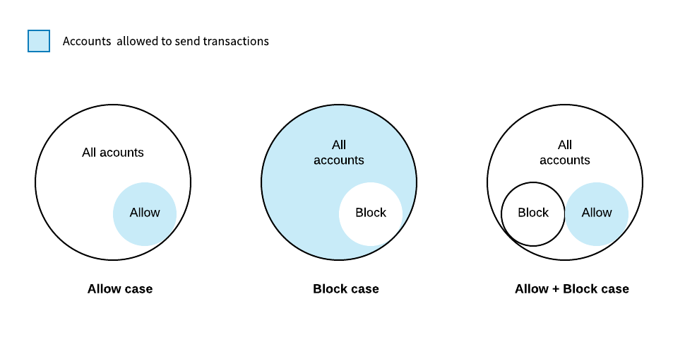

##############
Account Filter
##############

:doc:`Accounts<account>` may configure account properties, a set of smart rules to receive transactions only from an allowed list of addresses. Similarly, an account can specify a list of addresses that don’t want to receive transactions from.

When these pair of lists are empty, all accounts can send transactions to the stated account.

  Address filter

The same behavior can be applied to allow or block receiving transactions containing a given :doc:`mosaic id<mosaic>` or only allowing sending certain :ref:`transactions by type<transaction-types>`.

********
Examples
********

Blocking spam transactions
==========================

A company is using the public chain to certify the quality of their products.

When the quality verification process concludes, an operator sends a :doc:`quality seal<mosaic>` to the product account.

The final customers can review the product mosaics scanning a QR code. For that reason, the company only wants to show related transactions, avoiding others to spam their products with non-related information.

.. figure:: ../resources/images/concepts-account-properties-spam.png
  :align: center
  :width: 450px

  Blocking spam transactions

The company opts to configure their product accounts filters, enabling only to receive transactions containing "company.quality:seal" mosaics.

Enhancing the account security
==============================

Lately, Alice is only using her main account to cosign aggregate transactions where a :doc:`multisig<multisig>` she is a cosignatory is involved.

As a temporary measure, Alice opts to disable announcing transfer transactions from  her main account, double checking that any of the funds she owns will be transferred.

******************************
Account Properties Transaction
******************************

Filters are set using Account Properties Transaction.

Parameters
==========

  **Modifications**

  An array of modifications. A maximum of ``255`` modifications per transaction is allowed.

Each modification is composed of:

      **Modification Type**

      Add (1) or Delete (2) property.

      **Property**

      .. csv-table::
          :header: "Property Type", "Description", "Value Type", "Id"
          :delim: ;

          Address allow; Incoming transactions from specified address are allowed; Address; 1
          Address block; Incoming transactions from specified address are blocked; Address; 129
          Mosaic allow; Incoming transactions containing the specified mosaic are allowed; MosaicId; 2
          Mosaic block; Incoming transactions containing the specified mosaic are blocked; MosaicId; 130
          Transaction Type allow; Outgoing transactions with specified transactions type are allowed; :ref:`TransactionType<transaction-types>`; 4
          Transaction Type block; Outgoing transactions with specified transactions type are blocked;  :ref:`TransactionType<transaction-types>`; 132

      **Value**

      Address, MosaicId or TransactionType.