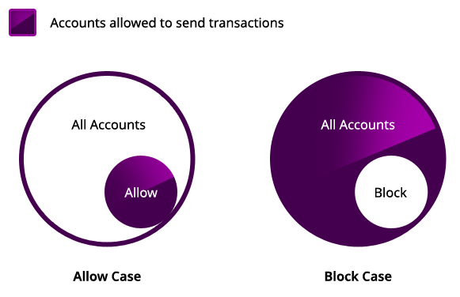

###################
Account Restriction
###################

:doc:`Accounts <account>` may configure a set of smart rules to block announcing or receiving transactions given a series of restrictions.

The account owners—plural in case of multisig accounts—can edit the account restrictions at a later time announcing the specific :ref:`accountaddressrestrictiontransaction`.

|codename|'s public network enables accounts to define up to ``512`` restrictions per account and restriction type, being this parameter :ref:`configurable per network <config-network-properties>`.

*******************
Address restriction
*******************

An account can decide to **only receive** transactions from a list of allowed **addresses**.
Alternatively, the account can define a list of blocked addresses.

Restricting **incoming transactions** is useful when the account will be only receiving transactions from known addresses, or when the account wants to block transactions coming from unknown senders.

    Address restriction diagram

.. note:: Allow and block restrictions are mutually exclusive. In other words, an account can only configure a block or an allow list per type of restriction.

By default, when there are no restrictions set, all the accounts in the network can announce transactions to the unrestricted account.

Additionally, an account can decide to apply address restrictions to the **outgoing transactions**, limiting the accounts allowed that are valid recipients.

******************
Mosaic restriction
******************

Similar to address restrictions, an account can configure a restriction to permit **incoming** transactions only if all the :doc:`mosaics <mosaic>` attached are allowed.
On the other hand, the account can refuse to accept transactions containing a mosaic listed as blocked.

Account mosaic restrictions are generally used to **prevent accounts being tagged with mosaics** not associated with their activity.

*********************
Operation restriction
*********************

An account can allow/block announcing **outgoing** transactions with a determined :ref:`operation type <transaction-types>`.
By doing so, the account increases its security, preventing the announcement by mistake of undesired transactions.

.. csv-table:: Restriction types allowed
    :widths: 40 30 30
    :header: "Restriction", "Incoming Transactions", "Outgoing Transactions"
    :delim: ;

    Address Restriction; ✔️; ✔️
    Mosaic Restriction;✔️ ;  ❌
    Operation Restriction;❌; ✔️

********
Examples
********

Blocking spam transactions
==========================

A pharmaceutical company is using the public chain to certify the quality of their products.

When the quality verification process concludes, an operator sends a :doc:`quality seal<mosaic>` to the product account.

The final customers can review the product mosaics scanning a QR code. For that reason, the company only wants to show related transactions, avoiding that others spam their products with non-related information.

.. figure:: ../resources/images/examples/account-restrictions-spam.png
    :align: center
    :width: 550px

    Blocking spam transactions

The company opts to configure their product accounts restrictions, enabling only to receive transactions containing ``pharmaceutical.quality.seal`` mosaics.

Enhancing the account security
==============================

Lately, Alice is only using her main account to cosign aggregate transactions where she is a cosignatory for the :doc:`multisig <multisig-account>` account.

As a temporary security measure, Alice opts to disable announcing transfer transactions from her main account.
Doing so, Alice double-checks that the funds held in the main account are not going to be transferred by mistake.

********************
Related transactions
********************

.. csv-table::
    :header:  "Id",  "Type", "Description"
    :widths: 20 30 50
    :delim: ;

    0x4150; :ref:`accountaddressrestrictiontransaction`; Allow or block incoming and outgoing transactions for a given a set of addresses.
    0x4250; :ref:`accountmosaicrestrictiontransaction`; Allow or block incoming transactions containing a given set of mosaics.
    0x4350; :ref:`accountoperationrestrictiontransaction`; Allow or block outgoing transactions by transaction type.

**************
Related guides
**************

.. postlist::
    :category: Account Restriction
    :date: %A, %B %d, %Y
    :format: {title}
    :list-style: circle
    :excerpts:
    :sort:
