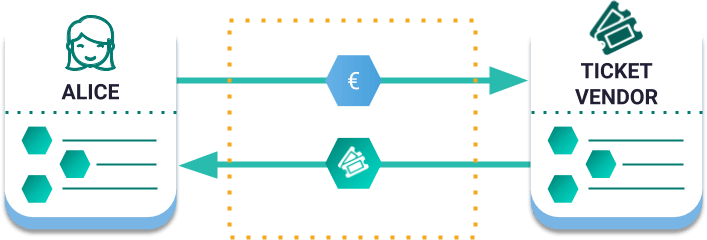
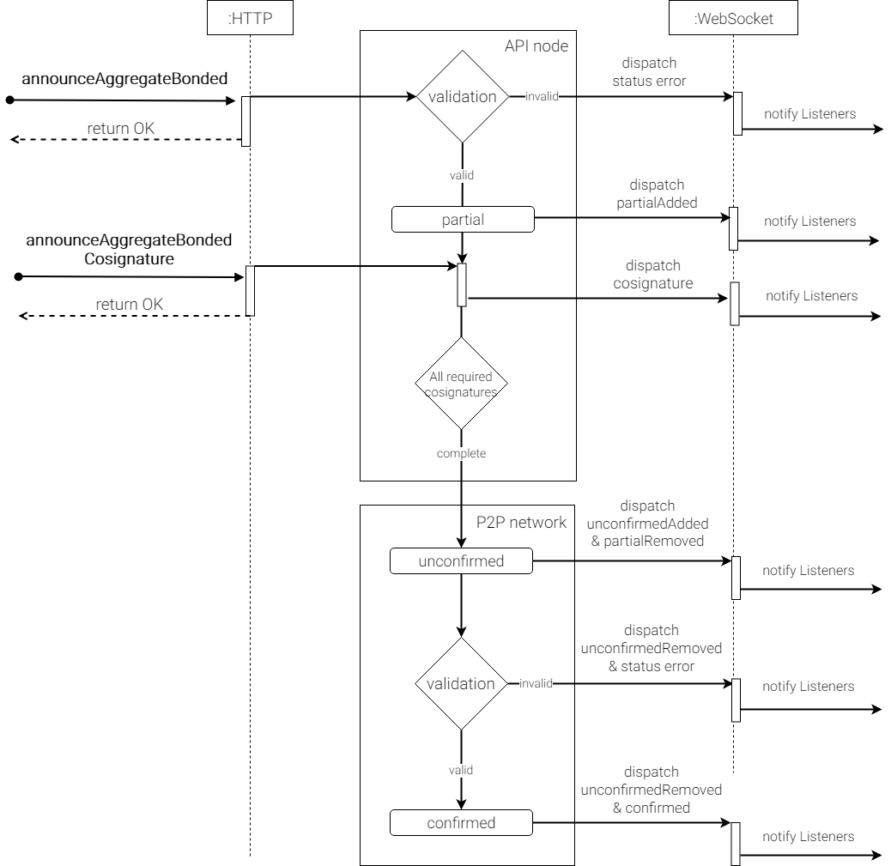
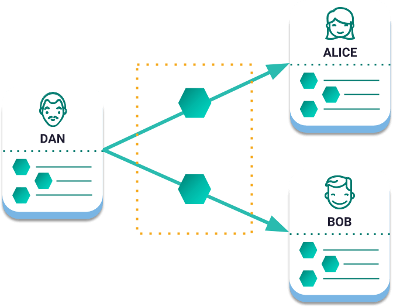
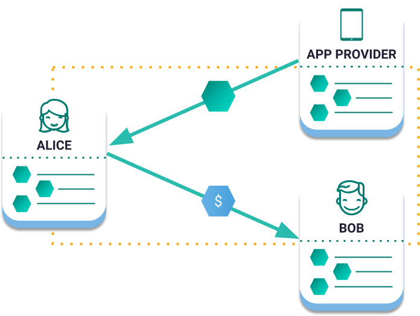

.. _aggregate-transaction:

#####################
Aggregate Transaction
#####################

Aggregate transactions merge multiple transactions into one, allowing **trustless swaps**, and other advanced logic.
|codename| does this by generating a one-time disposable smart contract.

    Example of an Aggregate Transaction between two participants. Alice transfers Euros and the ticket vendor transfers the tickets **at the same time**. The network guarantees that both transactions succeed or none does.

Instead of signing each inner transaction individually, the aggregate transaction gathers all required signatures (called then **cosignatures**). Only when all necessary signatures have been provided the aggregate transaction can be processed, and all inner transactions are executed simultaneously.

|codename|'s :ref:`public network <config-network-properties>` supports aggregate transaction containing up to **100** inner transactions involving up to **25** different cosignatories (as defined by the ``maxTransactionsPerAggregate`` and ``maxCosignaturesPerAggregate`` properties).
Other aggregate transactions are not allowed as inner transactions.

.. _aggregate-complete:

******************
Aggregate complete
******************

An Aggregate Transaction is  **complete** when it requires signatures from multiple participants and **all of them are available when the transaction is announced**.

The cosigners can sign the transaction without using the blockchain.
Once it has all the required signatures, any one of them can announce it to the network.
If the inner transaction setup is valid, and there is no validation error, the transactions will get executed at the same time.

Aggregate complete transactions enable adding more transactions per block by gathering multiple inner transactions.

.. _aggregate-bonded:

****************
Aggregate bonded
****************

An Aggregate Transaction is **bonded** when it requires signatures from multiple participants and **NOT all of them are available when the transaction is announced**.

Once an aggregate bonded is announced, it enters the **partial state** and the cosigners whose signatures are still required are **notified through their wallets**.

When a cosigner signs the transaction and announces its aggregate bonded :ref:`cosignature <cosignature>`, the network checks if all the required signatures are available. If so, the transaction moves to the **unconfirmed state** meaning that it will be **confirmed** and included in the next block if everything is correct.

Transactions can remain in the partial state for up to **48 hours**: This is the deadline all cosigners have to provide their signatures before the aggregate bonded transaction expires.

.. note:: Before announcing an **Aggregate Bonded Transaction**, an account must announce and get confirmed a :ref:`hashlocktransaction` locking **10 XYM**. This is refunded when the transaction is confirmed and serves as an anti-SPAM mechanism.

    AggregateBondedTransaction cycle

********
Examples
********

Sending multiple transactions together
======================================

Dan announces an AggregateTransaction that merges two transfer transactions.
Alice and Bob will receive the mosaics at the same time.

    Sending payouts with aggregate complete transactions

Multi-asset escrowed transactions
=================================

In this example, Alice is buying tickets with ``currency.euro`` :doc:`mosaic <mosaic>`.
When the ticket distributor cosigns the AggregateTransaction, the swap will happen atomically.

    Multi-Asset Escrowed Transactions

Paying for others fees
======================

Alice sends 10 ``currency.euro`` to Bob using an app to make payments.
However, Alice doesn't own |networkcurrency| to pay the transaction fee.

By creating an AggregateBondedTransaction, Alice can convert ``currency.euro`` to |networkcurrency| to pay the fee.
Now, Alice and Bob can use |codename|'s public blockchain without ever having to buy or hold |networkcurrency| units.

Since the app creator can put its own branding on the open source payment app, Alice and Bob may not even know they are using blockchain technology.

    Paying for others fees

********************
Related transactions
********************

.. csv-table::
    :header:  "Id",  "Type", "Description"
    :widths: 20 30 50
    :delim: ;

    0x4141; :ref:`aggregatecompletetransaction`; Send transactions in batches to different accounts.
    0x4241; :ref:`aggregatebondedtransaction`; Propose an arrangement of transactions between different accounts.
    --; :ref:`Cosignature <cosignature>`; Cosign an AggregateBondedTransaction.
    0x4148; :ref:`hashlocktransaction`;  Lock a deposit needed to announce aggregate bonded transactions.

**************
Related guides
**************

.. postlist::
    :category: Aggregate Transaction
    :date: %A, %B %d, %Y
    :format: {title}
    :list-style: circle
    :excerpts:
    :sort:
