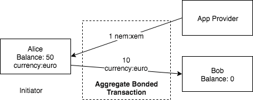

######################
Aggregate transaction
######################

.. warning:: The configuration presented is NOT intended to be used on the public network. These are the parameters used for the Catapult Testnet version (MIJIN_TEST).

.. _aggregate-transaction:

Aggregated Transactions merge multiple transactions into one, allowing trustless swaps, automatic cross-chain transactions, and other advanced logic. NEM does this by generating a one-time disposable smart contract. When all involved :doc:`accounts<../concepts/account>` have cosigned the transaction, all of them are executed at once.

    **Inner Transaction**

    Transactions initiated by different accounts. An aggregate transaction can contain up to ``1000`` inner transactions. Other aggregate transactions are not allowed as inner transactions.

    **Cosignatures**

    The array of transaction cosigners signatures.  The maximum number of cosignatories allowed is ``15``.

******************
Aggregate complete
******************

An aggregate transaction is  **complete** if before announcing it to the network, all cosigners have signed it. If valid, it will be included in a block.

.. figure:: ../resources/images/guides-transactions-sending-payouts.png
    :align: center
    :width: 450px

    Sending payouts with aggregate complete transactions

****************
Aggregate bonded
****************

In case that it requires signatures from other participants but announced to the network, then the transaction is considered Aggregate **bonded**.

.. note:: When sending an **aggregate bonded transaction**, an account should first send and get confirmed a Lock Funds Transaction for this aggregate with at least ``10`` XEM.

Once an aggregate bonded is announced, it reaches partial state and notifies its status through WebSockets or HTTP API calls.

Every time a cosignatory signs and announces an aggregate bonded cosignature, the network checks if all required cosigners have already signed. If it is the case, the transaction changes to unconfirmed state until the network accepts it, and is included in a block once processed.

.. figure:: ../resources/images/guides-transactions-escrow.png
    :align: center
    :width: 450px

    Multi-Asset Escrowed Transactions

In this example, Alice is buying tickets with currency:euro. When the ticket distributor cosigns the aggregate transaction, the swap will happen atomically.

    Paying for others fees

Alice sends 10 € to Bob using a payment app. But she doesn’t have any XEM to pay the blockchain transaction fee. Creating an aggregate bonded transaction, she can convert USD to XEM to pay the fee.

Now Alice and Bob can use NEM blockchain without ever having to buy or hold XEM. Since the app creator can put their own branding on the open source payment app, Alice and Bob may not even know they are using blockchain.

.. _cosignature-transaction:

***********************
Cosignature transaction
***********************

Cosignature transaction is used to sign :ref:`announced aggregate bonded transactions <aggregate-transaction>` with missing cosignatures.

    **Transaction to cosign**

    Aggregate bonded transaction to cosign.

.. _lock-funds-transaction:

**********************
Lock funds transaction
**********************

Announce a lock funds transaction before sending a signed :ref:`aggregate bonded transaction<aggregate-transaction>`. This mechanism is required to prevent network spamming and ensure that transactions are cosigned.

Once the related aggregate bonded transaction is confirmed, locked funds become available again in the account that signed the initial lock funds transaction.

If the aggregate bonded transaction deadline is reached without being signed by all cosignatories, the locked amount is collected by the block harvester at the height where the lock expires.

    **Mosaic**

    Locked mosaic, must be at least ``10 nem:xem``.

    **Duration**

    The funds lock duration.

    **Hash**

    Aggregate bonded has to be confirmed before unlocking funds.