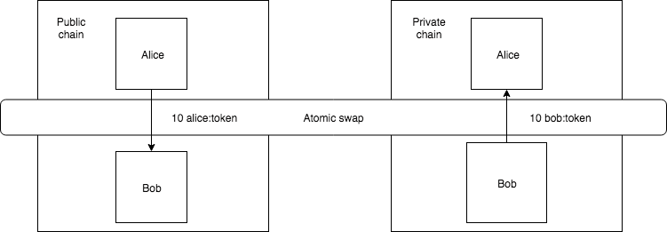

#################
Cross-Chain Swaps
#################

A cross-chain swap enables **trading tokens** across **different blockchains**, without using an intermediary party (eg. an exchange service) in the process. 

    Atomic cross-chain swap between public and private network

In order to create a trustless environment for an exchange, a specific transaction type is required that is commonly referred to as **Hashed TimeLock Contract** (HTLC). Two additional components characterize this transaction type: *hashlocks* and *timelocks*. A thorough explanation can be found on the `Bitcoin Wiki <https://en.bitcoin.it/wiki/Hashed_Timelock_Contracts>`_.

In other words, to reduce counterparty risk, the receiver of a payment needs to present a proof for the transaction to execute. Failing to do so, the locked funds are released after the deadline is reached, even if just one actor does not agree. 
The figure below illustrates the cross-chain swap protocol.

.. figure:: ../resources/images/guides-transactions-atomic-cross-chain-swap-sequence-diagram.png
    :align: center
    :width: 700px

    Atomic cross-chain swap sequence diagram

When talking about tokens in NEM, we are actually referring to :doc:`mosaics <../../concepts/mosaic>`. Catapult enables atomic swaps through :ref:`secret lock <secret-lock-transaction>` / :ref:`secret proof transaction <secret-proof-transaction>` mechanism.

.. _secret-lock-transaction:

***********************
Secret lock transaction
***********************

Use a secret lock transaction to initiate the cross-chain swap. Once announced, the specified mosaics are locked at blockchain level, associated with a previously chosen *hashed proof* called ``secret``. 

Funds are unlocked and transferred when an account announces a  valid :ref:`Secret Proof Transaction <secret-proof-transaction>`. The account must demonstrate knowing the *secret* that unlocks the transaction, by disclosing the previously used ``hashing algorithm`` and the ``proof``. 

If the transaction duration is reached and not proved, the locked amount is returned to the initiator of the secret lock transaction.

    **Mosaic**

    Locked mosaic.

    **Duration**

    The duration for the funds to be released or returned.

    **Hash Type**

    Hash algorithm used, with which secret is generated.

    **Secret**

    The proof hashed.

    **Recipient**

    The address who will receive the funds once unlocked.

.. _secret-proof-transaction:

************************
Secret proof transaction
************************

Secret proof transaction is used to unlock :ref:`secret lock transactions <secret-lock-transaction>`.

To unlock a secret lock transaction, the account must demonstrate that it knows the *proof* and the used *hashing algorithm*, which unlock the transaction.

    **Hash Type**

    The hash algorithm used, to check that proof hashed equals secret.

    **Secret**

    The proof hashed.

    **Proof**

    The proof seed.
