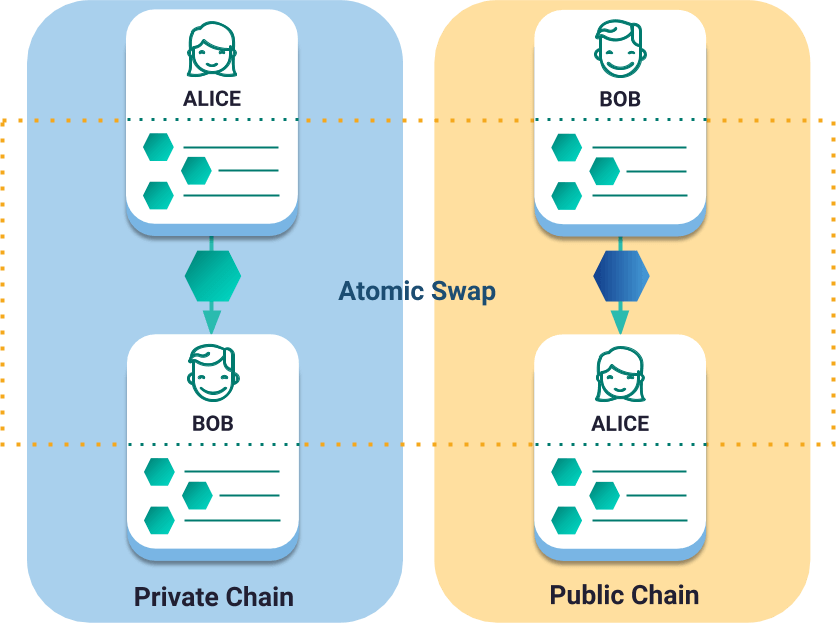

#################
Cross-Chain Swaps
#################

A cross-chain swap enables trading tokens across different blockchains without using an intermediary party (e.g. an exchange service) in the process.

    Cross-chain swap between public and private network

|codename| follows the **Hashed TimeLock Contract** (HTLC) protocol to create a trustless environment for the decentralized exchange of assets. The protocol guarantees that if all participants agree, the swap will take place. On the other hand, if some of them decide not to conclude the process, each participant should receive their locked funds back.

HTLC uses *hashlocks* and *timelocks* to reduce the counterparty risk.
Every participant in the exchange of tokens needs to present proof (hashlock) to complete it. Failing to do so, the locked assets are released back to each original owner after the timelock expires.

A thorough explanation of the protocol can be found on the `Bitcoin Wiki <https://en.bitcoin.it/wiki/Hashed_Timelock_Contracts>`_.

********
Protocol
********

Alice and Bob want to exchange **10 alice.tokens for 10 bob.tokens**.

The problem is that they are not in the same network: alice.token is defined in |codename|'s public chain whereas bob.token is only present in a private chain using |codename| tech.

Trading tokens directly from one blockchain to the other is not possible, due to the technological differences between them.

In the case of |codename| public and private chain, the same mosaic name could have a different definition and distribution or even not exist.
Between Bitcoin and |codename|, the difference is even more evident, as each blockchain uses an entirely different technology.

Instead of transferring tokens between different chains literally, the trade will be performed inside each chain.

The cross chan swap protocol will ensure that the token swap occurs atomically.

.. mermaid:: ../resources/diagrams/cross-chain-swap.mmd
    :caption: Cross-chain swap sequence diagram
    :align: center

Before starting with the swap, all participants involved int the swap must own at least one account in each blockchain.

1. Alice generates a random set of bytes called ``proof``. The proof should have a size between ``10`` and ``1000`` bytes.

2. Alice hashes the obtained proof with one of the :ref:`available algorithms <lock-hash-algorithm>` to generate the ``secret``.

3. Alice defines the :ref:`SecretLockTransaction <secret-lock-transaction>` **TX1**:

.. csv-table::
    :header: "TX1 Property", "Value"
    :widths: 20 80
    :delim: ;

    Type; SecretLockTransaction
    Mosaic; 10 alice.token
    Recipient; Bob's address (Private Chain)
    Algorithm; h
    Duration; 96 h
    Secret; h(proof)
    Network; Private Chain

Once announced, this transaction will remain locked until someone discovers the proof that matches the secret. If no one unlocks it before the duration set is reached, the locked funds will be returned back to Alice.

4. Alice **announces TX1 to the private network** and **shares with Bob the secret**.

.. note:: Bob should retrieve the secret from the chain. It is Bob's responsibility to verify the secret correctness.

5. Bob defines announces the following **SecretLockTransaction TX2** to the **public network**:

.. csv-table::
    :header: "TX2 Property", "Value"
    :widths: 20 80
    :delim: ;

    Type; SecretLockTransaction
    Mosaic; 10 bob.token
    Recipient; Alice's address (Public Chain)
    Algorithm; h
    Duration; 84 h
    Secret; h(proof)
    Network; Public Chain

6. Alice announces the :ref:`SecretProofTransaction <secret-proof-transaction>` **TX3** to the **public network**. This transaction defines the encrypting algorithm used, the original proof and the secret:

.. csv-table::
    :header: "TX3 Property", "Value"
    :widths: 20 80
    :delim: ;

    Type; SecretProofTransaction
    Recipient; Alice's address (Public Chain)
    Algorithm; h
    Secret; h(proof)
    Proof; proof
    Network; Public Chain

7. Once TX3 is confirmed, the **proof** is revealed. **TX2 transaction is unlocked**, and Alice receives the locked funds.

8. Bob picks the proof and announces the **SecretProofTransaction TX4** to the **private network**, receiving the locked funds from **TX1**.

.. csv-table::
    :header: "TX4 Property", "Value"
    :widths: 20 80
    :delim: ;

    Type; SecretProofTransaction
    Recipient; Bob's address (Private Chain)
    Algorithm; h
    Secret; h(proof)
    Proof; proof
    Network; Private Chain

The process is atomic, but should be completed with lots of time before the deadlines:

* TX1's duration should be significantly bigger than TX2's to guarantee that the second participant will have time to unlock TX1 after the first one reveals the proof.
* Each participant must wait for at least ``maxRollBackBlocks`` between announcements to prevent experiencing :ref:`transaction rollbacks <rollbacks>`.

******
Guides
******

.. postlist::
    :category: Cross-Chain Swaps
    :date: %A, %B %d, %Y
    :format: {title}
    :list-style: circle
    :excerpts:
    :sort:

*******************
Transaction schemas
*******************

.. _secret-lock-transaction:

SecretLockTransaction
=====================

Use a SecretLockTransaction to transfer mosaics between two accounts. The specified mosaics remain locked until a valid :ref:`SecretProofTransaction <secret-proof-transaction>` unlocks them.

The maximum number of blocks the lock can lie up to is ``30 days``, being this parameter :ref:`configurable per network <config-network-properties>`.
If the transaction duration is reached without being proved, the locked amount goes back to the initiator of the SecretLockTransaction.

**Version**: 0x01

**EntityType**: 0x4152

**Inlines**:

* :ref:`Transaction <transaction>` or :ref:`EmbeddedTransaction <embedded-transaction>`

.. csv-table::
    :header: "Property", "Type", "Description"
    :delim: ;

    secret; :schema:`Hash256 <types.cats>`; Proof hashed.
    mosaic; :ref:`UnresolvedMosaic <unresolved-mosaic>`; Locked mosaic.
    duration; :schema:`BlockDuration <types.cats>`; Number of blocks for which a lock should be valid. If reached, the mosaics will be returned to the initiator.
    hashAlgorithm ; :ref:`LockHashAlgorithm<lock-hash-algorithm>`; Algorithm used to hash the proof.
    recipientAddress; :schema:`UnresolvedAddress <types.cats>`; Address that receives the funds once unlocked.

.. _secret-proof-transaction:

SecretProofTransaction
======================

Use a SecretProofTransaction to unlock :ref:`SecretLockTransactions <secret-lock-transaction>`.

The transaction must prove that it knows the *proof* that unlocks the mosaics.

**Version**: 0x01

**EntityType**: 0x4252

**Inlines**:

* :ref:`Transaction <transaction>` or :ref:`EmbeddedTransaction <embedded-transaction>`

.. csv-table::
    :header: "Property", "Type", "Description"
    :delim: ;

    secret; :schema:`Hash256 <types.cats>`; Proof hashed.
    proofSize; uint16; Proof size in bytes.
    hashAlgorithm ; :ref:`LockHashAlgorithm<lock-hash-algorithm>`; Algorithm used to hash the proof.
    recipientAddress; :schema:`UnresolvedAddress <types.cats>`; Address that receives the funds once unlocked.
    proof; array(byte, proofSize); Original random set of bytes.

.. _lock-hash-algorithm:

LockHashAlgorithm
=================

The list of supported hashing algorithms.

Enumeration: uint8

.. csv-table::
    :header: "Id", "Description"
    :delim: ;

    0 (Op_Sha3_256); Proof is hashed using SHA3-256.
    1 (Op_Hash_160); Proof is hashed twice: first with SHA-256 and then with RIPEMD-160 (bitcoin's OP_HASH160).
    2 (Op_Hash_256); Proof is hashed twice with SHA-256 (bitcoin's OP_HASH256).

Continue: :doc:`Cryptography <cryptography>`.
