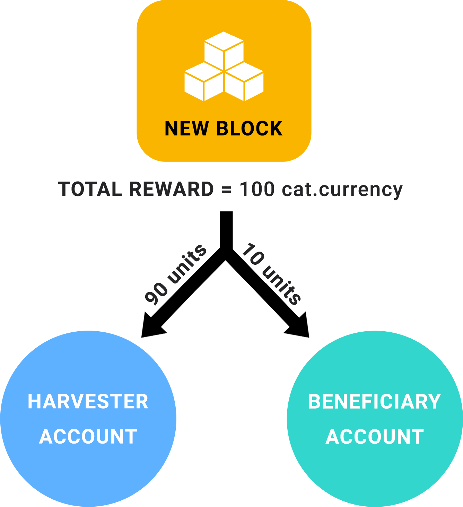

##########
Harvesting
##########

The process of creating new :doc:`blocks <block>` is called harvesting.

In this process, the :doc:`account <account>` that harvests a block—called the **harvester**—is rewarded with the :doc:`transaction fees <fees>` added in the block and the :doc:`inflation <inflation>` tokens generated.

Once an account harvests a block, the block recorded stores in its :ref:`header <block-header>` the public key and signature generated by the harvesting account.

********************
Eligibility criteria
********************

The :ref:`importance score <importance-calculation>` determines the probability of an account to harvest the next block in case the account has harvesting turned on and all other accounts are harvesting too.

|codename|'s public network defines that an account needs to hold at least ``10,000`` :ref:`harvesting mosaics <harvesting-mosaic>` units to have importance score greater than zero.
Eligible accounts can use their importance scores to create new blocks either by :ref:`running a node <local-harvesting>` or delegating it to a :ref:`remote node <delegated-harvesting>`.

Regardless of the method chosen, any account willing to activate harvesting must first announce a valid VrfKeyTransaction.
The Vrf transaction links the harvester account with a second key pair to randomize block production and leader selection.

.. _harvesting-mosaic:

*****************
Harvesting mosaic
*****************

|codename| software supports :ref:`defining any mosaic <config-network-properties>` for harvesting purposes to fit the business needs.

For example, consortium networks can distribute harvesting mosaics between the companies that are running the infrastructure, while other participants need to pay fees in the form of :doc:`currency mosaic <fees>` to consume services.

By contrast, public networks might use the same mosaic for paying transaction fees and running the network.
|codename|'s public network uses |networkcurrency| as the harvesting mosaic, enabling any eligible participant to harvest new blocks.

.. _local-harvesting:

****************
Local harvesting
****************

An eligible account can harvest new blocks by running a node.
To harvest locally, the account should provide the next properties in :properties:`config-harvesting.properties <config-node-properties>` file:

.. csv-table::
    :header: "Property", "Type", "Description", "Default"
    :delim: ;

    harvesterPrivateKey; string; The harvester account private key. This account needs to hold at least ``10,000`` :ref:`harvesting mosaics <harvesting-mosaic>` units to have importance score greater than zero in the public network.;
    harvesterSigningPrivateKey; string; The Vrf private key linked with the account.
    enableAutoHarvesting; bool; Set to true if delegated harvesting is enabled.; false
    maxUnlockedAccounts; uint32_t; Maximum number of delegated harvesting accounts.; 5
    delegatePrioritizationPolicy; harvesting::DelegatePrioritizationPolicy; Delegate harvester prioritization policy used to keep accounts once the node stores ``maxUnlockedAccounts``. Possible values are "Importance" or "Age".; Importance
    beneficiaryPublicKey; string; Public key of the account receiving part of the harvested fee.; 0000000000000000000000000000000000000000000000000000000000000000

Note that each node can set a **beneficiary public key** to share a 25% of the harvesting rewards (:doc:`fees <fees>` and :doc:`inflation <inflation>`), being the sharing ratio :ref:`configurable per network <config-network-properties>`.
When the node does not define a beneficiary, all the rewards go to the block signer.

    Rewards division when the network's sharing ratio equals 10%

Local harvesting is secure as long as no one accesses your node instance, which is storing the private key.

.. _delegated-harvesting:

********************
Delegated harvesting
********************

An eligible account may also to a node running local harvesting.
Delegated harvesting enables an eligible account to delegate its importance score to **proxy private key**. This private key can be shared securely with a node that it's running local harvesting.

In other words, delegated harvesting permits using the importance score of an account to create new blocks and receive block rewards without running a node.

.. figure:: ../resources/images/diagrams/delegated-harvesting.png
    :align: center
    :width: 400px

    Activating delegated harvesting

To enable delegated harvesting, the account owner has to link its **importance score** to a remote account announcing an :ref:`AccountKeyLinkTransaction <account-key-link-transaction>`.

Then, the account needs to send a `special encrypted message <https://github.com/nemtech/NIP/blob/master/NIPs/nip-0009.md>`_ to the node via a :doc:`TransferTransaction <transfer-transaction>`.
The message must contain the remote's account **proxy private key**  encrypted using AES, making the transaction only readable by the recipient.

The node receives an encrypted message using :ref:`WebSockets <websockets>`.
Once the node decrypts the private key of the potential delegated harvester, the node owner can **add the remote account as a delegated harvester** if the candidate meets the requirements.

As the remote private key is **saved on disk**, even if the node disconnects temporarily, the persistent delegated harvesters will be reestablished once the node reconnects to the network.
Additionally, the use of encrypted message creates a **backup** of the information for the nodes.
If the disk containing the delegated keys becomes corrupted or destroyed, the node owner can retrieve the data by querying the blockchain.

Security-wise, sharing a proxy private key does not compromise the original account since:

* The remote account has zero balance.
* The remote account by itself can't transfer the importance to another account.
* The original account receives the resulting fees.

Remote harvesters may not receive the entire reward if the following conditions are met:

*  The network harvesting sharing rate is greater than 0.
*  The node selected has defined a :ref:`beneficiary account <local-harvesting>`.

.. csv-table:: Comparison between local and delegated harvesting
    :header: "", "Local harvesting", "Delegated harvesting"
    :delim: ;

    **Configuration** ; Setup a catapult-server node.; Activate remote harvesting.
    **Cost** ; The node maintenance (electricity, cost VPN) + VrfKeyTransaction announcement fees.; VrfKeyTransaction + AccountKeyLinkTransaction + TransferTransaction announcement fees.
    **Security**; The node stores the private key.;  A proxy private key is shared with a node.
    **Reward**; Total reward. The node owner can share part of the reward with a beneficiary account.; Total reward - node's beneficiary share.

******
Guides
******

.. postlist::
    :category: Harvesting
    :date: %A, %B %d, %Y
    :format: {title}
    :list-style: circle
    :excerpts:
    :sort:

*******
Schemas
*******

AccountKeyLinkTransaction
=========================

Announce an AccountKeyLinkTransaction to delegate the account importance to a remote account.

In order for the remote account to be accepted for delegated harvesting, it needs to meet the following conditions:

* It cannot own any mosaics.
* It cannot be a cosignatory of any other account.
* It cannot be a multisig account.
* It cannot already be a remote account for another account.
* It cannot be its own remote account.

The account cannot be involved in any transaction while it is a delegated account.

**Version**: 0x01

**EntityType**: 0x414C

**Inlines**:

* :ref:`Transaction <transaction>` or :ref:`EmbeddedTransaction <embedded-transaction>`

.. csv-table::
    :header: "Property", "Type", "Description"
    :delim: ;

    remotePublicKey; :schema:`Key <types.cats#L14>`; Remote account public key.
    linkAction; :ref:`LinkAction <link-action>`; Account link action.

.. _link-action:

LinkAction
==========

Enumeration: uint8

.. csv-table::
    :header: "Id", "Description"
    :delim: ;

    0x00; Unlink account.
    0x01; Link account.

Continue: :doc:`Inflation <inflation>`.
