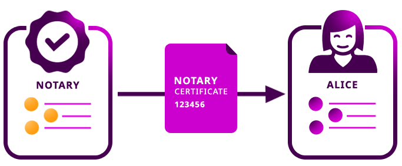
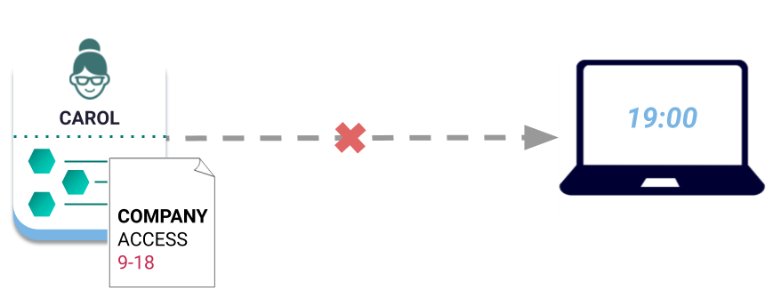

########
Metadata
########

|codename| provides the option to associate custom data to an :doc:`account <account>`, :doc:`mosaic <mosaic>` or :doc:`namespace <namespace>` with a transaction.

The most common uses of metadata are:

* Attach relevant information to assets.
* Validate the value attached to an asset to enable users in an application to perform an off-chain action.

Metadata is uniquely **identified** by the tuple ``{ signer, target-id, metadata-key }``.
Including a signer in this composite identifier allows multiple accounts to specify the same metadata without conflict.

The **value** linked to an identifier is a string up to ``1024`` characters,  being this parameter :ref:`editable per network <config-network-properties>`.
The client application is responsible for encrypting the message or keeping it visible for every blockchain participant.

***********
Persistence
***********

Metadata entries are stored on the blockchain—like the message of a regular :doc:`TransferTransaction <transfer-transaction>`—but also as a **key-value state**.

This feature reduces the reading time of client applications; metadata allows information to be accessed by keys instead of processing the entire account transaction history off-chain to obtain the latest transaction message value.

***********
Permissions
***********

The account, namespace or mosaic creator must **opt-in** to all metadata requests received by giving explicit permission.
In practice, this means that all MetadataTransactions must be wrapped in an :doc:`AggregateTransaction <aggregate-transaction>`.

The target account should cosign the aggregate to record the metadata on the blockchain and update the asset state.

********
Examples
********

Adding a certificate to an account
==================================

    Metadata used to attach relevant information to an asset

Bob works as a digital notary that stamp accounts on |codename|'s public blockchain.
When a customer comes to Bob to notarize a document, he checks the authentication of the customer’s documents then tags the account with a MetadataTransaction.

Alice a recent graduate and wants her educational certificate accredited to her |codename| account to avoid the hassle of repeatedly providing verification of her degree.
So she goes to Bob and provides him with proof of her degree.
Once Alice pays Bob a fee, Bob verifies the authenticity and stamps Alice’s account with metadata that signifies her degree.

Access management
=================

    Validating metadata to restrict performing an off-chain action

The HR department of the SneakersCompany uses the |codename| for access management of sensitive work resources.
Each account is tagged with the metadata that regulates its access to the company apps suite.

When a new employee, Carol, is hired, the HR department creates a new work account for her.
For security reasons, HR sets the metadata of the account to ``{company, ACCESS, 9-18}``.

Each time Carol attempts to access the company apps suite, the company app validates that Carol has permission and that the time falls under *9:00-18:00* before granting her admission.

Similarly, if Derek, who has no permissions, attempts to access the company apps suite, the app will reject his request.

********************
Related transactions
********************

.. csv-table::
    :header:  "Id",  "Type", "Description"
    :widths: 20 30 50
    :delim: ;

    0x4144; :ref:`accountmetadatatransaction`; Associate a key-value state to an account.
    0x4244; :ref:`mosaicmetadatatransaction`; Associate a key-value state to a mosaic.
    0x4344; :ref:`namespacemetadatatransaction`; Associate a key-value state to a namespace.

**************
Related guides
**************

.. postlist::
    :category: Metadata
    :date: %A, %B %d, %Y
    :format: {title}
    :list-style: circle
    :excerpts:
    :sort:
