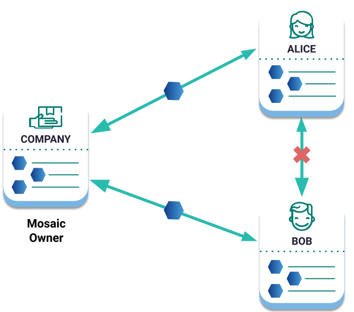
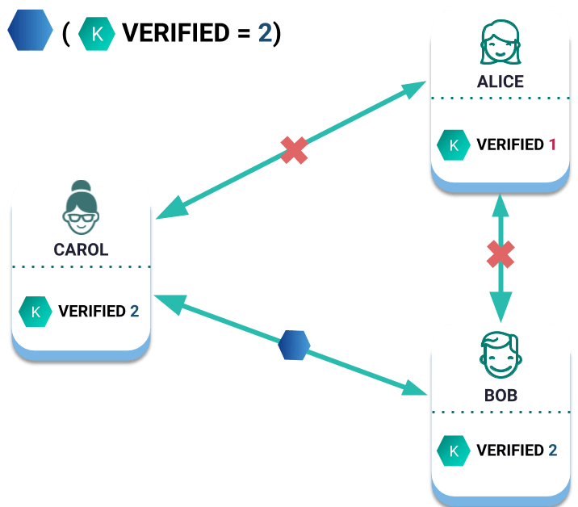

######
Mosaic
######

Mosaics are part of what makes the Smart Asset System unique and flexible.
They are **fixed assets** that can represent a set of multiple identical things that do not change.

A mosaic could be a **token**, but it could also be a collection of more specialized assets such as reward points, shares of stock, signatures, status flags, votes or even other currencies.

Each mosaic has a unique identifier represented as a 64-bit unsigned integer and a set of :ref:`configurable properties <mosaic-properties>` and flags that can be defined during the :doc:`mosaic creation <../guides/mosaic/creating-a-mosaic>`.

.. _mosaic-properties:

**********
Properties
**********

Find below the complete list of configurable properties.

Divisibility
============

Determines the decimal place to which the mosaic can be divided.
A divisibility of 3 means that the smallest fraction a mosaic can be divided into will be 0.001.
The divisibility must be in the range of 0 and 6.

Initial supply
==============

Indicates the amount of mosaic in circulation.
The total supply must be in the range of 0 and ``9,000,000,000,000,000`` atomic units.

Mosaic units in |codename| are defined as **absolute amounts**.
To get an absolute amount, multiply the amount of assets you want to create or send by 10\ :sup:`divisibility`.

For example, if the mosaic has **divisibility** 2, to create or send 10 units (relative) you should define 1,000 (absolute) instead.

Duration
========

Specifies the number of confirmed blocks the mosaic is rented for.
It is allowed to lie in |codename|'s public network up to ``3650`` days (10 years), being this maximum parameter :ref:`editable per network <config-network-properties>`.
**Non-expiring mosaics** can be created by setting this property to ``0``.

.. note:: Different from namespaces, a mosaic duration cannot be extended after its creation. Before creating one, consider if your use case requires the mosaic to expire or not.

The following formula is used to convert days to blocks approximately:

.. math::

    duration ≈ numberOfDays * 86400 / blockGenerationTargetTimeInSeconds

Supply mutable
==============

If set to true, the mosaic supply can change at a later point.
In this case, the mosaic creator is allowed to redefine the total mosaic supply with a :ref:`MosaicSupplyChangeTransaction <mosaic-supply-change-transaction>`.
The transaction increases or decreases the mosaic supply in ``delta`` units.

To decrease the mosaic supply, the mosaic creator account must own at least ``delta`` units.
This means that the mosaic creator cannot remove mosaics from other account balances, even if the supply mutable property is enabled.

If set to false, the mosaic supply remains immutable.
However, if the mosaic creator owns all the mosaic supply, this is modifiable even if the mosaic is defined as not mutable.

Transferable
============

    Example of a non-transferable mosaic

If set to true, the mosaic can be transferred between arbitrary accounts.
Otherwise, the mosaic can only be transferred back to the mosaic creator.

Restrictable
============

    Example of a mosaic restriction

If set to true, the mosaic creator can configure custom :doc:`restrictions <mosaic-restriction>`.

.. _mosaic-rental-fee:

************
Creation fee
************

An account willing to create a mosaic has to pay a rental fee in addition to the :doc:`transaction fee <fees>`.
Both fees will be deducted from the account's balance after the announcement of a valid **MosaicDefinitionTransaction**.

The :doc:`REST Gateway <../api>` provides an endpoint to get an estimation of how much network currency will cost you to create a mosaic:

.. example-code::

    .. viewsource:: ../resources/examples/typescript/mosaic/GettingMosaicRentalFee.ts
        :language: typescript
        :start-after: /* start block 01 */
        :end-before: /* end block 01 */
    
    .. viewsource:: ../resources/examples/typescript/mosaic/GettingMosaicRentalFee.js
        :language: javascript
        :start-after: /* start block 01 */
        :end-before: /* end block 01 */

By default, creating a mosaic in |codename|'s public network has an :ref:`initial cost <config-network-properties>` of ``0.0005`` |networkcurrency|.
However, **the network dynamically adjusts the mosaic rental fee** over time.

To calculate the effective rental fee, the network multiplies the default value set in the configuration by the :doc:`median network multiplier <harvesting>` over last :ref:`maxDifficultyBlocks <config-network-properties>`.
In case there are zero multipliers, these are replaced by the :ref:`defaultDynamicFeeMultiplier <config-network-properties>` before the median calculation.

********************
Related transactions
********************

.. csv-table::
    :header:  "Id",  "Type", "Description"
    :widths: 20 30 50
    :delim: ;
    
    0x414D; :ref:`MosaicDefinitionTransaction <mosaic-definition-transaction>`; Create a new mosaic.
    0x424D; :ref:`MosaicSupplyChangeTransaction <mosaic-supply-change-transaction>`; Change the mosaic total supply.

******
Guides
******

.. postlist::
    :category: Mosaic
    :date: %A, %B %d, %Y
    :format: {title}
    :list-style: circle
    :excerpts:
    :sort:

Continue: :doc:`Namespaces <namespace>`.
