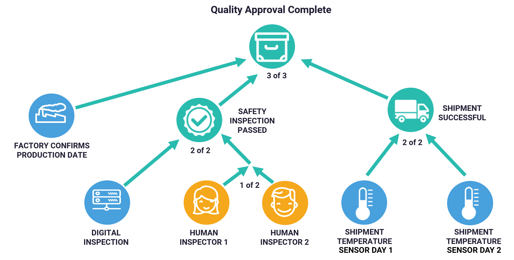
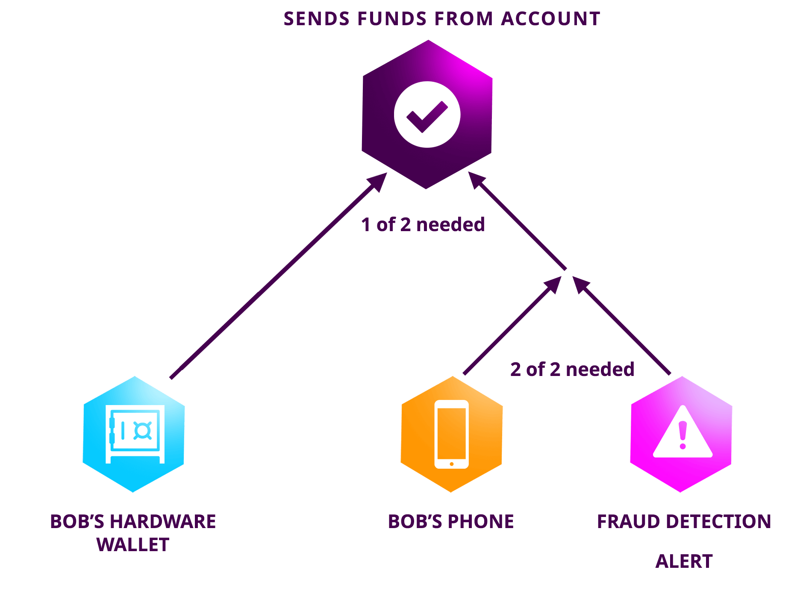
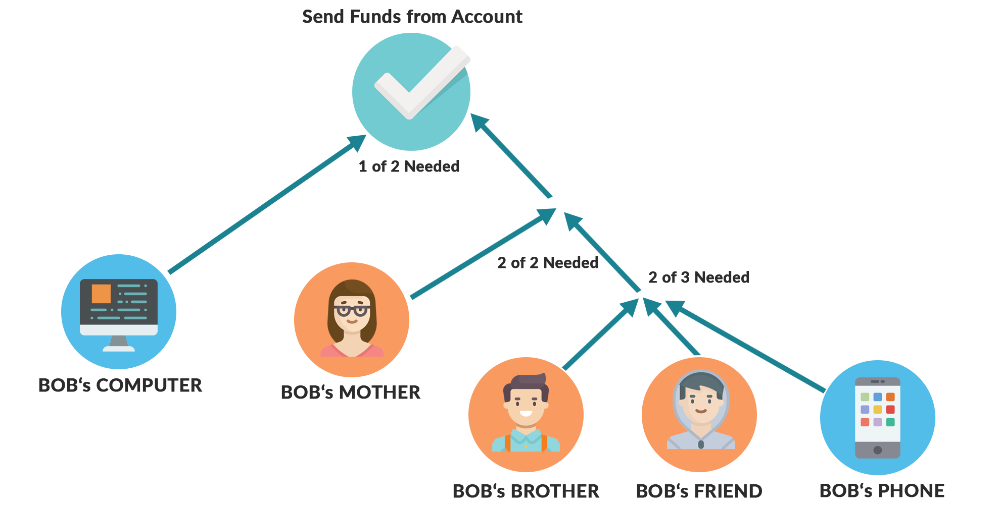

############################
Multi-Level Multisig Account
############################

:doc:`Multisig accounts <multisig-account>` can have as cosignatories other multisig accounts. Multi-level multisig accounts add “AND/OR” logic to multi-signature transactions.

The maximum depth of a multilevel multisig account is ``3``.

.. note:: Configuration parameters are `editable <https://github.com/nemtech/catapult-server/blob/master/resources/config-network.properties>`_ . Public network configuration may differ.

********
Examples
********

MLMA allows a huge variety of business logic.

Manufacturing and Supply Chains
===============================

In this example, a manufacturer is shipping a pharmaceutical product.

The product receives its quality approval :doc:`mosaic <mosaic>` only when its blockchain record shows it has a production date, safety inspection, and was shipped at the correct temperature.

Sensors in the shipping container report temperature data every 5 minutes and consolidate it into a daily report.

    Manufacturing and Supply Chains

Fraud Detection
===============

This example shows how a high-security account can be made easier to use.

Transactions are only approved from a hardware wallet OR your phone AND a fraud detection AI. MLMA allows a variety of security configurations at the protocol level to keep businesses and their customers hack-free.

    Fraud Detection

Account Recovery
================

You can set up your account so it can be recovered only with the approval of signatures from specified accounts, such as your friends and family. Combine the branches any way you like.

    Account Recovery