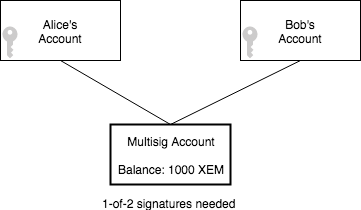
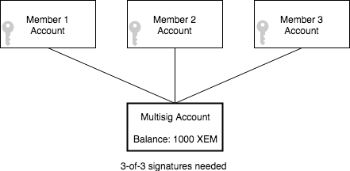
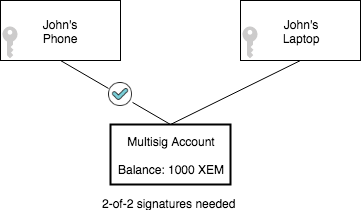

################
Multisig Account
################

.. warning:: The configuration presented is NOT intended to be used on the public network. These are the parameters used for the Catapult Testnet version (MIJIN_TEST).

Editable on-chain contracts, the most powerful way to secure funds and enable joint accounts.

A NEM :doc:`account <account>` can be :doc:`converted to multisig <../guides/account/converting-an-account-to-multisig>`. From that moment on, the account cannot announce transactions by itself. It will require other accounts to announce transactions for them. These other accounts are the multisig ``cosignatories``.

Nevertheless, it is not always necessary to force all cosignatories to cosign the transaction. NEM allows to set up the minimum number of consignatory agreements. These properties can be edited afterwards to suit almost all needs.

Some important considerations to keep in mind:

* Once you convert an account to a multisig, you can no longer initiate transactions from that account. Only cosignatories can initiate transactions for the account.

* NEM's current implementation of multisig is *"M-of-N"*. This means that M can be any number equal to or less than N, i.e., 1-of-4, 2-of-2, 4-of-9, 9-of-10 and so on.

* Multisig accounts can have up to ``10`` cosignatories.

* An account can be cosigner of up to ``5`` multisig accounts.

* The number of minimum cosignatures to approve transactions and remove cosignatories is editable.

* Multisig accounts can have as a cosigner another multisig, up to ``3`` levels. See :doc:`Multi-level Multisig Account <multi-level-multisig-account>`.

.. note:: Multisig accounts are a powerful tool, but please use this tool with caution.  If cosignatories keys get lost and minimum approval is not reached, it would result in the permanent loss of access to the funds held by the multisig account. Choose wisely ``minimum removal`` parameter to avoid this situation.

.. _modify-multisig-account-transaction:

**************************************
Modifying multisig account transaction
**************************************

Modifying multisig account transaction is used to change properties of a multisig account.

    **Minimum Approval Delta**

    The number of signatures needed to approve a transaction. If we are modifying an existing multisig account, this indicates the relative change of the minimum cosignatories.

    **Minimum Removal Delta**

    The number of signatures needed to remove a cosignatory. If we are modifying an existing multisig account, this indicates the relative change of the minimum cosignatories.

    **Modifications**

    List of :doc:`accounts <account>` enabled to announce and cosign transactions for its approval.

.. raw:: html

    <h2>Examples</h2>

There is a broad range of useful applications for multisig accounts. Let's take a look at some of the most common use cases.

1. Alice and Bob live together. They have separate accounts, but they also need a shared account so that if Bob is out shopping, he can buy groceries for both him and Alice.

    M-of-N multisig account example

2. Several families are members of the local philatelist society and use a shared account to buy stamps. To ensure that all agree on which old stamps they should buy and on the right price, they use a multisig account. This way, all members of the society need to approve the transaction before it is included in the blockchain.

    N-of-N multisig account example

3. Security is another critical aspect of multisig accounts. Alice wants to make sure her funds are not compromised in any way. Therefore she sets up a multisig account with her funds and attaches two accounts (signer accounts) to control her multisig account as a form of 2-factor authentication. Both of her signer accounts need to approve the transaction, and her signer accounts are located on different computer platforms with different passwords. This means that even if an evil hacker or virus should compromise one of her accounts, the funds are still kept secure.

    Multi-factor authorization using multisig accounts

4. Multisig accounts can be used to represent the ownership of assets. A company could create a 1-of-1 multisig account for each of their products, adding themselves as the cosignatory. When the company sells the product to Alice, she becomes the owner, being the company removed in the same transaction.

.. figure:: ../resources/images/concepts-multisig-figure-4.png
    :align: center
    :width: 300px

    Transferring an account