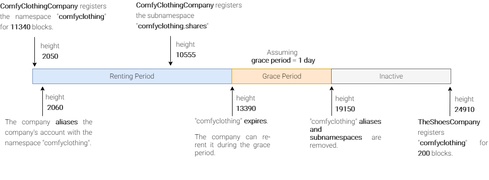
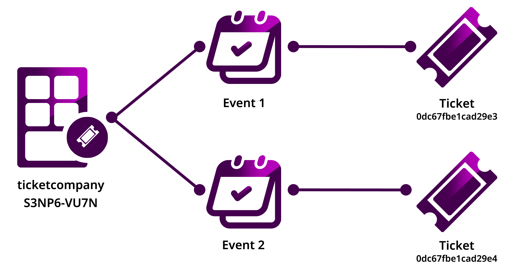

#########
Namespace
#########

Namespaces allow you to :doc:`create an on-chain unique place <../guides/namespace/registering-a-namespace>` for your business and your assets on the blockchain.

**********
Properties
**********

Find below the complete list of configurable properties.

Name
====

Namespaces function similarly to internet domains.
Creating a namespace starts with choosing a name that you will use to refer to an account or asset.
The name must be **unique in the network**, and may have a maximum length of ``64`` characters, and the allowed characters are a, b, c, …, z, 0, 1, 2, …, 9, _ , -.

Duration
========

At the time of the namespace registration, you must set the number of confirmed blocks you would like to rent the namespace for.

The public network defines a minimum namespace duration of ``30`` days and a maximum of ``365`` days, being these parameters :ref:`editable per network <config-network-properties>`.
By default, the network is configured to generate a block every ``15`` seconds.
You can use the following formula to convert approximately days to blocks:

.. math::

    duration ≈ numberOfDays * 86400 / blockGenerationTargetTimeInSeconds

    Namespace life-cycle

During the **renting period**, the namespace creator can create subnamespaces, alias accounts and mosaics.
The creator can also **extend the rental** by sending a :ref:`NamespaceRegistrationTransaction <namespace-registration-transaction>` with the desired number of additional blocks.

The network can define a **grace period** that enables the namespace creator to renew the namespace past the expiration date before it becomes publicly available for registration.
|codename|'s public network has set the :ref:`grace period <config-network-properties>` to ``30`` days.

When the grace period ends, the namespace is **deleted**.
At this point, the namespace becomes **available** for its registration again.

.. csv-table:: Permissions by namespace status
    :header: "Action", "Available", "Registration Period", "Grace Period"
    :delim: ;

    Register a new namespace; ✔️; ❌; ❌
    Renew the namespace;   ❌; ✔️; ✔️
    Create subnamespaces;   ❌; ✔️; ❌
    Link an alias to an address or mosaic;   ❌; ✔️; ❌
    Send a transaction using an alias;   ❌; ✔️; ❌

.. note:: Only namespaces created during the :doc:`nemesis block <block>` can have perpetual duration.

*************
Subnamespaces
*************

On the internet, a domain can have a sub-domain.
|codename| namespaces can have subnamespaces to identify and organize assets.

    Organizing assets with namespaces

In the :ref:`public network <config-network-properties>`, namespaces can have up to ``3`` levels—a namespace and its two levels of subnamespace domains.
Each root namespace can have up to ``256`` subnamespaces.

A subnamespace does not have a duration by its own; it inherits the duration from its parent namespace.

You can :doc:`create multiple subnamespaces <../guides/namespace/registering-a-subnamespace>` with the same name in different namespaces.
For example, you can create the subnamespaces ``foo.bar`` and ``foo2.bar``, but the combination rootnamespace + subnamespace must remain unique.

*****
Alias
*****

:ref:`Alias transactions <address-alias-transaction>` link namespaces to accounts and mosaics.
An alias or its linked asset can be used interchangeably when sending a transaction.
Using the alias makes *long addresses rememberable* and *mosaics recognizable*.

The creator of the namespace can :doc:`link the namespace <../guides/namespace/link-a-namespace-to-a-mosaic>` to an account or mosaic.
This link will be editable, so the creator may unlink a previously set alias and link the namespace to a different asset.

The block :doc:`receipts <receipt>` store the resolution of the alias for a given transaction.

Alias transactions have the following restrictions:

- An account or mosaic can be linked to many namespaces but one namespace can only be linked to one account or mosaic.
- An account can assign a namespace to any account that :doc:`permits receiving <account-restriction>` AddressAliasTransaction.
- An account can only link the alias to a mosaic id when the account is the creator of the mosaic.

.. _namespace-rental-fee:

**********
Rental fee
**********

An account willing to register a namespace or extend its duration has to pay a rental fee in addition to the :doc:`transaction fee <fees>`.
Both fees will be deducted from the account's balance after the announcement of a valid **NamespaceRegistrationTransaction**.

The :doc:`REST Gateway <../api>` provides an endpoint to get an estimation of how much network currency will cost you to register a namespace:

.. example-code::

    .. viewsource:: ../resources/examples/typescript/namespace/GettingNamespaceRentalFee.ts
        :language: typescript
        :start-after: /* start block 01 */
        :end-before: /* end block 01 */
    
    .. viewsource:: ../resources/examples/typescript/namespace/GettingNamespaceRentalFee.js
        :language: javascript
        :start-after: /* start block 01 */
        :end-before: /* end block 01 */

The default namespace rental fees are :ref:`configurable per network <config-network-properties>`, but the **network dynamically adjusts the namespace rental fees** over time.

.. csv-table:: Default values for public network
    :header: "Property", "Value"
    :delim: ;

    Registering a namespace; ``0.000001`` |networkcurrency| per block
    Extending a namespace duration; ``0.000001`` |networkcurrency| per block
    Creating a subnamespace; ``0.0001`` |networkcurrency|

To calculate the effective rental fee, the network multiplies the default value set in the configuration by the :doc:`median network multiplier <harvesting>` over last :ref:`maxDifficultyBlocks <config-network-properties>`.
In case there are zero multipliers, these are replaced by the :ref:`defaultDynamicFeeMultiplier <config-network-properties>` before the median calculation.

******
Guides
******

.. postlist::
    :category: Namespace
    :date: %A, %B %d, %Y
    :format: {title}
    :list-style: circle
    :excerpts:
    :sort:

*******************
Transaction schemas
*******************

.. _namespace-registration-transaction:

NamespaceRegistrationTransaction
================================

Announce a NamespaceRegistrationTransaction to register and re-rent a namespace.

**Version**: 0x01

**EntityType**: 0x414E

**Inlines**:

* :ref:`Transaction <transaction>` or :ref:`EmbeddedTransaction <embedded-transaction>`

.. csv-table::
    :header: "Property", "Type", "Description"
    :delim: ;

    duration; :schema:`BlockDuration <types.cats>`; Number of confirmed blocks you would like to rent the namespace for. Required for root namespaces.
    parentId; :schema:`NamespaceId <namespace/namespace_types.cats>`; Parent namespace identifier. Required for subnamespaces.
    id; :schema:`NamespaceId <namespace/namespace_types.cats#L1>`; Namespace identifier.
    registrationType; :ref:`NamespaceRegistrationType <namespace-registration-type>`; Namespace registration type.
    nameSize; uint8; Namespace name size in bytes.
    name; array(bytes, namespaceNameSize); Namespace name.

.. _address-alias-transaction:

AddressAliasTransaction
=======================

Announce an AliasTransaction to attach a namespace to an account. A namespace can be assigned to any account present in the network.

**Version**: 0x01

**EntityType**: 0x424E

**Inlines**:

* :ref:`Transaction <transaction>` or :ref:`EmbeddedTransaction <embedded-transaction>`

.. csv-table::
    :header: "Property", "Type", "Description"
    :delim: ;

    namespaceId; :schema:`NamespaceId <namespace/namespace_types.cats#L1>`; Identifier of the namespace that will become an alias.
    address; :schema:`Address <types.cats>`; Aliased address.
    aliasAction; :ref:`AliasAction <alias-action>`; Alias action.

.. _mosaic-alias-transaction:

MosaicAliasTransaction
======================

Announce an AliasTransaction to attach a namespace to a mosaic. Setting an alias to a mosaic is only possible if the account announcing the transaction has created the namespace and mosaic involved.

**Version**: 0x01

**EntityType**: 0x434E

**Inlines**:

* :ref:`Transaction <transaction>` or :ref:`EmbeddedTransaction <embedded-transaction>`

.. csv-table::
    :header: "Property", "Type", "Description"
    :delim: ;

    namespaceId; :schema:`NamespaceId <namespace/namespace_types.cats>`; Identifier of the namespace that will become an alias.
    mosaicId; :schema:`MosaicId <types.cats>`; Aliased mosaic identifier.
    aliasAction; :ref:`AliasAction <alias-action>`; Alias action.

.. _namespace-registration-type:

NamespaceRegistrationType
=========================

Enumeration: uint8

.. csv-table::
    :header: "Id", "Description"
    :delim: ;

    0; Root namespace.
    1; Child namespace.

.. _alias-action:

AliasAction
===========

Enumeration: uint8

.. csv-table::
    :header: "Id", "Description"
    :delim: ;

    0x00; Link alias.
    0x01; Unlink alias.

Continue: :doc:`Metadata <metadata>`.
