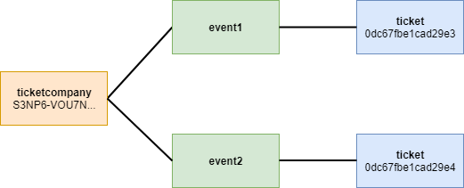

#########
Namespace
#########

Namespaces allow you to :doc:`create an on-chain unique place <../guides/namespace/registering-a-namespace>` for your business and your assets on the NEM blockchain.

    Organizing assets with namespaces

****
Name
****

A namespace starts with a name that you choose, similar to an internet domain name. The name must appear as **unique in the network**, and may have a maximum length of ``64`` characters. Allowed characters are a, b, c, …, z, 0, 1, 2, …, 9, _ , -.

*************
Subnamespaces
*************

On the internet, a domain can have a sub-domain. In NEM, namespaces can have subnamespaces.

You can :doc:`create multiple subnamespaces <../guides/namespace/registering-a-subnamespace>` with the same name in different namespaces. For example, you can create the subnamespaces ``foo.bar`` and ``foo2.bar``.

Namespaces can have up to ``3`` levels, a namespace and its two levels of subnamespace domains. A subnamespaces has the same duration as its parent namespace.

*****
Alias
*****

:ref:`Alias transactions <address-alias-transaction>` link namespaces to accounts and mosaics. An alias or its linked asset can be used interchangeably when sending a transaction. Using the alias makes *long addresses rememberable* and *mosaics recognizable*.

The creator of the namespace can :doc:`link the namespace <../guides/namespace/link-a-namespace-to-a-mosaic>` to an account or mosaic. This link will be editable, so the creator may unlink a previously set alias and link the namespace to a different asset.

The block :doc:`receipts <receipt>` store the resolution of the alias for a given transaction.

**Restrictions:**

- An account can only associate a name with one account or mosaic, but those can have many aliases linked.
- An account can assign a name to any account that :doc:`permits receiving <account-restriction>` AddressAliasTransaction.
- An account can only link the alias to a mosaicId when the account is the creator of the mosaic.

********
Duration
********

At the time of the namespace **registration**, you must set the number of confirmed blocks you would like to rent the namespace for.

The maximum namespace duration is ``365`` days. By default, the network is configured to generate a block every ``15`` seconds. You can use the following formula to convert approximately days to blocks:

    duration ≈ numberOfDays * 86400 / blockGenerationTargetTimeInSeconds

.. figure:: ../resources/images/diagrams/namespace-life-cycle.png
    :width: 800px
    :align: center

    Namespace life-cycle

During the **renting period**, the namespace owner can create subnamespaces, alias accounts and mosaics. The owner can also **extend the rental** by sending a :ref:`register namespace transaction <register-namespace-transaction>` with the desired number of additional blocks.

The network :properties:`can define <config-network.properties>` a **grace period** that enables the namespace owner to renew the namespace past the expiration date before it becomes publicly available for registration.

When the grace period ends, the namespace is **deleted**. At this point, the namespace becomes **available** for its registration again.

.. csv-table:: Permissions by namespace status
    :header: "Action", "Available", "Registration Period", "Grace Period"
    :delim: ;

    Register a new namespace; ✔️; ❌; ❌
    Renew the namespace;   ❌; ✔️; ✔️
    Create subnamespaces;   ❌; ✔️; ❌
    Link an alias to an address or mosaic;   ❌; ✔️; ❌
    Send a transaction using an alias;   ❌; ✔️; ❌

****
Cost
****

The cost of creating a namespace is :properties:`configurable per network <config-network.properties>`. By default, registering a namespace costs ``1 cat.currency per block`` plus transactions fees. Registering a subnamespace has a fixed cost of ``100 cat.currency`` plus transaction fees.

*******
Example
*******

A customer buys a ticket for an event. The ticket sales company sends a ticket to the customer account.

.. figure:: ../resources/images/examples/namespace-tickets.png
    :align: center
    :width: 500px

    Recognizable mosaics and addresses

Identifying the sender
======================

The ticket seller has registered the namespace ``ticketcompany`` to link it to its account as an alias. Customers can quickly recognize incoming transactions from the vendor account.

Identifying the ticket
======================

The same company sells tickets for events organized in different venues. The company registers a non-transferable :doc:`mosaic <mosaic>` for each actuation.

The ticket seller adds a series of subdomains on top of the root domain of ``ticketcompany``. The root plus subdomains are ``ticketcompany.event<ID>.ticket``.

The company links one registered mosaic with ``ticketcompany.event1.ticket`` namespace name.

Identifying the buyer
=====================

Alice, who wants to buy the ticket, has registered the namespace ``alice`` and assigned it to her account as an alias.

The ticket vendor can send 1 ``ticketcompany.event1.ticket`` to ``alice`` instead of 1  ``0dc67fbe1cad29e3`` to ``SCVG35-ZSPMYP-L2POZQ-JGSVEG-RYOJ3V-BNIU3U-N2E6``.

******
Guides
******

.. postlist::
    :category: Namespace
    :date: %A, %B %d, %Y
    :format: {title}
    :list-style: circle
    :excerpts:
    :sort:

*******
Schemas
*******

.. note:: Configuration parameters are :properties:`editable <config-network.properties>`. Public network configuration may differ.

.. _register-namespace-transaction:

RegisterNamespaceTransaction
============================

Announce a register namespace transaction to register and re-rent a namespace.

**Version**: 0x01

**Entity type**: 0x414E

**Inlines**:

* :ref:`Transaction <transaction>` or :ref:`EmbeddedTransaction <embedded-transaction>`

.. csv-table::
    :header: "Property", "Type", "Description"
    :delim: ;

    namespaceType; :ref:`NamespaceType <namespace-type>`; Type of the registered namespace.
    duration; :schema:`BlockDuration <types.cats#L2>`; Number of confirmed blocks you would like to rent the namespace for. Duration is allowed to lie up to ``365`` days. Required for root namespaces.
    parentId; :schema:`NamespaceId <namespace/namespace_types.cats#L1>`; Identifier of the parent namespace. Required for subnamespaces.
    namespaceId; :schema:`NamespaceId <namespace/namespace_types.cats#L1>`; Identifier of the namespace.
    namespaceNameSize; uint8; The size of the namespace name.
    name; array(bytes, namespaceNameSize); A namespace name must be unique and may have a maximum length of ``64`` characters. Allowed characters are a, b, c, ..., z, 0, 1, 2, ..., 9, _ , -.

.. _address-alias-transaction:

AddressAliasTransaction
=======================

Announce an alias transaction to attach a namespace to an account. A namespace can be assigned to any account present in the network.

**Version**: 0x01

**Entity type**: 0x424E

**Inlines**:

* :ref:`Transaction <transaction>` or :ref:`EmbeddedTransaction <embedded-transaction>`

.. csv-table::
    :header: "Property", "Type", "Description"
    :delim: ;

    aliasAction; :ref:`AliasAction <alias-action>`; Alias action.
    namespaceId; :schema:`NamespaceId <namespace/namespace_types.cats#L1>`; Identifier of the namespace that will become an alias.
    address; :schema:`Address <types.cats#L8>`; Aliased address.

.. _mosaic-alias-transaction:

MosaicAliasTransaction
======================

Announce an alias transaction to attach a namespace to a mosaic. Setting an alias to a mosaic is only possible if the account announcing the transaction has created the namespace and mosaic involved.

**Version**: 0x01

**Entity type**: 0x434E

**Inlines**:

* :ref:`Transaction <transaction>` or :ref:`EmbeddedTransaction <embedded-transaction>`

.. csv-table::
    :header: "Property", "Type", "Description"
    :delim: ;

    aliasAction; :ref:`AliasAction <alias-action>`; Alias action.
    namespaceId; :schema:`NamespaceId <namespace/namespace_types.cats#L1>`; Identifier of the namespace that will become an alias.
    mosaicId; :schema:`MosaicId <types.cats#L4>`; Identifier of the aliased mosaic.

.. _namespace-type:

NamespaceType
=============

Enumeration: uint8

.. csv-table::
    :header: "Id", "Description"
    :delim: ;

    0; Root namespace.
    1; Child namespace.

.. _alias-action:

AliasAction
===========

Enumeration: uint8

.. csv-table::
    :header: "Id", "Description"
    :delim: ;

    0; Link alias.
    1; Unlink alias.
