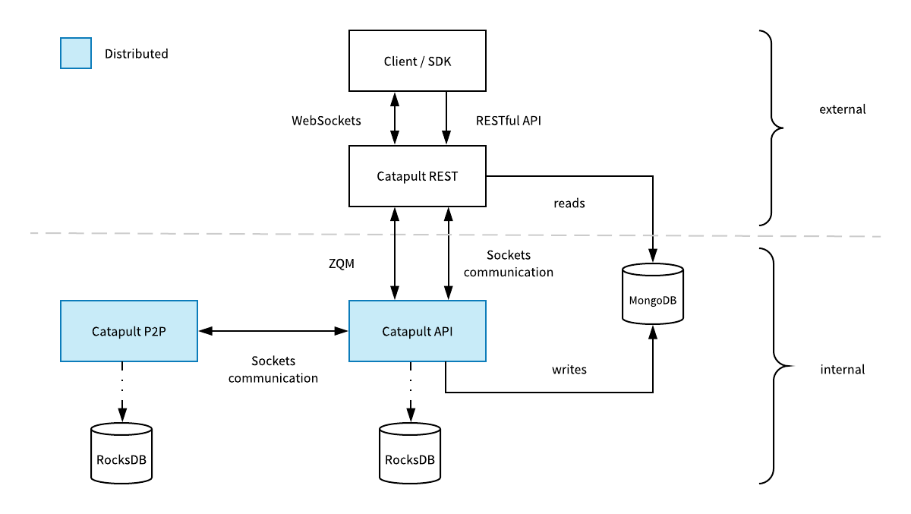

####
Node
####

The NEM blockchain platform is built from a network of nodes. These nodes provide a powerful, easy-to-use, stable, and secure platform where Smart Assets transactions are conducted, searched, and immutably logged to the blockchain ledger.

    Catapult’s Performance Advantage: A Four-Layered Architecture

The four-layered architecture allows developers to update any of these tiers without disrupting the others, which improves security.

NEM nodes are represented in the two first layers. The blockchain server and the Rest API can be run separately, having two types of nodes:

.. note: Guides explaining how to run a main net node are pending to be published. See how to run :doc:`Catapult in local<../guides/running-a-node>` for testing purposes.

Catapult Server: The blockchain network
=======================================

**Repository:** |catapult-server|

These nodes work with other nodes to build the peer-to-peer blockchain network. In short, this network creates and supports the blockchain itself.

The server verifies transactions, maintains a database, synchronizes with other nodes, and maintains stability and trustworthiness to create a network that is fast, secure, and scalable.

Catapult REST: MongoDB & API Server
===================================

**Repository:** |catapult-rest|

Catapult Rest provides the :doc:`API <../api/overview>` gateway that applications may use to access the blockchain and its features.

MongoDB serves supplemental data to Catapult REST clients. It is used for high query performance to satisfy high transaction per second scenarios.

Your application does not need to run any complex node software; all usage functionality is available through the API interface.

.. |catapult-server| raw:: html

   <a href="https://github.com/nemtech/catapult-server" target="_blank">Catapult Server</a>

.. |catapult-rest| raw:: html

    <a href="https://github.com/nemtech/catapult-rest" target="_blank">Catapult Rest</a>

