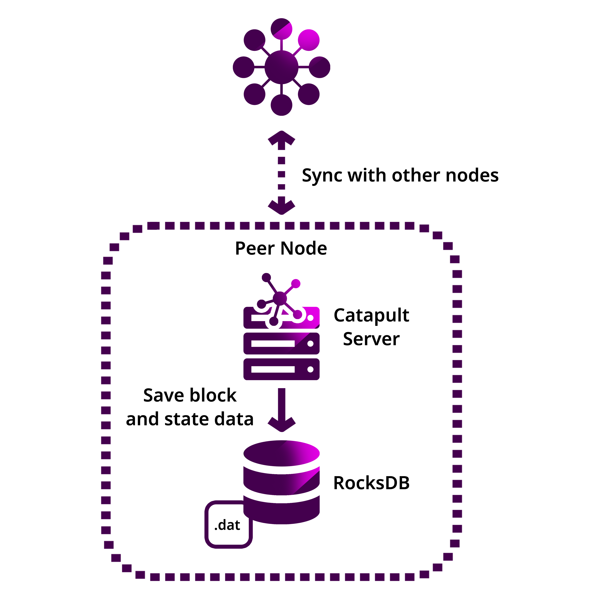
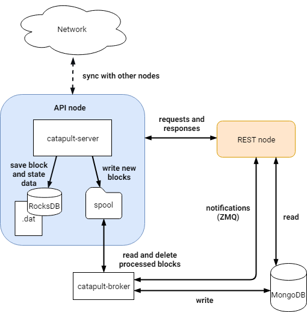

####
Node
####

|codename| blockchain platform is built from a **network of nodes**.
These nodes provide a powerful, stable, and secure platform where Smart Assets transactions are conducted, searched, and immutably logged on the blockchain ledger.

.. figure:: ../resources/images/diagrams/four-layer-architecture.png
    :width: 550px
    :align: center

    |codename|’s Performance Advantage: A Four-Layered Architecture

The **four-layered architecture** allows developers to update any of these tiers without disrupting the others, which improves security.

.. _peer-node:

*********
Peer node
*********

**Repository:** |catapult-client|

    Peer node communication

The peer nodes form the backbone of the blockchain, making the network robust since it cannot be shut down by eliminating a single entity.
The role of the node is to :ref:`verify transactions <transaction-validation>` and :doc:`blocks<block>`, run the consensus algorithm, create new blocks, and propagate the changes through the network.

The API nodes push new transactions to the P2P network, where they are :doc:`included in a block <harvesting>` or discarded.
After the block is processed, the node saves:

* The binary of each block as a flat-file on disk.
* The updated chain state in memory or RocksDB (configurable).

RocksDB
=======

Peer nodes store the chain state in |rocksdb|.
The data structures cached are serialized and stored as values to corresponding keys.
For example, a column in this database maps the public keys to addresses.
Another one, the account state entries as the values to corresponding address keys.

Storing the state in memory is faster than using RocksDB.
However, storing state information in RocksDB demands less memory of the network nodes.

.. note:: Persisting the state in RocksDB is convenient in networks with a large number of accounts.

Node reputation
===============

Public networks enable anyone to run a node.
Some of these nodes could share invalid information or try to disturb the network.

To reduce miscommunication attempts, the nodes keep track of the results of preceding communications.
Every node with P2P capabilities keeps a success and a failure counter for every other peer node that it has interacted with.

Nodes update the counters accordingly after processing the data requested.
If a node successfully connects to a remote peer, it first increments the success counter towards the remote peer.
If the communication attempt fails, the node increments the remote peer’s failure counter.
Likewise, the node updates the peer counters accordingly after processing data shared.

Extrapolating from these scores, the node assigns a weight between 500 and 10000 to every peer reached.

The probability of selecting a remote node to read data from depends linearly on its weight.
Every four rounds of node selections, the criteria changes to prevent |sybil|.

.. _api-node:

********
API node
********

**Repository:** |catapult-client|

    Peer + API (Dual) node communication

The primary responsibility of an API node is to store the data in a readable form in MongoDB.
The catapult-client software allows configuring standalone API nodes or with Peer capabilities (Dual).

Instead of writing the data directly into MongoDB, the nodes write it into a file-based queue called ``spool``.
A broker service consumes the data from the spool and updates MongoDB accordingly.
Once a block is processed, the broker service notifies the changes to catapult-rest instances using ZMQ.

API nodes are also responsible for collecting the cosignatures of :doc:`aggregated bonded transactions <aggregate-transaction>`, which are only processed once they are complete.

MongoDB
=======

|mongodb| stores blocks, transactions, and chain states for high query performance.

The broker service updates the linked MongoDB instance when:

* A new block / a bunch of blocks finish processing.
* New unconfirmed transactions complete processing.

.. note:: MongoDB should not be accessed externally.

ZMQ
====

|zmq| is an asynchronous messaging library, which enables real-time subscriptions.
It transports notifications from the API node to the ZMQ endpoint, where Catapult REST listens.
It is an alternative to REST WebSockets, aimed to be used when performance is critical.

.. _rest-gateway:

************
REST gateway
************

**Repository:** |catapult-rest|

.. figure:: ../resources/images/diagrams/rest-detail.png
    :width: 500px
    :align: center

    REST gateway communication

The REST gateways handle :doc:`JSON API <../api>` client requests.
The gateway reads from MongoDB, formats the response, and returns it to the client.
This component is also responsible for returning events to the client using :ref:`WebSockets <websockets>`.

Each REST gateway connects to one API instance to send new transactions requests triggered from the client-side and receive updates in real-time using sockets.

.. |catapult-client| raw:: html

   <a href="https://github.com/symbol/catapult-client" target="_blank">Catapult Client</a>

.. |catapult-rest| raw:: html

    <a href="https://github.com/symbol/catapult-rest" target="_blank">Catapult REST</a>

.. |rocksdb| raw:: html

  <a href=" https://en.wikipedia.org/wiki/RocksDB" target="_blank">RocksDB</a>

.. |mongodb| raw:: html

  <a href="https://es.wikipedia.org/wiki/MongoDB" target="_blank">MongoDB</a>

.. |zmq| raw:: html

  <a href=" https://en.wikipedia.org/wiki/ZeroMQ" target="_blank">ZeroMQ</a>

.. |sybil| raw:: html

  <a href=" https://en.wikipedia.org/wiki/Sybil_attack" target="_blank">Sybil attacks</a>

**************
Related guides
**************

.. postlist::
    :category: Network
    :date: %A, %B %d, %Y
    :format: {title}
    :list-style: circle
    :excerpts:
    :sort:
