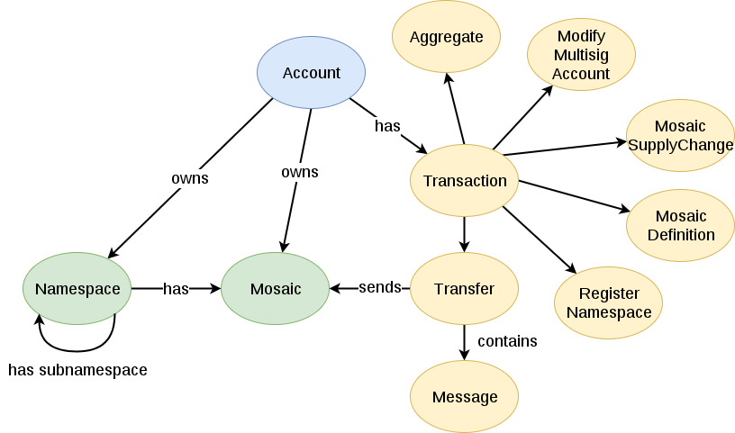

#########
Overview
#########

This section presents high-level concepts to understand NEM features.

    NEM basic concepts interrelated

* :doc:`Account<account>`: Key pair associated to a mutable state stored on the blockchain. Certain :doc:`permissions can be assigned <multisig-account>` to other accounts.
* :doc:`Transaction <transaction>`: Actions taken on the blockchain that change its state.
* :doc:`Namespace <namespace>`: Unique naming convention system.
* :doc:`Mosaic <mosaic>`: Asset representation system.
* :doc:`Block <block>`: Group of transactions that links to previous block, conforming the blockchain.
* :doc:`Node <node>`: Entities that exchange data in the network.