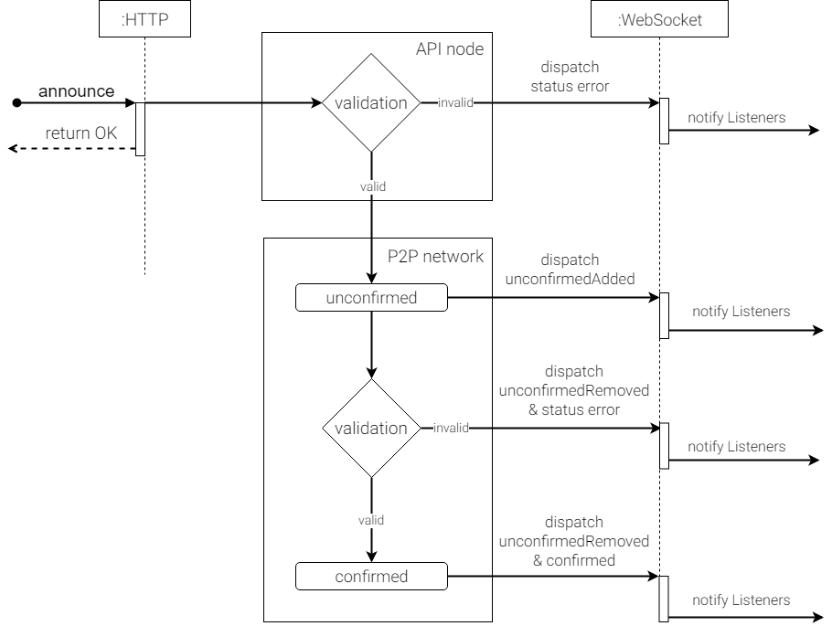

###########
Transaction
###########

A transaction generally represents a unit of work within a database system.
In the case of blockchain, that is when an action signed by an :doc:`account <account>` changes its state.

*****************
Transaction types
*****************

.. _transaction-types:

|codename| supports many different transaction types.
For example, there are transactions to transfer :doc:`mosaics <mosaic>` between accounts, messages or configure the ownership of accounts (including the use of :doc:`multisig <multisig-account>` rules), and more.

The following transaction types are included in |codename| based networks by default:

.. csv-table::
    :header:  "Id",  "Type", "Description"
    :widths: 20 30 50
    :delim: ;

    **Account Link**;;
    0x414C; :ref:`AccountKeyLinkTransaction <account-key-link-transaction>`; Delegate the account importance to a proxy account. Required for all accounts willing to activate delegated harvesting.
    0x424C; :ref:`NodeKeyLinkTransaction <node-key-link-transaction>`; Link an account with a public key used by TLS to create sessions. Required for node operators.
    **Aggregate**;;
    0x4141; :ref:`AggregateCompleteTransaction <aggregate-transaction>`; Send transactions in batches to different accounts.
    0x4241; :ref:`AggregateBondedTransaction <aggregate-transaction>`; Propose an arrangement of transactions between different accounts.
    --; :ref:`CosignatureTransaction <cosignature-transaction>`; Cosign an AggregateBondedTransaction.
    **Core**;;
    0x4143; :ref:`VotingKeyLinkTransaction <voting-key-link-transaction>`; Link an account with a BLS public key. Required for node operators willing to vote finalized blocks.
    0x4243; :ref:`VrfKeyLinkTransaction <vrf-key-link-transaction>`; Link an account with a VRF public key. Required for all harvesting eligible accounts.
    **Mosaic**;;
    0x414D; :ref:`MosaicDefinitionTransaction <mosaic-definition-transaction>`; Create a new mosaic.
    0x424D; :ref:`MosaicSupplyChangeTransaction <mosaic-supply-change-transaction>`; Change the mosaic total supply.
    **Namespace**;;
    0x414E; :ref:`NamespaceRegistrationTransaction <namespace-registration-transaction>`; Register a namespace to organize your assets.
    0x424E; :ref:`AddressAliasTransaction <address-alias-transaction>`; Attach a namespace name to an account.
    0x434E; :ref:`MosaicAliasTransaction <mosaic-alias-transaction>`; Attach a namespace name to a mosaic.
    **Metadata**;;
    0x4144; :ref:`AccountMetadataTransaction <account-metadata-transaction>`; Associate a key-value state to an account.
    0x4244; :ref:`MosaicMetadataTransaction <mosaic-metadata-transaction>`; Associate a key-value state to a mosaic.
    0x4344; :ref:`NamespaceMetadataTransaction <namespace-metadata-transaction>`; Associate a key-value state to a namespace.
    **Multisignature**;;
    0x4155; :ref:`MultisigAccountModificationTransaction <multisig-account-modification-transaction>`; Create or modify a multisig contract.
    **Hash Lock**;;
    0x4148; :ref:`HashLockTransaction <hash-lock-transaction>`;  Lock a deposit needed to announce aggregate bonded transactions.
    **Secret Lock**;;
    0x4152; :ref:`SecretLockTransaction <secret-lock-transaction>`; Start a token swap between different chains.
    0x4252; :ref:`SecretProofTransaction <secret-proof-transaction>`; Conclude a token swap between different chains.
    **Account restriction**;;
    0x4150; :ref:`AccountAddressRestrictionTransaction <account-address-restriction-transaction>`; Allow or block incoming and outgoing transactions for a given a set of addresses.
    0x4250; :ref:`AccountMosaicRestrictionTransaction <account-mosaic-restriction-transaction>`; Allow or block incoming transactions containing a given set of mosaics.
    0x4350; :ref:`AccountOperationRestrictionTransaction <account-operation-restriction-transaction>`; Allow or block outgoing transactions by transaction type.
    **Mosaic restriction**;;
    0x4151; :ref:`MosaicGlobalRestrictionTransaction  <mosaic-global-restriction-transaction>`; Set global rules to transfer a restrictable mosaic.
    0x4251; :ref:`MosaicAddressRestrictionTransaction <mosaic-address-restriction-transaction>`; Set address specific rules to transfer a restrictable mosaic.
    **Transfer**;;
    0x4154; :ref:`TransferTransaction <transfer-transaction>`; Send mosaics and messages between two accounts.

Every base transaction type available in |codename| is defined as a separate :doc:`plugin <plugin>`.
The plugin approach allows developers to introduce new transaction types without modifying the core engine or disrupting other features.

.. _transaction-definition:

**********************
Defining a transaction
**********************

Transactions are defined in a serialized form.
Every transaction extends from the base :ref:`transaction schema definition <transaction>`, adding the type's particular properties.

All transactions should define a deadline and a max_fee:

* ``deadline``: A transaction has a time window to be accepted before it reaches its deadline. The transaction expires when the deadline is reached and all the nodes reject the transaction. By default, the SDK sets the deadline to 2 hours, but it can be extended up to 24 hours.

* ``max_fee``: The maximum amount of network currency that the sender of the transaction is willing to pay to get the transaction accepted. :doc:`The next documentation <fees>` shows you how to set the optimal max_fee value.

.. note:: The `catbuffer schemas <https://github.com/nemtech/catbuffer>`_ repository defines how each transaction type should be serialized. In combination with the `catbuffer-generators <https://github.com/nemtech/catbuffer-generators>`_ project, developers can generate builder classes for a given set of programming languages.

We recommend using the :doc:`SDK <../sdk>` to define new transactions.

.. example-code::

    .. viewsource:: ../resources/examples/typescript/transfer/SendingATransferTransaction.ts
        :language: typescript
        :start-after:  /* start block 01 */
        :end-before: /* end block 01 */

.. _transaction-signature:

*********************
Signing a transaction
*********************

Accounts must sign transactions before announcing them to the network.
Signing a transaction expresses the account's agreement to change the network state as defined.

For example, a TransferTransaction describes who the recipient is and the number of mosaics to transfer.
In this case, signing the transaction means to accept moving those mosaics from one account's balance to another.

An account has to follow the next steps to `sign a transaction <https://github.com/nemtech/symbol-sdk-typescript-javascript/blob/master/src/model/transaction/Transaction.ts#L216>`_:

1. Get the ``signing bytes``, which are all the bytes of the transaction except the size, signature, and signer.
2. Get the nemesis block ``generation hash``. You can query ``nodeUrl + '/node/info'`` and copy ``meta.networkGenerationHash`` value.
3. Prepend the nemesis block generation hash to the signing bytes.
4. Sign the resulting string with the signer's private key. This will give you the transaction ``signature``.
5. Append the signer's signature and public key to the transaction to obtain the ``payload``.
6. Calculate the `transaction hash <https://github.com/nemtech/symbol-sdk-typescript-javascript/blob/master/src/model/transaction/Transaction.ts#L127>`_ by applying SHA3-512 hashing algorithm to the first 32 bytes of signature, the signer public key, nemesis block generation hash, and the remaining transaction payload.

.. example-code::

    .. viewsource:: ../resources/examples/typescript/transfer/SendingATransferTransaction.ts
        :language: typescript
        :start-after:  /* start block 02 */
        :end-before: /* end block 02 */

.. _transaction-validation:

************************
Announcing a transaction
************************

Signed transactions are ready to be announced to the network.
You can either use the SDK ``TransactionHttp`` service or append the payload to the request of the `transaction endpoint <https://nemtech.github.io/symbol-openapi/#operation/announceTransaction>`_.

.. example-code::

    .. viewsource:: ../resources/examples/typescript/transfer/SendingATransferTransaction.ts
        :language: typescript
        :start-after:  /* start block 03 */
        :end-before: /* end block 03 */

    .. code-block:: bash

        curl -X PUT -H "Content-type: application/json" -d '{"payload":"B3000000F77A8DCFCB57B81F9BE5B46738F7132998F55123BFF4D89DC8E5CAE1F071A040E5571F4D8DA125B243C785DA5261F878E3DE898815F6E8F12A2C0A5F0A9C3504FA6249E8334E3F83E972461125504AFFD3E7750AFBB3371E7B2D22A599A3D0E3039054410000000000000000265DEE3F1700000090FA39EC47E05600AFA74308A7EA607D145E371B5F4F1447BC0F00010057656C636F6D6520546F204E454D44B262C46CEABB858096980000000000"}' http://localhost:3000/transaction

After announcing the transaction, the REST API will always return an OK response immediately.
At this point, it is still unknown whether the transaction is valid.

    Transaction cycle

**********
Validation
**********

The first stage of validation happens in the API nodes.
If the transaction presents some error, the WebSocket throws a notification through the status channel.
In the positive case, the transaction reaches the P2P network with an **unconfirmed** status.
Never rely on a transaction that has an unconfirmed state.
It is not clear if it will get included in a block, as it should pass a second validation.

The second validation is done before the transaction is added in a :doc:`harvested block <block>`.
If valid, the harvester stores the transaction in a block and reaches the **confirmed** status.

Continuing the previous example, the transaction gets processed and the amount stated gets transferred from the signer's account to the recipient's account.
Additionally, the :doc:`transaction fee <fees>` is deducted from the signer's account.

The transaction has zero confirmations at this point.
When another block is added to the blockchain, the transaction has one confirmation.
The next block added to the chain will give it two confirmations and so on.

Under certain circumstances, like network failure or partition, the most recent confirmed blocks might need to be reversed.
:ref:`Rollbacks <rollbacks>` are characteristic of blockchain systems and essential to resolve forks.

In the public network, a transaction is considered to be irrevocable when it receives ``398`` confirmations. But the maximum number of blocks that can be rolled back is :ref:`configurable per network <config-network-properties>`.
In other words, it is necessary to wait at least ``398`` blocks after a transaction receives its first confirmation to guarantee that it cannot be reversed on the public network.

*************
Spam Throttle
*************

The node's cache holds unconfirmed transactions until they can be included in a block.
Since cache is a valuable resource, |codename| implements a spam throttle that prevents an attacker from filling the cache with unconfirmed transactions while still letting honest actors successfully submit new unconfirmed transactions.

The spam throttle controls the amount of unconfirmed transactions accounts can submit by calculating the fair share of cache for each account relative to its importance score.
If an account has surpassed its fair share of the cache and the node cache contains more unconfirmed transactions than the amount that can be included in a single block, the transaction will be rejected.
This effectively blocks malicious actors from spamming a node with transactions while allowing other users to continue using the node normally.

******
Guides
******

.. postlist::
    :category: Monitoring
    :date: %A, %B %d, %Y
    :format: {title}
    :list-style: circle
    :excerpts:
    :sort:

Continue: :doc:`Fees <fees>`.
