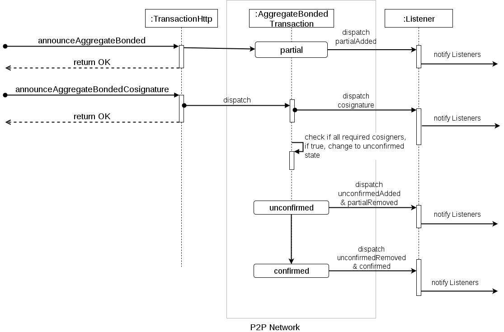

###########
Transaction
###########

.. warning:: The configuration presented is NOT intended to be used on the public network. These are the parameters used for the Catapult Testnet version (MIJIN_TEST).

Transactions are actions taken on the blockchain that change its state.

Once a transaction is initiated, it is still unconfirmed and thus not yet accepted by the network. At this point, it is not clear if it will get included in a block. Never rely on a transaction which has the state unconfirmed.

.. figure:: ../resources/images/transaction-cycle.png
    :width: 800px
    :align: center

    Transaction cycle

Once it is included in a :doc:`block <block>`, the transaction gets processed and, in case of a transfer transaction, the amount stated in the transaction gets transferred from the sender's account to the recipient's account. Additionally, the transaction fee is deducted from the sender's account.

The transaction is said to have 0 confirmations at this point. When another block is added to the blockchain, the transaction has 1 confirmation. The next block added to the chain will give it 2 confirmations and so on.

Cryptocurrencies have the ability to roll back part of the blockchain. This is essential for being able to resolve forks of the blockchain. 

There is, however, a maximum number of blocks that can be rolled back, which is called the "rewrite limit". Hence, forks can only be resolved up to a certain depth too. 

NEM has a rewrite limit of 360 blocks. Once a transaction has more than 360 confirmations, it cannot be reversed. 

In real life, forks that are deeper than 20 blocks do not happen, unless there are some severe problem with the blockchain due to a bug in the code or an attack of some kind.

******
Fields
******

Transactions share the following properties:

    **Type**

    NEM defines some types of transactions that can be performed. See :ref:`transaction types <transaction-types>`.

    **Version number**

    The version of the structure.

    **Deadline**

    The maximum amount of time to include the transaction in the blockchain.

    **Fee**

    How many XEM costs announcing the transaction.

    **Signature**

    The transaction signature.

    **Signer**

    The account of the transaction creator public key.

.. _transaction-types:

*****************
Transaction types
*****************

.. _transfer-transaction:

Transfer transaction
====================

Transfer transaction is used to send :doc:`assets <mosaic>` between two accounts. It can hold a message of length ``1024``.

Following parameters are required:

    **Recipient**

    The address of the recipient account.

    **Mosaics**

    The array of mosaic to be sent.

    **Message**

    The transaction message of ``1024`` characters.

.. _register-namespace-transaction:

Register namespace transaction
==============================

Register namespace transaction is used to create and re-rental a :doc:`namespace<namespace>` or subnamespace.

    **Type**

    The namespace type could be namespace or subnamespace.

    **Name**

    A namespace name must be unique and may have a maximum length of ``64`` characters.

    Allowed characters are a, b, c, ..., z, 0, 1, 2, ..., 9, ', _ , -.

    **Duration**

    Renting duration represents the number of confirmed blocks we would like to rent our namespace for.

    During the renting period, there is the possibility to extend the rental by sending a ``RegisterNamespaceTransaction`` with the extra-confirmed block to rent the namespace.

    When a renting period ends, the namespace will become inactive, and you will have ``N`` blocks to re-rent it.

    **Parent namespace**

    If it is a subdomain, a reference to parent namespace name is required.

.. _mosaic-definition-transaction:

Mosaic definition transaction
=============================

Mosaic definition transaction is used to create a new :doc:`mosaic<mosaic>`.

    **Name**

    Name of the mosaic, up to a size limit of ``64`` characters; must be unique under the domain name.

    **Namespace name**

    To be able to create a mosaic definition, an account must rent at least one root namespace which the mosaic definition can then refer to.

    **Mosaic properties**

    * ``divisibility``: Determines up to what decimal place the mosaic can be divided. Divisibility of 3 means that a mosaic can be divided into smallest parts of 0.001 mosaics. The divisibility must be in the range of 0 and 6.

    * ``duration``: The number of confirmed blocks we would like to rent our namespace for. Should be inferior or equal to namespace duration.

    * ``supply``: The amount of mosaic in circulation. The creator can specify an initial supply of mosaics when creating the definition. The initial supply must be in the range of 0 and 9,000,000,000.

    * ``supply mutable``: The creator can choose between a definition that allows a mosaic supply change at a later point or a **immutable** supply. In the first case the creator is only allowed to decrease the supply within the limits of mosaics owned.

    * ``transferability``: The creator can choose if the mosaic can be transferred to and from arbitrary accounts, or only allowing itself to be the recipient once transferred for the first time.

.. _mosaic-supply-change-transaction:

Mosaic supply change transaction
================================

Mosaic supply change transaction is used to assign supply to a :doc:`mosaic<mosaic>`.

    **Mosaic Id**

    Combination of namespace name and mosaic name. For example "foo.bar:token".

    **Direction**

    Could be Increase (0) or Decrease (1).

    **Delta**

    The amount of supply to increase or decrease.

.. _modify-multisig-account-transaction:

Modify multisig account transaction
===================================

.. warning:: If cosignatories keys get lost, and minimum approval is not reached, this would currently result in the permanent loss of access to the funds held by the multisig account.

Modify multisig account transaction is used to change properties of a :doc:`multisig account<multisig-account>`.

    **Minimum Approval Delta**

    The number of signatures needed to approve a transaction. If we are modifying an existing multisignature account this indicates the relative change of the minimum cosignatories.

    **Minimum Removal Delta**

    The number of signatures needed to remove a cosignatory. If we are modifying an existing multisignature account this indicates the relative change of the minimum cosignatories.

    **Modifications**

    Array of cosigner accounts added or removed from the multisignature account.

.. _aggregate-transaction:

Aggregate transaction
=====================

Aggregate transactions contain multiple transactions that can be initiated by different :doc:`accounts<account>`. The Aggregate transaction is used when all transactions need to be included in a block or none of them.

    **Inner Transaction**

    Transactions initiated by different accounts. Other aggregate transactions are not allowed as inner transactions.

    **Cosignatures**

    The array of transaction cosigners signatures.

An aggregate transaction is  **complete** if before announcing it to the network, all cosigners have signed it. If valid, it will be included in a block.

.. figure:: ../resources/images/guides-transactions-sending-payouts.png
    :align: center
    :width: 450px

    Sending payouts with aggregate complete transactions

In case that it requires signatures from other participants but announced to the network, then the transaction is considered Aggregate **bonded**.


+-------------------------------------------------------------------+---------------------------------------------------------------------------------+
| .. figure:: ../resources/images/guides-transactions-escrow.png    | .. figure:: ../resources/images/guides-transactions-paying-for-others-fees.png  |
|    :align: center                                                 |    :align: center                                                               |
|                                                                   |                                                                                 |
|    Multi-Asset Escrowed Transactions                              |    Automatic Transaction Fee Payment                                            |
+-------------------------------------------------------------------+---------------------------------------------------------------------------------+

.. note:: When sending an **aggregate bonded transaction**, an account should first send and get confirmed a Lock Funds Transaction for this aggregate with at least ``10`` XEM.

Once an aggregate bonded is announced, it reaches partial state and notifies its status through WebSockets or HTTP API calls.

Every time a cosignatory signs and announces an aggregate bonded cosignature, the network checks if all required cosigners have already signed. If it is the case, the transaction changes to unconfirmed state until the network accepts it, and is included in a block once processed.



    Aggregate bonded transaction cycle

.. _cosignature-transaction:

Cosignature transaction
=======================

Cosignature transaction is used to sign :ref:`announced aggregate bonded transactions <aggregate-transaction>` with missing cosignatures.

    **Transaction to cosign**

    Aggregate bonded transaction to cosign.

.. _lock-funds-transaction:

Lock funds transaction
======================

Announce a lock funds transaction before sending an :ref:`announced aggregate bonded transactions<aggregate-transaction>`.

Once the related aggregate bonded transaction is confirmed, funds locked become available again in the account that signed the initial lock funds transaction.

If the aggregate bonded transaction deadline is reached without being signed by all cosignatories, the locked amount is collected by the block harvester at the height where the lock expires.

    **Mosaic**

    Locked mosaic, must be at least ``10 nem:xem```.

    **Duration**

    The funds lock duration.

    **Hash**

    Aggregate bonded has to be confirmed before unlocking funds.

.. _secret-lock-transaction:

Secret lock transaction
=======================

Use secret lock transaction to send mosaics to a recipient once an account discovers an attached secret message, known as *proof*.

Once announced, the specified mosaics are locked at blockchain level using the *hashed secret* message.

Funds are unlocked and transferred when an account announces a  valid :ref:`Secret Proof Transaction <secret-proof-transaction>`. The account should demonstrate that knows the *proof* that unlocks the transaction. That means applying ``hashing algorithm`` to ``proof`` and obtaining hashed ``secret`` message.

If the transaction duration is reached and not proved, the locked amount is returned to the initiator of the secret lock transaction.

.. figure:: ../resources/images/guides-transactions-atomic-cross-chain-swap.png
    :align: center

    Atomic cross-chain trading between public and private network

Secret lock and proof transactions enable :ref:`atomic cross-chain trading <guide-using-secret-lock-for-atomic-cross-chain-swap>`, without the necessity of trusting a third party.

    **Mosaic**

    Locked mosaic.

    **Duration**

    The duration for the funds to be released or returned.

    **Hash Type**

    Hash algorithm used, with which secret is generated.

    **Secret**

    The proof hashed.

    **Recipient**

    The address who will receive the funds once unlocked.

Based on `Bitcoin Atomic Cross Chain Trading <https://en.bitcoin.it/wiki/Atomic_cross-chain_trading>`_.

.. _secret-proof-transaction:

Secret proof transaction
========================

Secret proof transaction is used to unlock :ref:`secret lock transactions <secret-lock-transaction>`.

To unlock a secret lock transaction, the account should demonstrate that knows the *proof* that unlocks the transaction.

    **Hash Type**

    Hash algorithm used, to check that proof hashed equals secret.

    **Secret**

    The proof hashed.

    **Proof**

    The proof seed.