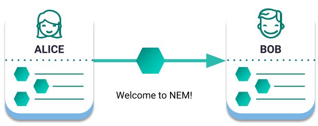

####################
Transfer Transaction
####################

Transfer transactions are used to send :doc:`mosaics <mosaic>` and messages between two :doc:`accounts <account>`.

    Alice sends 10 |networkcurrency| to Bob

*********
Recipient
*********

The recipient is the address or :ref:`alias <alias>` of the account that receives the TransferTransaction.

It is possible to send mosaics to any valid address, even if the address has not previously participated in any transaction.

.. note:: If nobody owns the private key of the recipient's account, the funds are most likely lost forever.

*******
Mosaics
*******

A :doc:`mosaic <mosaic>` could be a token, but it could also be more specialized assets such as reward points, shares of stock, signatures, status flags, votes or even other currencies.

You can send a combination of different mosaics in the same transaction.

*******
Message
*******

In the :ref:`public network <config-network-properties>`, transfer transactions can hold a message up to ``1023`` characters in length, making them suitable for timestamping data permanently on the blockchain.

By default, the messages attached are visible to all network participants.

Encrypted message
=================

Encrypted messages are only accessible by the sender and the recipient.

|codename| uses Bouncy Castle's AES block cipher implementation in `CBC mode <https://en.wikipedia.org/wiki/Block_cipher_mode_of_operation#CBC>`_ to encrypt and decrypt messages.

.. note:: You can find under the ``crypto`` module how to `encode <https://github.com/symbol/symbol-sdk-typescript-javascript/blob/main/src/core/crypto/Crypto.ts#L116-L126>`_ and `decode <https://github.com/symbol/symbol-sdk-typescript-javascript/blob/main/src/core/crypto/Crypto.ts#L162-L178>`_ encrypted messages, but we recommend you to use the available `SDK public methods <https://symbol.github.io/symbol-sdk-typescript-javascript/0.23.2/classes/_model_account_account_.account.html#decryptmessage>`_ instead.

********************
Related transactions
********************

.. csv-table::
    :header:  "Id",  "Type", "Description"
    :widths: 20 30 50
    :delim: ;

    0x4154; :ref:`transfertransaction`; Send mosaics and messages between two accounts.

**************
Related guides
**************

.. postlist::
    :category: Transfer Transaction
    :date: %A, %B %d, %Y
    :format: {title}
    :list-style: circle
    :excerpts:
    :sort:
