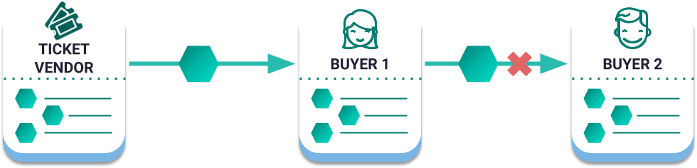

##############################
Writing your first application
##############################

This guide will take you through the NEM development cycle. You will send your first transaction to the blockchain after combining some NEM :doc:`built-in features <../concepts/account>`.

**********
Background
**********

The secondary ticket market, also known as the resale market, is the exchange of tickets that happens between individuals after they have purchased a ticket from an initial vendor. The initial vendor could be the event website, an online ticket vending platform, a shop or a stall at the entrance of the event.

Buying a ticket from someone that is not the initial vendor does not necessarily only mean to pay more for the ticket. The is the chance to be a victim of buying a fake or duplicate ticket, where the initial original vendor can't do anything to solve the issue.

**What do we want to solve?**

    Authorization model

The ticket vendor wants to set up a system to:

a) Identify each ticket buyer.
b) Avoid ticket reselling.
c) Avoid non-authentic tickets and duplicate ones.

**Why should we use NEM?**

Blockchain technology makes sense in cases where:

* There are different participants involved.
* These participants need to trust each other.
* There is the need to keep track of an immutable set of events.

NEM is a **flexible blockchain** technology. Instead of uploading all the application logic into the blockchain, you can use its tested features through **API calls** for transfer and storage of value, authorization, traceability, and identification.

The rest of the code remains **off-chain**. This reduces the inherent immutability risk, as you could change the process when necessary.

*************
Prerequisites
*************

- Finish :doc:`getting started section <setup-workstation>`
- Text editor or IDE
- NEM2-SDK and CLI
- An account with XEM

************************
Let’s get into some code
************************

**1.Creating an account for each participant**

First, we identify the actors involved in the problem we want to solve:

* The ticket vendor.
* The ticket buyer.

We have decided to represent the ticket vendor and buyer as separate :doc:`accounts <../concepts/account>`. Each account is unique and identified by an address. An account has access to a deposit box in the blockchain, which can be modified with an appropriate private key.

Have you loaded an account with test XEM? If it is not the case, go back to :doc:`getting started section <setup-workstation>`. The account you have created represents the ticket vendor.

1. After running the following command, you should see on your screen a line similar to:

.. code-block:: bash

   $> nem2-cli account info

   New Account: SCVG35-ZSPMYP-L2POZQ-JGSVEG-RYOJ3V-BNIU3U-N2E6

   [...]

   Mosaics

   3628d0b327fb1dd8:       1000000

2. This account owns 1.000.000 XEM. If your row after mosaics is empty, follow :doc:`the previous guide instructions <setup-workstation>`.

3. Create a second account to identify the ticket buyer.

.. code-block:: bash

   $> nem2-cli account generate --network MIJIN_TEST --save --url http://localhost:3000 --profile buyer

**2. Monitoring the blockchain**

Accounts change the blockchain state through transactions. Once an account announces a transaction, if properly formed, the server will return an OK response.

Receiving an OK response does not mean the transaction is valid, which means it is still not included in a block. A good practice is to monitor transactions before being announced.

We suggest opening three new terminals:

1. The first terminal :doc:`monitors announced transactions <../guides/transaction/monitoring-a-transaction-status>` validation errors.

.. code-block:: bash

   $> nem2-cli monitor status

2. Monitoring ``unconfirmed`` shows you which transactions have reached the network, but are not included in a block yet.

.. code-block:: bash

   $> nem2-cli monitor unconfirmed

3. Once a transaction is included, you will see it under the ``confirmed`` terminal.

.. code-block:: bash

   $> nem2-cli monitor confirmed

**3. Creating the ticket**

We are representing the ticket as a NEM mosaic. :doc:`Mosaics <../concepts/mosaic>` can be used to represent any asset in the blockchain, such as objects, tickets, coupons, stock share representation, and even your cryptocurrency. They have configurable properties, which are defined at the moment of their creation. For example, we opt to set **transferable property to false**. This means that the ticket buyer can only send back the ticket to the creator of the mosaic, avoiding the ticket reselling.

Before creating a mosaic with the ticket vendor account, you need to register a namespace. A :doc:`namespace <../concepts/namespace>` is a unique name in the network that gives a recognizable name to your assets.

1. Register the namespace called ``company``. Let's check if this name is available.

.. code-block:: bash

   $> nem2-cli namespace info --name company

2. Is the namespace available? Register it by setting the namespace name and its renting duration expressed in blocks.

.. code-block:: bash

   $> nem2-cli transaction namespace --name foo --rootnamespace --duration 1000

Did you check what happened in terminals where you are monitoring your account transactions? The transaction first appeared under ``unconfirmed`` terminal and, after a while, got confirmed ``confirmed``.

3.  Create a  mosaic named ``ticket``.

* It should be under the ``company`` namespace , with a total supply of ``100``.
* The mosaic is configured with ``transferability`` set so false.
* Divisibility should be set to 0, as no one should be able to send “0.5 company:tickets”.

.. code-block:: bash

   $> nem2-cli transaction mosaic --mosaicname ticket--namespacename company--amount 1000000 --supplymutable --divisibility 0 --duration 1000

**4. Sending the ticket**

Send one ``company:ticket`` to the ticket vendor account announcing a :ref:`transfer transaction <transfer-transaction>`, one of the most commonly used actions in NEM.

1. Prepare the transfer transaction. Three main attributes form a transfer transaction:

* The recipient account address: ``SC7A4H-7CYCSH-4CP4XI-ZS4G2G-CDZ7JP-PR5FRG-2VBU``.
* A message: ``enjoy your ticket``.
* An array of mosaics: ``[1 company:ticket]``.

.. example-code::

   .. code-block:: typescript

       import {
           Account, Address, Deadline, UInt64, NetworkType, PlainMessage, TransferTransaction, Mosaic, MosaicId,
           TransactionHttp
       } from 'nem2-sdk';

       const transferTransaction = TransferTransaction.create(
           Deadline.create(),
           Address.createFromRawAddress('SC7A4H-7CYCSH-4CP4XI-ZS4G2G-CDZ7JP-PR5FRG-2VBU'),
           [new Mosaic(new MosaicId(company:ticket'), UInt64.fromUint(1))],
           PlainMessage.create(‘enjoy your ticket’'),
           NetworkType.MIJIN_TEST
       );

   .. code-block:: java

       import io.nem.sdk.model.account.Address;
       import io.nem.sdk.model.blockchain.NetworkType;
       import io.nem.sdk.model.mosaic.Mosaic;
       import io.nem.sdk.model.mosaic.MosaicId;
       import io.nem.sdk.model.transaction.Deadline;
       import io.nem.sdk.model.transaction.PlainMessage;
       import io.nem.sdk.model.transaction.TransferTransaction;

       import java.math.BigInteger;
       import java.util.Arrays;

       import static java.time.temporal.ChronoUnit.HOURS;

       final TransferTransaction transferTransaction = TransferTransaction.create(
           Deadline.create(2, HOURS),
           Address.createFromRawAddress("SC7A4H-7CYCSH-4CP4XI-ZS4G2G-CDZ7JP-PR5FRG-2VBU"),
           Arrays.asList(new Mosaic(new MosaicId("company:ticket"), BigInteger.valueOf(1))),
           PlainMessage.create("enjoy your ticket"),
           NetworkType.MIJIN_TEST
       );

Although the transaction is created, it has not been announced to the network yet.

2.  Sign the transaction the ticket vendor account first, so that the network can verify the authenticity of the transaction.

.. example-code::

   .. code-block:: typescript

       const privateKey = process.env.PRIVATE_KEY;

       const account = Account.createFromPrivateKey(privateKey, NetworkType.MIJIN_TEST);

       const signedTransaction = account.sign(transferTransaction);

   .. code-block:: java

       final String privateKey = "";

       final Account account = Account.createFromPrivateKey(privateKey,NetworkType.MIJIN_TEST);

       final SignedTransaction signedTransaction = account.sign(transferTransaction);

3. Once signed, announce the transaction to the network.

.. example-code::

   .. code-block:: typescript

       const transactionHttp = new TransactionHttp('http://localhost:3000');

       transactionHttp.announce(signedTransaction).subscribe(
           x => console.log(x),
           err => console.log(err)
       );

   .. code-block:: java

       final TransactionHttp transactionHttp = new TransactionHttp("http://localhost:3000");

       transactionHttp.announceTransaction(signedTransaction).toFuture().get();

   .. code-block:: bash

       $> nem2-cli transaction transfer --recipient SD5DT3-CH4BLA-BL5HIM-EKP2TA-PUKF4N-Y3L5HR-IR54 --mosaics company:ticket::1 --message enjoy_your_ticket

4. When the transaction is confirmed, check that the ticket buyer has received the ticket.

   .. code-block:: bash

    $> nem2-cli account info --profile buyer

************
What's next?
************

Did you solve the proposed use case?

✅ Identify each ticket buyer: Creating NEM accounts for each buyer.

✅ Avoid ticket reselling: Creating a non-transferable mosaic.

✅ Avoid non-authentic tickets and duplicate ones: Creating a unique namespace and a mosaic named ``company:ticket``.

Continue learning about more :doc:`NEM built-in features <../concepts/account>` or practicing with :doc:`self-paced training <training>`.