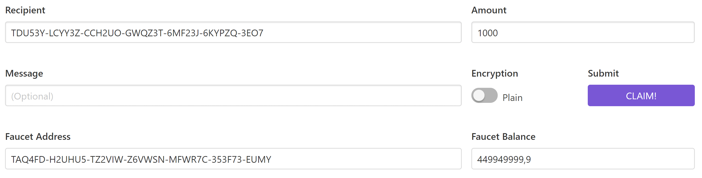

.. post:: 01 Aug, 2018
    :tags: SDK, CLI
    :excerpt: 1
    :nocomments:

###########################
Setting up your workstation
###########################

This first guide will walk you through a step-by-step installation of the required tools to **start developing applications** on |codename|.

We will be using the **test network**, which uses the same technology and features of the **main network**.
The testnet allows developers to experiment with the offered |codename|'s transaction set in a live network without the loss of valuable assets.

.. note:: Not a developer? Download our :doc:`client <../wallets>` to manage ``XYM`` and issue transactions.

.. _setup-creating-a-test-account:

*******************
Creating an account
*******************

An :doc:`account <../concepts/account>` is a deposit box where you can hold :doc:`mosaics <../concepts/mosaic>` (tokens) and interact with them by :doc:`announcing transactions <../concepts/transaction>`.

We are creating a new account with the :doc:`Symbol CLI <../cli>`, a command-line tool designed to architect solutions and interact with Symbol networks in an efficient manner.

1. Symbol CLI requires **Node.js 12 LTS** to execute. Open a new terminal and check the version installed with:

   .. code-block:: bash

      node --version

   If you get an error or the version returned does not match v12.X, visit |node-js| to install the requirement (Although it is recommended to install through `nvm <https://github.com/nvm-sh/nvm>`__).

2. To install |cli|, run the next command.

   .. code-block:: bash

      npm install --global symbol-cli

3. Then, generate a new account and save it as a **profile**.

   .. code-block:: symbol-cli

      symbol-cli account generate

      Enter network type (MAIN_NET, TEST_NET): TEST_NET
      Do you want to save the account? [y/n]: y
      Select an import type: » PrivateKey
      Enter Symbol Node URL. (Example: http://localhost:3000): <NODE_URL>
      Insert the profile name: testnet
      Do you want to set the account as the default profile? [y/n]: y

4. If everything goes well, you should see the account credentials displayed in the terminal.

   .. code-block:: symbol-cli

      Profile stored correctly
      ┌─────────────┬──────────────────────────────────────────────────────────────┐
      │ Property    │ Value                                                        │
      ├─────────────┼──────────────────────────────────────────────────────────────┤
      │ Address     │ TCWYXK-VYBMO4-NBCUF3-AXKJMX-CGVSYQ-OS7ZG2-TLI                │
      ├─────────────┼──────────────────────────────────────────────────────────────┤
      │ Public Key  │ 203...C0A                                                    │
      ├─────────────┼──────────────────────────────────────────────────────────────┤
      │ Private Key │ AAA...AAA                                                    │
      └─────────────┴──────────────────────────────────────────────────────────────┘

   .. note:: Make sure to keep the private key secret and backed up safely somewhere offline.

If you get the error ``The CLI cannot reach the node``, the most common causes are:

* **Incorrect node URL**: The URL used does not belong to an active node. Open the URL provided in a new browser tab and check if you get a response. If the test network node is not working, you can **use another node url** from |network-list| or **run your own testnet node** by following :doc:`the next guide <../guides/network/running-a-symbol-node>`.

* **Internet connection**: The CLI resolves some values from the node. If you decide to use the tool without being connected to the internet, you will have to pass the options ``--network``, ``--generation-hash``, ``--namespace-id``, and ``divisibility``. Type ``symbol-cli account generate --help`` to know more about each parameter.

.. _setup-getting-test-currency:

*********************
Getting test currency
*********************

To announce a transaction, the sender should pay a :doc:`fee <../concepts/fees>` to provide an incentive to those who validate and secure the network and run the infrastructure.
This cost is paid in |networkcurrency| mosaics, the default network currency of the public network.

Now that you have created your first account, let's request |networkcurrency| units from the **testnet faucet**.
|faucet|, indicate the amount of |networkcurrency| you want to receive and the address, and click "**CLAIM!**".

After the transaction gets confirmed, check if your account has received |networkcurrency| using the command-line tool.

.. code-block:: symbol-cli

    symbol-cli account info --profile testnet

    Balance Information
    ┌──────────────────┬─────────────────┬─────────────────┬───────────────────┐
    │ Mosaic Id        │ Relative Amount │ Absolute Amount │ Expiration Height │
    ├──────────────────┼─────────────────┼─────────────────┼───────────────────┤
    │ 5E62990DCAC5BE8A │ 750.0           │ 750000000       | Never             │
    └──────────────────┴─────────────────┴─────────────────┴───────────────────┘

.. note:: The faucet has a limited amount of |networkcurrency| and must be replenished before it dries out. If you don’t need your test |networkcurrency| units anymore, please send them back to the account indicated in the faucet's page.

.. _setup-development-environment:

******************
Creating a project
******************

Now that you have your account filled with |networkcurrency| units, it is time to **choose a programming language**.
Pick the one you feel most comfortable with, or follow your project requirements.

Then, **create a folder for your new project** and run the instructions for the selected language.
If none of the languages fits your project, you can always query the blockchain directly using the :doc:`REST gateway <../api>`.

.. tabs::

    .. tab:: TypeScript

        .. note:: Symbol SDK requires Node.js 12 LTS to execute.

        1. Create a ``package.json`` file.

           .. code-block:: bash

              npm init

        2. Install |sdk| and RxJS library.

           .. code-block:: bash

              npm install symbol-sdk rxjs

        3. Install globally TypeScript dependency:

           .. code-block:: bash

              npm install --global typescript
              typescript --version

        4. Install `ts-node`_ to execute TypeScript files with node.

           .. code-block:: bash

              sudo npm install --global ts-node

    .. tab:: JavaScript

        .. note:: Symbol SDK requires Node.js 12 LTS to execute.

        1. Create a ``package.json`` file.

           .. code-block:: bash

              npm init

        2. Install |sdk| and RxJS library.

           .. code-block:: bash

              npm install symbol-sdk rxjs

    .. tab:: Java

        .. note:: Symbol SDK requires JDK 8 to execute.

        1. Open a new Java `gradle`_ project.  Use your favourite IDE or create a project from the command line.

           .. code-block:: bash

              gradle init --type java-application

        2. Edit ``build.gradle`` to use Maven central repository.

           .. code-block:: java

              repositories {
                  mavenCentral()
              }

        3. Add ``symbol-sdk`` as a dependency.

           .. code-block:: java

              dependencies {
                  compile "io.nem:symbol-sdk-vertx-client"
              }

        4. Execute ``gradle build`` and ``gradle run`` to run your program.

.. _ts-node: https://www.npmjs.com/package/ts-node

.. _gradle: https://gradle.org/install/

.. _JDK: https://www.oracle.com/technetwork/es/java/javase/downloads/index.html

.. |node-js| raw:: html

   <a href="https://nodejs.org/en/download/" target="_blank">nodejs.org</a>

.. |different-ways-to-install-a-nuget-package| raw:: html

   <a href="https://docs.microsoft.com/en-us/nuget/consume-packages/ways-to-install-a-package" target="_blank">different ways to install a NuGet Package</a>

.. |network-list| raw:: html

   <a href="https://symbol.fyi/nodes" target="_blank">this list</a>

.. |faucet| raw:: html

   <a href="https://testnet.symbol.tools/" target="_blank">Navigate here</a>
