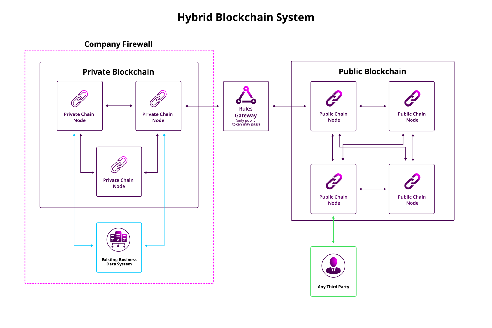

###############
What is Symbol?
###############

******************************
Symbol is built for developers
******************************

|codename| is a feature-rich development platform that lets you build blockchain projects faster and more efficiently, so you can exceed expectations.

.. raw:: html

    <iframe width="100%" height="315" src="https://www.youtube.com/embed/oXBOsOX7r5Y" frameborder="0" allow="accelerometer; autoplay; encrypted-media; gyroscope; picture-in-picture" allowfullscreen></iframe>

|codename| uses familiar **APIs** to interface with your existing platform so the learning curve is lower and you can develop your way.
This means you can create a variety of architectural solutions with lightweight code efficiently, in **any programming language**.

:doc:`Try the API <../api>`

*****************
Built-in features
*****************

Connect and combine |codename|'s built-in features to architect your blockchain solution.
Use our ready-made plugin configurations for your most common business needs, or configure the plugin primitives to customize the capabilities of your network without sacrificing performance.

:doc:`Discover the built-in features <../concepts/overview>`

********************************************
Private, public and hybrid chain deployments
********************************************

|codename| provides access to both public and private blockchains, individually or as a hybrid, providing options to best suit your project needs.

* **Public chain**: The |codename| public chain is a platform supported by a decentralized network of nodes. Entities on the platform can freely communicate and exchange value with one another in a trustless environment. `XYM <https://symbolplatform.com/xym/>`_ serves as the native currency to |codename|'s public blockchain.

* **Private chain** Private chains, on the other hand, are permissioned blockchains that prefer privacy, compliance, customization, and efficiency over decentralization. You can choose to deploy their own private chains with |codename| in cases where blockchain technology is desired in a closed ecosystem. 

* **Hybrid chain**: By utilizing both public and private blockchains, you can preserve an intimate ecosystem in a private chain and communicate freely with the public chain as a decentralized hub of data.

:doc:`Run your private test network <../guides/network/creating-a-private-test-net>`

Continue: :doc:`Setting up your workstation <setup-workstation>`.
