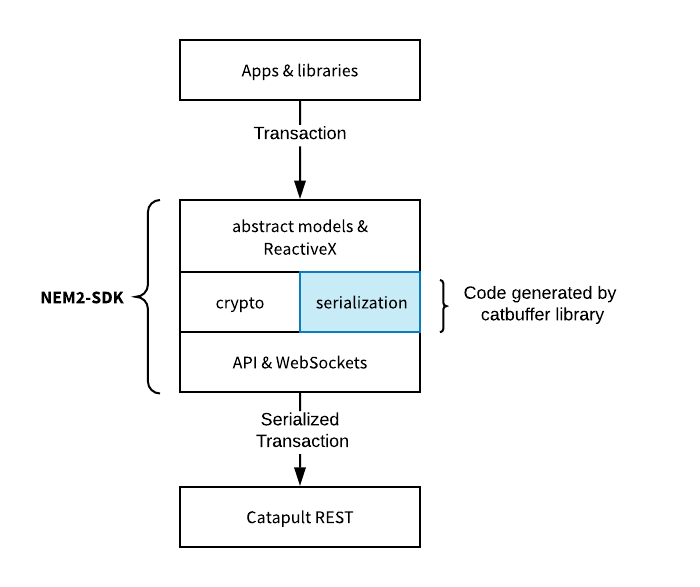

:orphan:

###############################
Generating transaction builders
###############################

Learn how to generate transaction builders for your target SDK language.

**********
Background
**********

The `catbuffer library <https://github.com/nemtech/catbuffer>`_ defines the protocol to serialize and deserialize |codename| entities.
The library comes with code generators for different languages.
SDKs and applications use the generated code to interact with REST transaction endpoint.

    |sdk| serialization module

The library accomplishes the following properties:

**Memory Efficiency**

Large networks compute a large number of transactions.
Working with binary optimized in size makes the communication faster.
Furthermore, reading entities from memory buffers—or just a part of them—is memory efficient.

**Flexibility**

REST `transaction endpoints <https://docs.symbolplatform.com/symbol-openapi/#operation/announceTransaction>`_ handle the calls to update the blockchain state.
The serialized payload of a transaction is appended to the body of the POST call.
These endpoints allow the addition of new functionality to the server-side without modifying the API contract.

**Reusability**

Applications can embed the generated code without managing dependencies, which is particularly desirable in highly-secure environments.
Besides, sharing a common codebase enables the addition of new features with less effort.

The `schemas <https://github.com/nemtech/catbuffer/tree/main/schemas>`_ define the entities' data structure.
The library generates the leanest code necessary to serialize and deserialize defined entities.

************
Installation
************

1. Clone the ``catbuffer-generators`` repository.

.. code-block:: bash

    git clone https://github.com/nemtech/catbuffer-generators

2. Install the package requirements.

.. code-block:: bash

    pip install -r requirements.txt

3. Clone the ``catbuffer`` repository inside the ``catbuffer-generators`` folder.

.. code-block:: bash

    git clone https://github.com/nemtech/catbuffer

*****
Usage
*****

Under the ``schemas`` folder of the catbuffer repository, you can find the entities' data structure. With the help of a code generator, you can produce the leanest code necessary to serialize and deserialize those entities.

For example, run the following command to generate C++ transaction builders for a :ref:`TransferTransaction <transfer-transaction>`:

.. code-block:: bash

    python main.py --schema schemas/transfer/transfer.cats --generator cpp_builder

You can also generate code for all the schemas running the following command under the ``catbuffer-generators`` directory:

.. code-block:: bash

    python ../scripts/generate_all.sh cpp_builder

The generator creates a new file for every schema under the ``catbuffer/_generated/cpp_builder`` folder.
