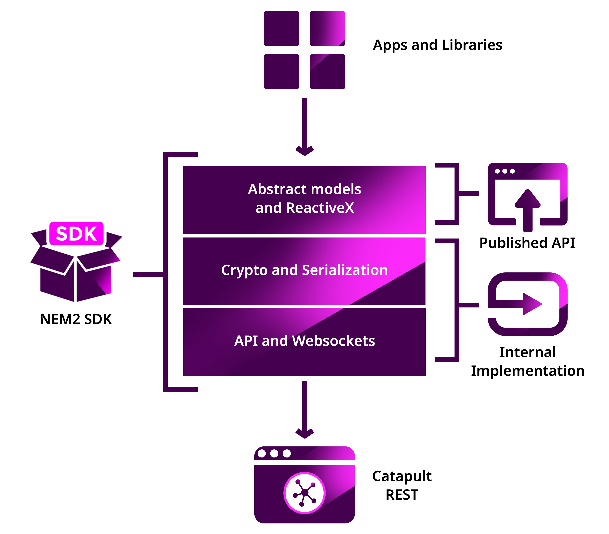

:orphan:

###############
SDK Development
###############

A key objective is that interoperability becomes a natural design of the NEM2-SDK. Follow this guideline to collaborate creating a NEM SDK, achieving the best quality with less effort.

NEM2-SDK shares the same design/architecture between programming languages to accomplish the next properties:

* **Fast language adaptation**: There is a library for Java, but you need it for C# for example. As both SDKs share the same design, you can re-write the library faster, adapting the syntax to your language. It also applies to examples, projects, applications...

* **Cohesion/shared knowledge cross NEM developers**: Be able to change between projects that use NEM, sharing the same design accompanied by the best practices.

* **Fast SDK updates**: Migrating any improvement from a NEM2-SDK implementation to the rest is faster.

* **Fewer bugs**: If any bug appears in one language, it is faster to check and fix it.

************
Architecture
************

**Characteristics**

- **Standardized Contracts**: Guaranteeing interoperability and harmonization of data models.
- **Loose Coupling**: Reducing the degree of component coupling fosters.
- **Abstraction**: Increasing long-term consistency of interoperability and allowing underlying components to evolve independently.
- **Reusability**: Enabling high-level interoperability between modules and potential component consumers.
- **Stateless**: Increasing availability and scalability of components allowing them to interoperate more frequently and reliably.
- **Composability**: For components to be effectively composable they must be interoperable.

**Reactive**

NEM2-SDK uses intensely ReactiveX Library.

- **Functional**: Developers can avoid complex stateful programs using clean input/output functions over observable streams.
- **Less is more**: ReactiveX's operators often reduce what was once an elaborate challenge into a few lines of code.
- **Async error handling**: Traditional try/catch is powerless for errors handling in asynchronous computations, but ReactiveX will offer developers the proper tools to handle these sort of errors.
- **Concurrency**: Observables and Schedulers in ReactiveX allow the programmer to abstract away low-level threading, synchronization, and concurrency issues.
- **Frontend**: Manipulation of UI events and API responses on the Web using RxJS.
- **Backend**: Embrace ReactiveX's asynchronicity, enabling concurrency and implementation independence.

.. note:: In case you are not familiar with ReactiveX and you still have to deliver something fast, you can convert an observable to Promise/Future by reviewing this |rp-promise-example|. However, **we encourage you to learn ReactiveX**.

- |rxjsinaction|
- |frp|
- |learnrxjs|
- |rp-wiki|
- |op-wiki|
- |reactivex|

Package Organization
====================

    Package organization diagram

**Infrastructure**

The HTTP requests are made following the Repository Pattern, and they return NEM Domain immutable models via the Observable Pattern.

**Models**

The NEM Domain models are, usually, immutable by definition. The developer cannot change its attributes. Instead, the developers have to create new Transactions and dispatch them to NEM Blockchain via TransactionHTTP, to change the NEM Blockchain state.

**Services**

Common operations that require multiple :doc:`REST API <../api>` requests are handled by already provided services.

.. |reactivex| raw:: html

    <a href="http://reactivex.io/" target="_black">ReactiveX</a>

.. |rxjsinaction| raw:: html

    <a href="https://www.manning.com/books/rxjs-in-action" target="_black">RxJS in Action</a>

.. |frp| raw:: html

    <a href="https://www.manning.com/books/functional-reactive-programming" target="_black">Functional Reactive Programming</a>

.. |rp-wiki| raw:: html

    <a href="https://en.wikipedia.org/wiki/Reactive_programming" target="_black">Reactive Programming</a>

.. |op-wiki| raw:: html

    <a href="https://en.wikipedia.org/wiki/Observer_pattern" target="_black">Observer Pattern</a>

.. |learnrxjs| raw:: html

    <a href="https://www.learnrxjs.io/" target="_black">Learn RxJS</a>

.. |rp-promise-example| raw:: html

    <a href="https://www.learnrxjs.io/operators/utility/topromise.html" target="_black">example</a>

***************
Before starting
***************

1. Review the technical documentation to become familiar with the :doc:`NEM built-in features<../concepts/account>`.
2. Setup the `catapult in local environment via docker <https://github.com/tech-bureau/catapult-service-bootstrap>`_.
3. :doc:`Check the API reference <../api>` and play with the API endpoints.
4. Become familiar with the current :doc:`nem2-sdk via code examples <../concepts/account>` & :doc:`nem2-cli <../cli>` .
5. `Join <https://join.slack.com/t/nem2/shared_invite/enQtMzY4MDc2NTg0ODgyLTFhZjgxM2NhYTQ1MTY1Mjk0ZDE2ZTJlYzUxYWYxYmJlYjAyY2EwNGM5NzgxMjM4MGEzMDc5ZDIwYTgzZjgyODM>`_ our Slack to ask Catapult related questions.
6. Be sure no one is already working on the SDK you want to create. Check the :doc:`repository list <../sdk>` and  comment your intentions in  nem2 slack ``#sig-api`` channel. If someone is already working on it, we suggest you collaborate with him/her.
7. Claim the SDK `forking this repository <https://help.github.com/articles/creating-a-pull-request/>`_ and add a new entry to the :doc:`repository list <../sdk>`.

***********
Development
***********

You can base your work in `TypeScript <https://github.com/nemtech/nem2-sdk-typescript-javascript>`_ and `Java <https://github.com/nemtech/nem2-sdk-java>`_ SDKs. The TypeScript version is the first SDK getting the latest updates. Meanwhile, Java takes longer to be updated.

Unfortunately, the TypeScript version has one specific implementation detail: the low-level implementation is separated from the SDK, called `nem2-library-js <https://github.com/nemtech/nem2-library-js>`_. There
was a need to create this low-level library to perform specific chain testing.

.. note:: The SDKs you create does not require this separate implementation.

Regularly check the `Changelog <https://github.com/nemtech/nem2-sdk-java/blob/master/CHANGELOG.md>`_ to be sure you didn't miss any code change update.

Creating the project
=====================

1. Add a README with the instructions to install the SDK. You can find
   :download:`here a template <../resources/templates/README_SDK.md>`.
2. Add a `Code of
   Conduct <https://help.github.com/articles/adding-a-code-of-conduct-to-your-project/>`_.  Download :download:`here an example code of conduct <../resources/templates/CODE_OF_CONDUCT.md>`.
3. Add a `Contributors guidelines <https://help.github.com/articles/setting-guidelines-for-repository-contributors/>`_ to help others know how they can help you. Find :download:`here a CONTRIBUTING.md template<../resources/templates/CONTRIBUTING.md>`.
4. Setup the Continuous Integration system. We use `travis-ci <https://travis-ci.org/>`_, but feel free to use the one suits you best.

A project with a good test coverage it's more likely to be used and
trusted by the developers!

We **strongly** suggest to do `Test-Driven Development <https://en.wikipedia.org/wiki/Test-driven_development>`_ or Unit-Testing (test last). If you need inspiration, you can adapt the same `tests we
did <https://github.com/nemtech/nem2-sdk-typescriptjavascript/tree/master/test>`_.

API Wrapper
===========

`Swagger Codegen <https://swagger.io/tools/swagger-codegen/>`_ can handle the API generation. It supports multiple languages, and hopefully, yours is on the list.

1. Generate the ``DTOs`` and place them under under `sdk/infrastructure <https://github.com/nemtech/nem2-sdk-java/tree/master/src/main/java/io/nem/sdk/infrastructure>`_. The API swagger file definition can be found `here <https://github.com/nemtech/nem2-docs/blob/master/source/resources/collections/swagger.yaml>`_.

2. Drop the generated client classes and  implement them using the
`Repository pattern <https://martinfowler.com/eaaCatalog/repository.html>`_ returning `Observables <https://en.wikipedia.org/wiki/Observer_pattern>`_ of
`ReactiveX <http://reactivex.io/>`_.

Example of a Repository and HTTP implementation:

-  `BlockchainRepository <https://github.com/nemtech/nem2-sdk-java/blob/master/src/main/java/io/nem/sdk/infrastructure/BlockchainRepository.java>`_

-  `BlockchainHttp <https://github.com/nemtech/nem2-sdk-java/blob/master/src/main/java/io/nem/sdk/infrastructure/BlockchainHttp.java>`_

.. warning:: The **repositories return models instead of DTOs**. You will need to code the models before finishing the API wrapper.

Models
======

The `models <https://github.com/nemtech/nem2-sdk-java/tree/master/src/main/java/io/nem/sdk/model>`_ are by default immutable and aim to hide the complexity, like type conversion or relationship between objects.

You will find in the different implementations different invariants to
ensure the object is well constructed and a nicer API is published.

Particular decisions to consider:

-  ``uint64`` support: meanwhile `Java supports big numbers <https://docs.oracle.com/javase/7/docs/api/java/math/BigInteger.html>`_, for example JavaScript doesn't. The JavaScript SDK has a custom class to handle the `uint64 types <https://github.com/nemtech/nem2-sdk-typescript-javascript/blob/master/src/model/UInt64.ts>`_. If your language supports ``uint64`` use that implementation instead.
-  API conversions: The API returns the data sometimes compressed, you
   might need to convert those types for the user.
-  `Namespace <https://github.com/nemtech/nem2-sdk-java/blob/master/src/main/java/io/nem/sdk/model/namespace/NamespaceId.java>`_ ID:  At creation time you add the string name, but when you receive the Namespace from the network, it comes in formatted as ``uint64`` ID. A specific endpoint returns the Namespace ``string`` name.

Transaction Serialization
=========================

A Transaction needs a particular serialization schema in binary optimized in size.

**Generate the buffer classes**

.. note:: This section is incomplete. It will be updated with complete information once the first SDK integrates the builders generated with `catbuffer <https://github.com/nemtech/catbuffer>`_ library.

**Create the schema classes**

1. `Schema class <https://github.com/nemtech/nem2-sdk-java/blob/master/src/main/java/io/nem/sdk/model/transaction/Schema.java>`_.
2. `SchemaAttribute class <https://github.com/nemtech/nem2-sdk-java/blob/master/src/main/java/io/nem/sdk/model/transaction/SchemaAttribute.java>`_.
3. `ScalarAttribute class <https://github.com/nemtech/nem2-sdk-java/blob/master/src/main/java/io/nem/sdk/model/transaction/ScalarAttribute.java>`_.
4. `ArrayAttribute class <https://github.com/nemtech/nem2-sdk-java/blob/master/src/main/java/io/nem/sdk/model/transaction/ArrayAttribute.java>`_.
5. `TableAttribute class <https://github.com/nemtech/nem2-sdk-java/blob/master/src/main/java/io/nem/sdk/model/transaction/TableAttribute.java>`_.
6. `TableArrayAttribute class <https://github.com/nemtech/nem2-sdk-java/blob/master/src/main/java/io/nem/sdk/model/transaction/TableArrayAttribute.java>`_.
7. `Constants class <https://github.com/nemtech/nem2-sdk-java/blob/master/src/main/java/io/nem/sdk/model/transaction/Constants.java>`_.

**Create the transaction schemas**

Each transaction has a schemas. It has the same type as ``catbuffer schemas`` but using the ``Schema`` class. It's used to know where each component is located in the ``catbuffer schema`` and remove the unnecessary bytes to create the optimized serialization.

Example: `TransferTransactionSchema <https://github.com/nemtech/nem2-sdk-java/blob/master/src/main/java/io/nem/sdk/model/transaction/TransferTransactionSchema.java>`_.

**Using the schemas in the transaction models**

The Transaction class has the abstract method `generateBytes() <https://github.com/nemtech/nem2-sdk-java/blob/master/src/main/java/io/nem/sdk/model/transaction/Transaction.java#L159>`_.

Each Transaction has to implement and use the previous classes, the Buffers and the Schemas, to serialize the transaction.

Example:  `TransferTransaction.generateBytes() <https://github.com/nemtech/nem2-sdk-java/blob/master/src/main/java/io/nem/sdk/model/transaction/TransferTransaction.java>`_.

.. note:: Do not forget to implement the `Cosignatory  <https://github.com/nemtech/nem2-sdk-java/tree/master/src/main/java/io/nem/sdk/model/transaction>`_ classes.

KeyPair and Cryptographic functions
===================================

.. note:: This section is incomplete.

Implement the cryptographic purposes required to sign transactions.

Example: `core/crypto <https://github.com/nemtech/nem2-sdk-java/tree/master/src/main/java/io/nem/core/crypto>`_

********************
Documenting your SDK
********************

The SDKs need to be adopted by other developers. As a contributor, no one knows better than you how a determined SDK works. Consider helping others and spread the usage of the SDK by providing :doc:`the following documentation <sdk-documentation>`.

******************************
Publishing the SDK as official
******************************

To make an SDK officially supported, submit it as a `NIP <https://github.com/nemtech/NIP/blob/master/NIPs/nip-0001.md>`_. The reason behind the NEM2 Improvement Proposal is to ensure that the new libraries are reviewed, tested and shared among NEM developers.

***********
Future work
***********

The current guideline shows what is done up to today since the SDK isn't complete. It will get updates according to the latest architecture/features.

********************
Recommended Licenses
********************

-  MIT: `Expat/MIT/X11 license <https://opensource.org/licenses/MIT>`_
-  Apache-2.0: `Apache License, version
   2.0 <http://www.apache.org/licenses/LICENSE-2.0>`_
-  BSD-2-Clause: `OSI-approved BSD 2-clause
   license <https://opensource.org/licenses/BSD-2-Clause>`_
-  BSD-3-Clause: `OSI-approved BSD 3-clause
   license <https://opensource.org/licenses/BSD-3-Clause>`_
-  CC0-1.0: `Creative Commons CC0 1.0
   Universal <https://creativecommons.org/publicdomain/zero/1.0/>`_
-  GNU-All-Permissive: `GNU All-Permissive
   License <http://www.gnu.org/prep/maintain/html_node/License-Notices-for-Other-Files.html>`_
-  LGPL-2.1+: `GNU Lesser General Public License (LGPL), version 2.1 or
   newer <http://www.gnu.org/licenses/old-licenses/lgpl-2.1.en.html>`_
