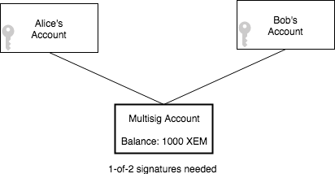
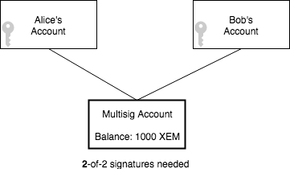
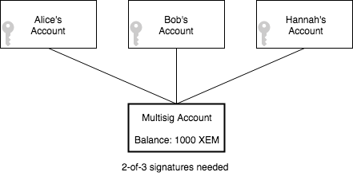

#########################
Interacting with accounts
#########################

.. _guide-creating-and-opening-an-account:

*******************************
Creating and opening an account
*******************************

You are going to create a new :doc:`account <../concepts/account>` and open it.

Prerequisites
=============

- Finish the :doc:`getting started section <../getting-started/setup-workstation>`
- Text editor or IDE
- NEM2-SDK or CLI

Let’s get into some code
=========================

An account is a key pair (private and public key) associated to a mutable state stored on the NEM blockchain.

.. example-code::

    .. literalinclude:: ../resources/examples/typescript/account/CreatingAnAccount.ts
        :language: typescript
        :lines:  23-

    .. literalinclude:: ../resources/examples/javascript/account/CreatingAnAccount.js
        :language: javascript
        :lines: 23-

    .. literalinclude:: ../resources/examples/cli/account/CreatingAnAccount.sh
        :language: bash
        :start-after: #!/bin/sh

The **private key** uniquely identifies a NEM account, holds all its power.  It is a priority to make sure it is stored safely somewhere **offline** and do not share it with anyone.

The **public key** is cryptographically derived from the private key and safe to be shared. Although that, it is preferable to share the **address**, which contains further information such as network and validity check.

In case you already have a private key, not needing to generate a new account:

.. example-code::

    .. literalinclude:: ../resources/examples/typescript/account/OpeningAnAccount.ts
        :language: typescript
        :lines:  21-

    .. literalinclude:: ../resources/examples/java/src/test/java/nem2/guides/examples/account/CreatingAnAccount.java
        :language: java
        :lines: 31-34

    .. literalinclude:: ../resources/examples/javascript/account/OpeningAnAccount.js
        :language: javascript
        :lines: 23-

**Using a Wallet**

If the programming language of the SDK you are using allows client-side development, you will be able to create a new account by creating a new wallet.

A wallet grants using an account for signing transactions, encrypting your credentials with a password.

.. example-code::

    .. literalinclude:: ../resources/examples/typescript/account/CreatingAnAccountWallet.ts
        :language: typescript
        :lines:  21-

    .. literalinclude:: ../resources/examples/javascript/account/CreatingAnAccountWallet.js
        :language: javascript
        :lines: 24-

    .. literalinclude:: ../resources/examples/cli/account/CreatingAnAccountWallet.sh
        :language: bash
        :start-after: #!/bin/sh

In case you already have a private key, not needing to generate a new account:

.. example-code::

    .. literalinclude:: ../resources/examples/typescript/account/OpeningAnAccountWallet.ts
        :language: typescript
        :lines:  21-

    .. literalinclude:: ../resources/examples/javascript/account/OpeningAnAccountWallet.js
        :language: javascript
        :lines: 24-
        
    .. literalinclude:: ../resources/examples/cli/account/OpeningAnAccountWallet.sh
        :language: bash
        :start-after: #!/bin/sh

.. _guide-getting-account-information:

***************************
Getting account information
***************************

You are going to develop a program to get the public key, height, balance and importance of an :doc:`account <../concepts/account>`.

Prerequisites
=============

- Finish the :doc:`getting started section <../getting-started/setup-workstation>`
- Text editor or IDE
- NEM2-SDK or CLI

Let’s get into some code
=========================

Calling ``accountHttp.getAccountInfo`` you can get account information just passing address and network as a parameter.

.. example-code::

    .. literalinclude:: ../resources/examples/typescript/account/GettingAccountInformation.ts
        :language: typescript
        :lines:  21-
    
    .. literalinclude:: ../resources/examples/java/src/test/java/nem2/guides/examples/account/GettingAccountInformation.java
        :language: java
        :lines: 33-40

    .. literalinclude:: ../resources/examples/javascript/account/GettingAccountInformation.js
        :language: javascript
        :lines: 22-

    .. literalinclude:: ../resources/examples/cli/account/GettingAccountInformation.sh
        :language: bash
        :start-after: #!/bin/sh
    
Can you spot account's public key?

    publicKey: 'F33152059827EAA4D7D67C6E27A59851AF09FBD0926C35150FA44D2A9A5E4CAA',

Which block was the first one where account address and public key appeared?

    publicKeyHeight: UInt64 { lower: 401575, higher: 0 },
    addressHeight: UInt64 { lower: 288598, higher: 0 },

Does the account have an importance?

    importance: UInt64 { lower: 1100282, higher: 0 },

**Checking account's balance**

Check account's balance using ``mosaicService``. The balance is the amount of the different mosaics stored in the account.

.. example-code::

    .. literalinclude:: ../resources/examples/typescript/account/CheckingBalanceOfAnAccount.ts
        :language: typescript
        :lines:  21-

    .. literalinclude:: ../resources/examples/javascript/account/CheckingBalanceOfAnAccount.js
        :language: javascript
        :lines: 27-

    .. literalinclude:: ../resources/examples/cli/account/CheckingBalanceOfAnAccount.sh
        :language: bash
        :start-after: #!/bin/sh

What’s next?
============

Try to repeat retrieving the balance by only filtering XEM amount.

.. _guide-getting-the-amount-of-XEM-sent-to-an-account:

********************************************
Getting the amount of XEM sent to an account
********************************************

You are going to develop a program to check the amount of XEM you have sent to some account.

Prerequisites
=============

- Finish the :doc:`getting started section <../getting-started/setup-workstation>`
- Text editor or IDE
- NEM2-SDK or CLI

Let’s get into some code
=========================

After obtaining all outgoing :doc:`transactions <../concepts/transaction>` from an account, apply a filter to distinguish target recipient.

.. example-code::

    .. literalinclude:: ../resources/examples/typescript/account/GettingTheAmountOfXEMSentToAnAccount.ts
        :language: typescript
        :lines:  23-

    .. literalinclude:: ../resources/examples/java/src/test/java/nem2/guides/examples/account/GettingTheAmountOfXEMSentToAnAccount.java
        :language: java
        :lines: 40-66

    .. literalinclude:: ../resources/examples/javascript/account/GettingTheAmountOfXEMSentToAnAccount.js
        :language: javascript
        :lines: 28-

The amount of sent XEM in transfer transactions is displayed.

What’s next?
============

Try to repeat the example by changing NEM filter for another :doc:`mosaic <../concepts/mosaic>` .

.. _guide-receiving-transactions-of-an-account:

************************************
Receiving transactions of an account 
************************************

You are going to develop a program to get the list of :doc:`transactions <../concepts/transaction>` where an :doc:`account <../concepts/account>` is involved.

Background
==========

By default, the SDK provides up to 10 transactions. This parameter is increasable up to 100 transactions.

Prerequisites
=============

- Finish the :doc:`getting started section <../getting-started/setup-workstation>`
- Text editor or IDE
- NEM2-SDK or CLI
- An account that has received some transaction

Let’s get into some code
=========================

In this example, we will fetch confirmed transactions for a given account using ``accountHttp`` repository.

A transaction is confirmed if it is included in a block and validated by the network.

.. example-code::

    .. literalinclude:: ../resources/examples/typescript/account/GettingConfirmedTransactions.ts
        :language: typescript
        :lines:  21-
    
    .. literalinclude:: ../resources/examples/java/src/test/java/nem2/guides/examples/account/GettingConfirmedTransactions.java
        :language: java
        :lines: 36-48

    .. literalinclude:: ../resources/examples/javascript/account/GettingConfirmedTransactions.js
        :language: javascript
        :lines: 26-

    .. literalinclude:: ../resources/examples/cli/account/GettingConfirmedTransactions.sh
        :language: bash
        :start-after: #!/bin/sh

Notice that you can also retrieve aggregate bonded, unconfirmed, incoming and outgoing transactions for a given account. See available ``accountHttp`` methods `here <https://nemtech.github.io/nem2-sdk-typescript-javascript/classes/_infrastructure_accounthttp_.accounthttp.html>`_.

What's next
===========

Try to get more than 10 transactions per request.

.. _guide-converting-an-account-to-multisig:

*********************************
Converting an account to multisig
*********************************

The purpose of this guide is to create a 1-of-2 :doc:`multisig account<../concepts/multisig-account>`, by adding two cosignatories.

Background
==========

Alice and Bob live together and have separate :doc:`accounts <../concepts/account>`. They also have a shared account so that if Bob is out shopping, he can buy groceries for both him and Alice.

This shared account is in NEM translated as 1-of-2 multisig, meaning that one cosignatory needs to cosign the transaction to be included in a block.

    1-of-2 multisig account example

Remember that a multisig account has cosignatories accounts, and it cannot start transactions itself. Only the cosignatories can initiate transactions.

Prerequisites
=============

- Finish :ref:`creating and opening accounts guide <guide-creating-and-opening-an-account>`
- Text editor or IDE
- NEM2-SDK or CLI
- Two accounts (public keys)
- One account with XEM

Let’s get into some code
=========================

The first step is to define who will be the cosignatories of the multisig account. Then, open the account that will be converted into multisig by providing its private key.

.. example-code::

    .. literalinclude:: ../resources/examples/typescript/account/ConvertingAnAccountToMultisig.ts
        :language: typescript
        :lines:  25-35
    
    .. literalinclude:: ../resources/examples/java/src/test/java/nem2/guides/examples/account/ConvertingAnAccountToMultisig.java
        :language: java
        :lines: 39-49

    .. literalinclude:: ../resources/examples/javascript/account/ConvertingAnAccountToMultisig.js
        :language: javascript
        :lines: 29-39

The next step is to convert the account into a multisig account by setting a :ref:`modify multisig account transaction <modify-multisig-account-transaction>`. As it is a 1-of-2 multisig account, set the minimum signatures to 1.

.. example-code::

    .. literalinclude:: ../resources/examples/typescript/account/ConvertingAnAccountToMultisig.ts
        :language: typescript
        :lines: 37-51

    .. literalinclude:: ../resources/examples/java/src/test/java/nem2/guides/examples/account/ConvertingAnAccountToMultisig.java
        :language: java
        :lines: 51-67

    .. literalinclude:: ../resources/examples/javascript/account/ConvertingAnAccountToMultisig.js
        :language: javascript
        :lines: 41-55

Finally, multisig account signs and announces the transaction.

.. example-code::

    .. literalinclude:: ../resources/examples/typescript/account/ConvertingAnAccountToMultisig.ts
        :language: typescript
        :lines: 53-

    .. literalinclude:: ../resources/examples/java/src/test/java/nem2/guides/examples/account/ConvertingAnAccountToMultisig.java
        :language: java
        :lines: 68-70

    .. literalinclude:: ../resources/examples/javascript/account/ConvertingAnAccountToMultisig.js
        :language: javascript
        :lines: 57-

.. _guide-get-multisig-account-info:

If everything goes well, Alice and Bob should be cosignatories of the multisig account.

.. example-code::

    .. literalinclude:: ../resources/examples/typescript/account/GettingMultisigAccountCosignatories.ts
        :language: typescript
        :lines: 20-

    .. literalinclude:: ../resources/examples/java/src/test/java/nem2/guides/examples/account/GettingMultisigAccountInformation.java
        :language: java
        :lines: 18-27

.. note:: You could also get the list of the multisig accounts where Alice or Bob are cosignatories using ``getMultisigAccountInfo`` method.

What's next?
============
Try to modify the account, converting it into a 2-of-2 multisig following :ref:`modifying a multisig account <guide-modifying-a-multisig-account>` guide.

.. _guide-modifying-a-multisig-account:

****************************
Modifying a multisig account
****************************

After reviewing this guide, you will learn how to modify an existing :doc:`multisig account<../concepts/multisig-account>`.

Specifically, you are going to convert a 1-of-2 into a 2-of-2 multisig account.

    2-of-2 multisig account example

Then, you will add a new cosignatory, becoming a 2-of-3.

    2-of-3 multisig account example

Prerequisites
=============

- Finish :ref:`converting an account to multisig guide <guide-converting-an-account-to-multisig>`
- Text editor or IDE
- NEM2-SDK or CLI
- One multisig account

Let’s get into some code
=========================

Alice and Bob are cosignatories of the 1-of-2 multisig account.

One of them, announces a :ref:`modify multisig account transaction <modify-multisig-account-transaction>` wrapped in an :ref:`aggregate transaction <aggregate-transaction>`.

1) Create a modify multisig account transaction,  increasing ``minAprovalDelta`` in one unit.

.. example-code::

    .. literalinclude:: ../resources/examples/typescript/account/ModifyingAMultisigAccountIncreaseMinApproval.ts
        :language: typescript
        :lines:  24-37

    .. literalinclude:: ../resources/examples/java/src/test/java/nem2/guides/examples/account/ModifyingAMultisigAccountIncreaseMinApproval.java
        :language: java
        :lines: 41-54

    .. literalinclude:: ../resources/examples/javascript/account/ModifyingAMultisigAccountIncreaseMinApproval.js
        :language: javascript
        :lines: 29-42

2) Wrap the modify multisig account transaction under an aggregate transaction, attaching multisig public key as the signer.

An aggregate transaction is *complete* if before announcing it to the network, all required cosignatories have signed it. If valid, it will be included in a block.

.. example-code::

    .. literalinclude:: ../resources/examples/typescript/account/ModifyingAMultisigAccountIncreaseMinApproval.ts
        :language: typescript
        :lines:  39-

    .. literalinclude:: ../resources/examples/java/src/test/java/nem2/guides/examples/account/ModifyingAMultisigAccountIncreaseMinApproval.java
        :language: java
        :lines: 56-66

    .. literalinclude:: ../resources/examples/javascript/account/ModifyingAMultisigAccountIncreaseMinApproval.js
        :language: javascript
        :lines: 44-

Announce the aggregate transaction.

**Adding a new cosignatory**

Suddenly, Alice and Bob want to add Carol as a cosignatory of the multisig account.

Alice creates a :ref:`modify multisig account transaction <modify-multisig-account-transaction>` adding in a ``MultisigCosignatoryModification`` Carol as a cosignatory.

1) Create a multisig cosignatory modification:

.. example-code::

    .. literalinclude:: ../resources/examples/typescript/account/ModifyingAMultisigAccountAddCosignatory.ts
        :language: typescript
        :lines:  25-34

    .. literalinclude:: ../resources/examples/java/src/test/java/nem2/guides/examples/account/ModifyingAMultisigAccountAddCosignatory.java
        :language: java
        :lines: 42-54

    .. literalinclude:: ../resources/examples/javascript/account/ModifyingAMultisigAccountAddCosignatory.js
        :language: javascript
        :lines: 35-44

2) Create a modify multisig account transaction:

.. example-code::

    .. literalinclude:: ../resources/examples/typescript/account/ModifyingAMultisigAccountAddCosignatory.ts
        :language: typescript
        :lines:  36-44

    .. literalinclude:: ../resources/examples/java/src/test/java/nem2/guides/examples/account/ModifyingAMultisigAccountAddCosignatory.java
        :language: java
        :lines: 56-62

    .. literalinclude:: ../resources/examples/javascript/account/ModifyingAMultisigAccountAddCosignatory.js
        :language: javascript
        :lines: 46-54

3) Create an aggregate bonded transaction:

.. example-code::

    .. literalinclude:: ../resources/examples/typescript/account/ModifyingAMultisigAccountAddCosignatory.ts
        :language: typescript
        :lines:  46-54

    .. literalinclude:: ../resources/examples/java/src/test/java/nem2/guides/examples/account/ModifyingAMultisigAccountAddCosignatory.java
        :language: java
        :lines: 64-70

    .. literalinclude:: ../resources/examples/javascript/account/ModifyingAMultisigAccountAddCosignatory.js
        :language: javascript
        :lines: 56-64

Alice needs to lock at least 10 XEM.

Once Bob cosigns the transaction, the amount of XEM becomes available again on Alice's account.

After lock funds transaction has been confirmed, Alice announces the aggregate transaction.

.. example-code::

    .. literalinclude:: ../resources/examples/typescript/account/ModifyingAMultisigAccountAddCosignatory.ts
        :language: typescript
        :lines:  56-

    .. literalinclude:: ../resources/examples/java/src/test/java/nem2/guides/examples/account/ModifyingAMultisigAccountAddCosignatory.java
        :language: java
        :lines: 72-93

    .. literalinclude:: ../resources/examples/javascript/account/ModifyingAMultisigAccountAddCosignatory.js
        :language: javascript
        :lines: 65-

What’s next?
============

Bob didn't cosign the transaction yet. Follow :ref:`signing announced aggregate bonded transactions guide<guide-signing-announced-aggregate-bonded-transactions>`.

Once you have finished this guide, try to delete a cosignatory from the multisig. Notice that multisig accounts can be converted again to regular accounts by removing all cosignatories, just make sure you own the multisig private key!

The following shows how to remove a cosignatory of a 2-of-3 multisig account with minimum removal set to 1.

.. example-code::

    .. literalinclude:: ../resources/examples/typescript/account/ModifyingAMultisigAccountRemoveCosignatory.ts
        :language: typescript
        :lines:  25-

    .. literalinclude:: ../resources/examples/java/src/test/java/nem2/guides/examples/account/ModifyingAMultisigAccountRemoveCosignatory.java
        :language: java
        :lines: 39-71

    .. literalinclude:: ../resources/examples/javascript/account/ModifyingAMultisigAccountRemoveCosignatory.js
        :language: javascript
        :lines: 31-

.. _guide-creating-a-mlma:

*********************************************
Creating a multilevel multisig account (MLMA)
*********************************************

Following this tutorial, you will create a :doc:`multi-level multisig account <../concepts/multisig-account>`.

.. figure:: ../resources/images/concepts-multisig-multilevel-1.png
    :align: center
    :width: 750px

    Three-level multisig account example

Background
==========
A multi-level multisig is a multisig that has a cosignatory that is another multisig.

Consider the following constraints:

* The maximum number of levels is ``3``.
* The maximum of no-multisig cosignatories (leaf) is ``15``.

Prerequisites
=============

- Finish :ref:`converting an account to multisig guide <guide-converting-an-account-to-multisig>`
- Text editor or IDE
- NEM2-SDK or CLI

Let’s get into some code
=========================

1) Creating multisig account #2

.. example-code::

    .. literalinclude:: ../resources/examples/typescript/account/CreatingAMultilevelMultisigAccount.ts
        :language: typescript
        :lines:  26-60

    .. literalinclude:: ../resources/examples/java/src/test/java/nem2/guides/examples/account/CreatingAMultilevelMultisigAccount.java
        :language: java
        :lines: 39-75

    .. literalinclude:: ../resources/examples/javascript/account/CreatingAMultilevelMultisigAccount.js
        :language: javascript
        :lines: 29-63

2) Creating multisig account #3

.. example-code::

    .. literalinclude:: ../resources/examples/typescript/account/CreatingAMultilevelMultisigAccount.ts
        :language: typescript
        :lines:  63-101

    .. literalinclude:: ../resources/examples/java/src/test/java/nem2/guides/examples/account/CreatingAMultilevelMultisigAccount.java
        :language: java
        :lines: 77-117

    .. literalinclude:: ../resources/examples/javascript/account/CreatingAMultilevelMultisigAccount.js
        :language: javascript
        :lines: 66-104

3) Creating multisig account #1

.. example-code::

    .. literalinclude:: ../resources/examples/typescript/account/CreatingAMultilevelMultisigAccount.ts
        :language: typescript
        :lines: 104-

    .. literalinclude:: ../resources/examples/java/src/test/java/nem2/guides/examples/account/CreatingAMultilevelMultisigAccount.java
        :language: java
        :lines: 119-149

    .. literalinclude:: ../resources/examples/javascript/account/CreatingAMultilevelMultisigAccount.js
        :language: javascript
        :lines: 107-137

What's next?
============
Who should cosign the transaction if Account #5 initiates an aggregate bonded transaction? Notice that multisig accounts are not capable of cosigning transactions, being responsible for doing so cosignatories.

.. figure:: ../resources/images/concepts-multisig-multilevel-2.png
    :align: center
    :width: 750px

    Sending an aggregate bonded transaction from a MLMA
