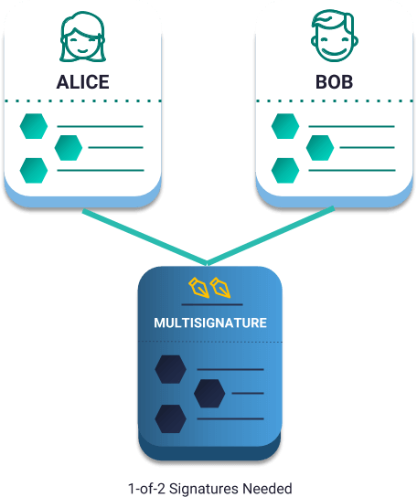

:orphan:

.. post:: 16 Aug, 2018
    :category: Multisig Account
    :excerpt: 1
    :nocomments:

#################################
Converting an account to multisig
#################################

Create a 1-of-2 :doc:`multisig account<../../concepts/multisig-account>`.

**********
Background
**********

Alice and Bob have separate :doc:`accounts <../../concepts/account>`. They also want to have a shared account to buy groceries, so that if Bob is out shopping, he can buy groceries for both himself and Alice.

This shared account appears in NEM as **1-of-2 multisig**. Multisig accounts permit Alice and Bob sharing funds in a separate account, requiring only the signature from one of them to transact.

    1-of-2 multisig account example

In this guide, you are going to create a 1-of-2 multisig account. In future guides, you will learn how to increase the minimum number of cosignatures required, as well as invite and remove cosignatories from the multisig account.

*************
Prerequisites
*************

- Finish the :doc:`getting started section <../../getting-started/setup-workstation>`
- Have one :ref:`account with cat.currency <setup-getting-a-test-account>`
- Create :doc:`two accounts <creating-and-opening-an-account>`

**********************
Getting into some code
**********************

1. First, define the accounts that will be cosginatories of the multisig account. In our case, these are Alice and Bob addresses. Then, open the account that will be converted into multisig using its private key.

.. example-code::

    .. viewsource:: ../../resources/examples/typescript/account/ConvertingAnAccountToMultisig.ts
        :language: typescript
        :start-after:  /* start block 01 */
        :end-before: /* end block 01 */

    .. viewsource:: ../../resources/examples/javascript/account/ConvertingAnAccountToMultisig.js
        :language: javascript
        :start-after:  /* start block 01 */
        :end-before: /* end block 01 */

2. Create a :ref:`modify multisig account transaction <modify-multisig-account-transaction>`  to convert the shared account into a multisig account. As you want to create a 1-of-2 multisig account, set the minimum signatures required to ``1``.

.. example-code::

    .. viewsource:: ../../resources/examples/typescript/account/ConvertingAnAccountToMultisig.ts
        :language: typescript
        :start-after:  /* start block 02 */
        :end-before: /* end block 02 */

    .. viewsource:: ../../resources/examples/javascript/account/ConvertingAnAccountToMultisig.js
        :language: javascript
        :start-after:  /* start block 02 */
        :end-before: /* end block 02 */

3. Create an :ref:`aggregate bonded transaction <aggregate-transaction>`, wrapping the modify multisig account transaction. This is necessary since Alice and Bob must opt-in to become cosignatories of the new multisig account.

.. example-code::

    .. viewsource:: ../../resources/examples/typescript/account/ConvertingAnAccountToMultisig.ts
        :language: typescript
        :start-after:  /* start block 03 */
        :end-before: /* end block 03 */

    .. viewsource:: ../../resources/examples/javascript/account/ConvertingAnAccountToMultisig.js
        :language: javascript
        :start-after:  /* start block 03 */
        :end-before: /* end block 03 */

4. Sign the aggregate transaction using the private key of the multisig account.

.. note:: To make the transaction only valid for your network, include the first block generation hash. Open ``http://localhost:3000/block/1`` in a new tab and copy the ``meta.generationHash`` value.

.. example-code::

    .. viewsource:: ../../resources/examples/typescript/account/ConvertingAnAccountToMultisig.ts
        :language: typescript
        :start-after:  /* start block 04 */
        :end-before: /* end block 04 */

    .. viewsource:: ../../resources/examples/javascript/account/ConvertingAnAccountToMultisig.js
        :language: javascript
        :start-after:  /* start block 04 */
        :end-before: /* end block 04 */

5. Before sending an aggregate bonded transaction, the future multisig account needs to :ref:`lock <hash-lock-transaction>` at least ``10`` cat.currency. This transaction is required to prevent network spamming and ensure that the inner transactions are cosigned. After the hash lock transaction has been confirmed, announce the aggregate transaction.

.. example-code::

    .. viewsource:: ../../resources/examples/typescript/account/ConvertingAnAccountToMultisig.ts
        :language: typescript
        :start-after:  /* start block 05 */
        :end-before: /* end block 05 */

    .. viewsource:: ../../resources/examples/javascript/account/ConvertingAnAccountToMultisig.js
        :language: javascript
        :start-after:  /* start block 05 */
        :end-before: /* end block 05 */

6. :doc:`Cosign the aggregate transaction <../transaction/signing-announced-aggregate-bonded-transactions>` with Alice's account.

.. code-block:: bash

    nem2-cli transaction cosign --hash A6A374E66B32A3D5133018EFA9CD6E3169C8EEA339F7CCBE29C47D07086E068C --profile alice

7. :doc:`Cosign the aggregate transaction <../transaction/signing-announced-aggregate-bonded-transactions>` with Bob's account.

.. code-block:: bash

    nem2-cli transaction cosign --hash A6A374E66B32A3D5133018EFA9CD6E3169C8EEA339F7CCBE29C47D07086E068C --profile bob

.. _guide-get-multisig-account-info:

8. If everything goes well, the account is now multisig, being Alice and Bob cosignatories. You can get the list of the multisig accounts where Alice or Bob are cosignatories using ``getMultisigAccountInfo`` function.

.. example-code::

    .. viewsource:: ../../resources/examples/typescript/account/GettingMultisigAccountCosignatories.ts
        :language: typescript
        :start-after:  /* start block 01 */
        :end-before: /* end block 01 */

    .. viewsource:: ../../resources/examples/javascript/account/GettingMultisigAccountCosignatories.js
        :language: javascript
        :start-after:  /* start block 01 */
        :end-before: /* end block 01 */

************
What's next?
************

Modify the multisig account you just created, converting it into a 2-of-2 multisig following :doc:`the next guide <modifying-a-multisig-account>`.
