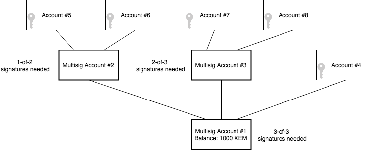
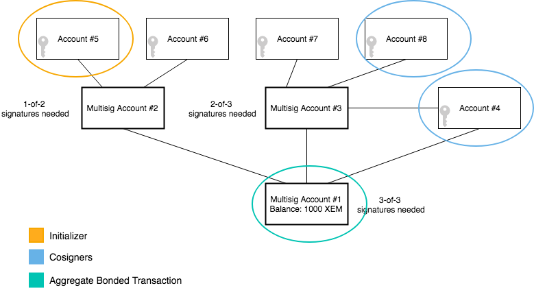

:orphan:

##############################################
Creating a multi-level multisig account (MLMA)
##############################################

Following this tutorial, you will create a :doc:`multi-level multisig account <../../concepts/multisig-account>`.

    Three-level multisig account example

**********
Background
**********

Multisig accounts can have as a cosigner another multisig, up to ``3`` levels. Multi-level multisig accounts add “AND/OR” logic to multi-signature transactions.

*************
Prerequisites
*************

- Finish :doc:`converting an account to multisig guide <converting-an-account-to-multisig>`
- Text editor or IDE
- NEM2-SDK or CLI

************************
Let’s get into some code
************************

1) Creating multisig account #2

.. example-code::

    .. literalinclude:: ../../resources/examples/typescript/account/CreatingAMultilevelMultisigAccount.ts
        :language: typescript
        :lines:  31-61

    .. literalinclude:: ../../resources/examples/java/src/test/java/nem2/guides/examples/account/CreatingAMultilevelMultisigAccount.java
        :language: java
        :lines: 39-75

    .. literalinclude:: ../../resources/examples/javascript/account/CreatingAMultilevelMultisigAccount.js
        :language: javascript
        :lines: 31-61

2) Creating multisig account #3

.. example-code::

    .. literalinclude:: ../../resources/examples/typescript/account/CreatingAMultilevelMultisigAccount.ts
        :language: typescript
        :lines:  64-99

    .. literalinclude:: ../../resources/examples/java/src/test/java/nem2/guides/examples/account/CreatingAMultilevelMultisigAccount.java
        :language: java
        :lines: 77-117

    .. literalinclude:: ../../resources/examples/javascript/account/CreatingAMultilevelMultisigAccount.js
        :language: javascript
        :lines: 64-99

3) Creating multisig account #1

.. example-code::

    .. literalinclude:: ../../resources/examples/typescript/account/CreatingAMultilevelMultisigAccount.ts
        :language: typescript
        :lines: 102-

    .. literalinclude:: ../../resources/examples/java/src/test/java/nem2/guides/examples/account/CreatingAMultilevelMultisigAccount.java
        :language: java
        :lines: 119-149

    .. literalinclude:: ../../resources/examples/javascript/account/CreatingAMultilevelMultisigAccount.js
        :language: javascript
        :lines: 102-

************
What's next?
************

Who should cosign the transaction if Account #5 initiates an aggregate bonded transaction? Notice that multisig accounts are not capable of cosigning transactions, cosignatories are responsible for doing so.

    Sending an aggregate bonded transaction from a MLMA
