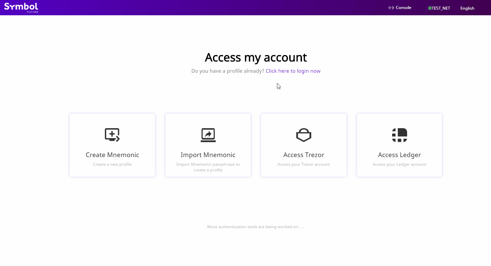
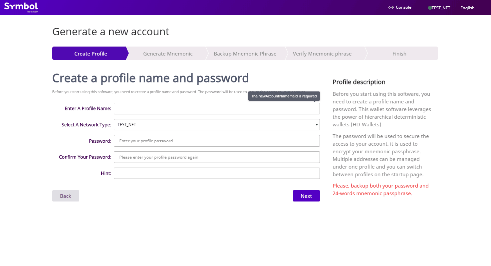
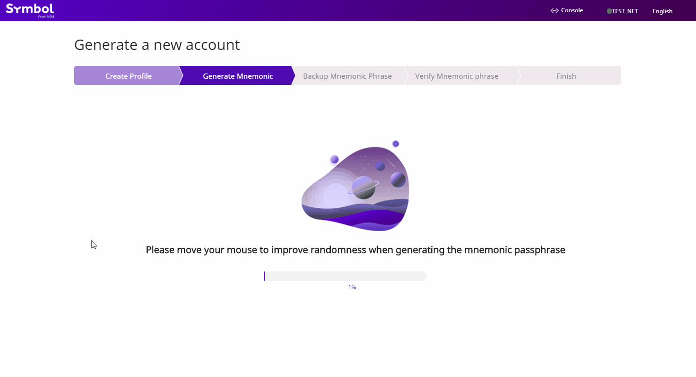
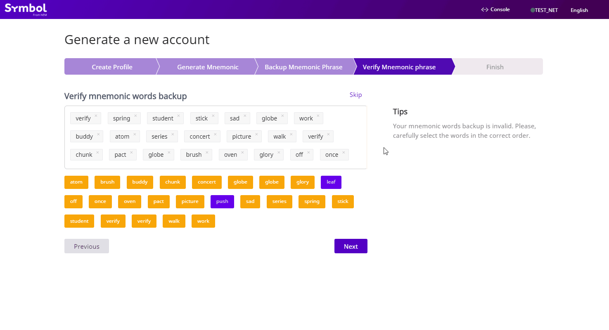

:orphan:

.. post:: 02 Aug, 2018
    :category: Account
    :tags: wallet, SDK, CLI
    :excerpt: 1
    :nocomments:

###################
Creating an account
###################

Create a new |codename| account to start sending and receiving transactions.

*************
Prerequisites
*************

- Complete the :doc:`getting started section <../../getting-started/setup-workstation>`.

************************************
Method #01: Using the Desktop Wallet
************************************

1. Open up the :ref:`Desktop Wallet <wallet-desktop>` application and click on the "**Create Mnemonic**" button.

2. Enter your profile information, including your profile name, network type and password.
Be sure to select the correct network type for your desired purpose.
Once you have filled out the page with the appropriate information, click "**Next**".

3. On the next page, the Desktop Wallet uses the movement of your mouse cursor to generate a random mnemonic passphrase for your wallet.
Shift your mouse around the screen until the progress bar reaches 100% and the application automatically moves you to the next page.

4. Click "**Display mnemonic words**" to view your private passphrase. Be sure to store this information as it stores all the information that is needed to recover your assets in the wallet in case of emergencies. Storing this passphrase somewhere offline is preferred. Click "**Next**".

5. Verify that you have backed up your mnemonic passphrase. Click the passphrase in the correct order. Click "**Next**".

6. Read the safety tips on the next page and click "**Next**". Congratulations, your account should be ready for use!

*************************
Method #02: Using the SDK
*************************

To create an account, open a new file and run the following code snippet.
Be sure to select the correct network type for your desired purpose.

.. example-code::

    .. viewsource:: ../../resources/examples/typescript/account/CreatingAnAccount.ts
        :language: typescript
        :start-after:  /* start block 01 */
        :end-before: /* end block 01 */

    .. viewsource:: ../../resources/examples/typescript/account/CreatingAnAccount.js
        :language: javascript
        :start-after:  /* start block 01 */
        :end-before: /* end block 01 */

    .. viewsource:: ../../resources/examples/java/src/test/java/symbol/guides/examples/account/CreatingAnAccount.java
        :language: java
        :start-after:  /* start block 01 */
        :end-before: /* end block 01 */

If you already have a private key, you can use it to define a new ``Account`` object.

.. example-code::

    .. viewsource:: ../../resources/examples/typescript/account/OpeningAnAccount.ts
        :language: typescript
        :start-after:  /* start block 01 */
        :end-before: /* end block 01 */

    .. viewsource:: ../../resources/examples/typescript/account/OpeningAnAccount.js
        :language: javascript
        :start-after:  /* start block 01 */
        :end-before: /* end block 01 */

    .. viewsource:: ../../resources/examples/java/src/test/java/symbol/guides/examples/account/OpeningAnAccount.java
        :language: java
        :start-after:  /* start block 01 */
        :end-before: /* end block 01 */

*************************
Method #03: Using the CLI
*************************

Open a terminal window and run the following command to create a new account.

.. viewsource:: ../../resources/examples/bash/account/CreatingAnAccount.sh
    :language: bash
    :start-after: #!/bin/sh
