.. post:: 26 Mar, 2023
    :category: Account
    :tags: wallet, Ledger
    :excerpt: 1
    :nocomments:

################################################
How to use your Ledger device with Symbol Wallet
################################################

The Ledger Nano S and X are hardware wallets that support multiple cryptocurrencies, including Symbol.

A hardware wallet is a type of cryptocurrency wallet where you can store your private keys on a physical device. It's a secure and simultaneously user-friendly way to access your coins, as the private key is stored on the device and doesn't get leaked. Your coins are safe even when connected to an infected or malicious computer or a phishing/scam web page.

Symbol Wallet for Desktop allows you to send and receive Symbol assets using a Ledger hardware wallet. Along with providing support for XYM, the Ledger device can also offer support for tokens created on the Symbol blockchain.

*************
Prerequisites
*************

- Your Ledger device has been initialized. Select and click your model below for instructions on how to set up your device.

  - `Ledger S device set up <https://support.ledger.com/hc/en-us/articles/360000613793>`_
  - `Ledger X device set up <https://support.ledger.com/hc/en-us/articles/360018784134>`_

- Your Ledger device’s firmware is up to date. Select and click your model below for instructions on how to update your device’s firmware.

  - `Ledger S device update <https://support.ledger.com/hc/en-us/articles/360002731113>`_
  - `Ledger X device update <https://support.ledger.com/hc/en-us/articles/360013349800>`_

- `Ledger Live <https://www.ledger.com/ledger-live>`_ application is installed. Click `here <https://support.ledgerwallet.com/hc/en-us/articles/360006395233-Take-your-first-steps>`_ for instructions on how to get started.

- `Symbol Wallet for Desktop <https://github.com/nemgrouplimited/symbol-desktop-wallet/releases/latest>`_ is installed.

*******************************************
Step 1: Install Symbol app on Ledger device
*******************************************

1. Launch the Ledger Live app, then click **Manager** in the left side panel.

2. Connect and unlock your Ledger device.

3. Allow the Manager on your device by pressing both left and right buttons simultaneously.

4. Find Symbol in the App catalog.

5. Click the **Install** button.

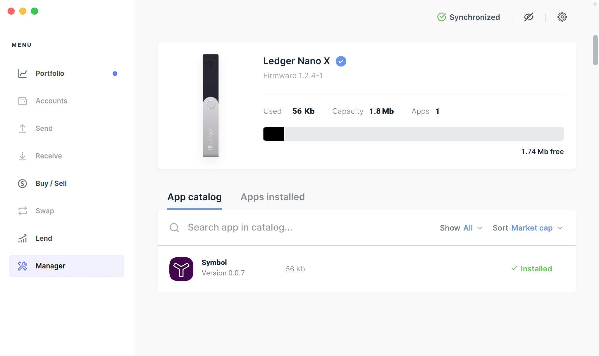

****************************************
Step 2: Open Symbol app on Ledger device
****************************************

1. Find the Symbol app in your Ledger device by pressing the left and right buttons.

2. Press both left and right buttons simultaneously to open the Symbol app.

.. figure:: ../../resources/images/screenshots/ledger-guide-1.png
  :align: center
  :width: 100%
  :class: with-shadow
  :target: /_images/ledger-guide-1.png

********************************
Step 3: Launch the Symbol Wallet
********************************

1. Launch the Symbol Wallet.

2. Click **Create a new profile?** link.

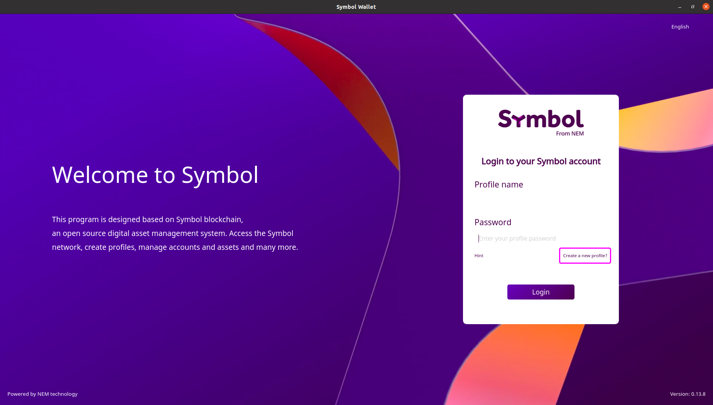

3. Click the **Access Ledger** button. Make sure the Symbol app is loaded in your Ledger device.

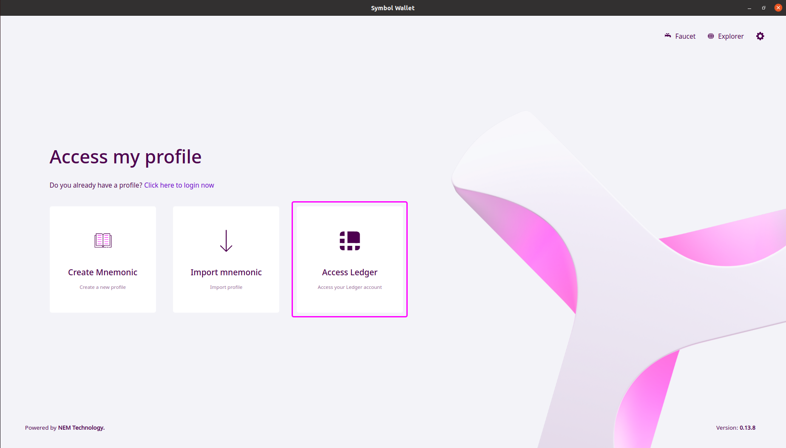

4. Enter a profile name, select **MAIN_NET** network, enter a password and then click the **Next** button. A popup will appear to check your Ledger device for verification.

.. figure:: ../../resources/images/screenshots/ledger-guide-4.png
  :align: center
  :width: 100%
  :class: with-shadow
  :target: /_images/ledger-guide-4.png

5. Once your profile has been created, click the **Next** button to continue. Note that all transactions must be confirmed via your Ledger device NOT with your password.

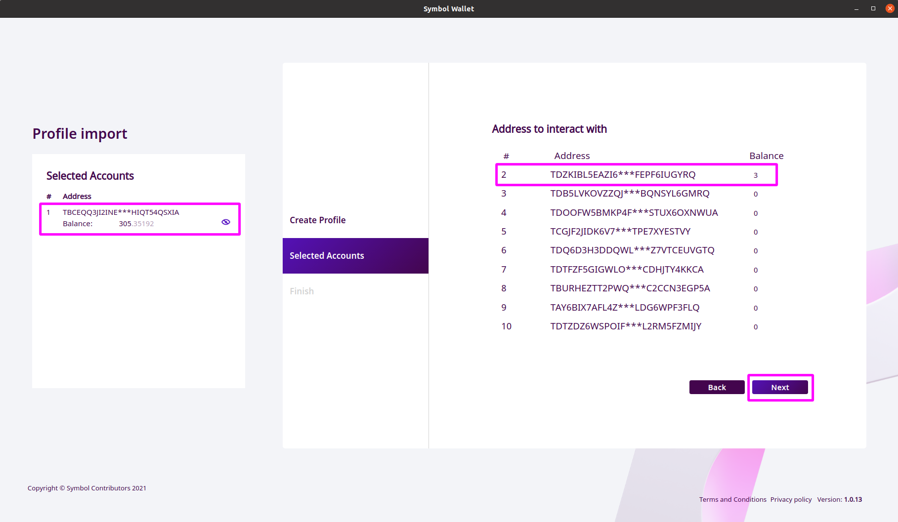

**************************************************
Step 4: Verify Symbol address in the Ledger device
**************************************************

1. Press the right button of your Ledger device to verify your address. This is the Symbol (XYM) address generated by the device synced to the Symbol Wallet.

.. figure:: ../../resources/images/screenshots/ledger-guide-6.png
  :align: center
  :width: 100%
  :class: with-shadow
  :target: /_images/ledger-guide-6.png

2. Review your Symbol address, then press the right button. In this tutorial, the Symbol address is shown below.

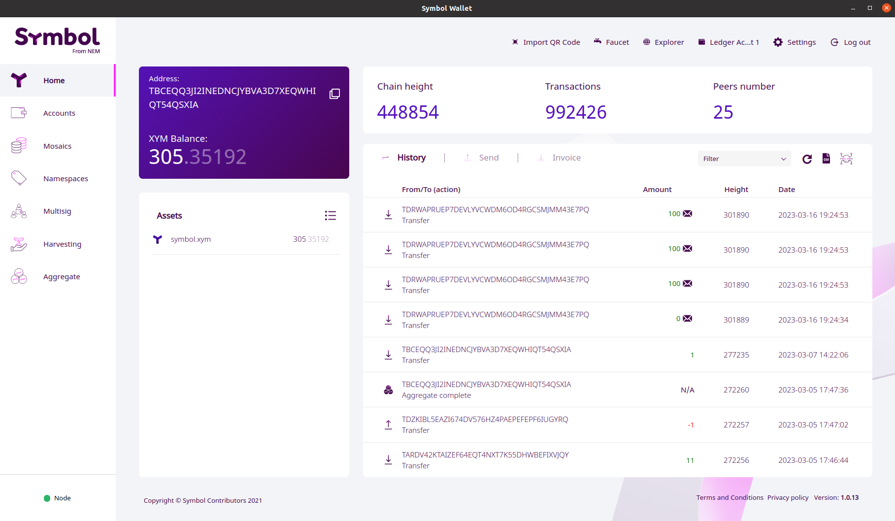

3. Press both left and right buttons simultaneously to approve.

.. figure:: ../../resources/images/screenshots/ledger-guide-8.png
  :align: center
  :width: 100%
  :class: with-shadow
  :target: /_images/ledger-guide-8.png

*************************************************
Step 5: Send and receive XYM in the Ledger device
*************************************************

After completing the steps mentioned above, navigate to the Symbol Wallet dashboard by clicking **Home** in the left side panel.

The dashboard shows all the transactions coming in and out of your Ledger device, your account balance, assets and block information.

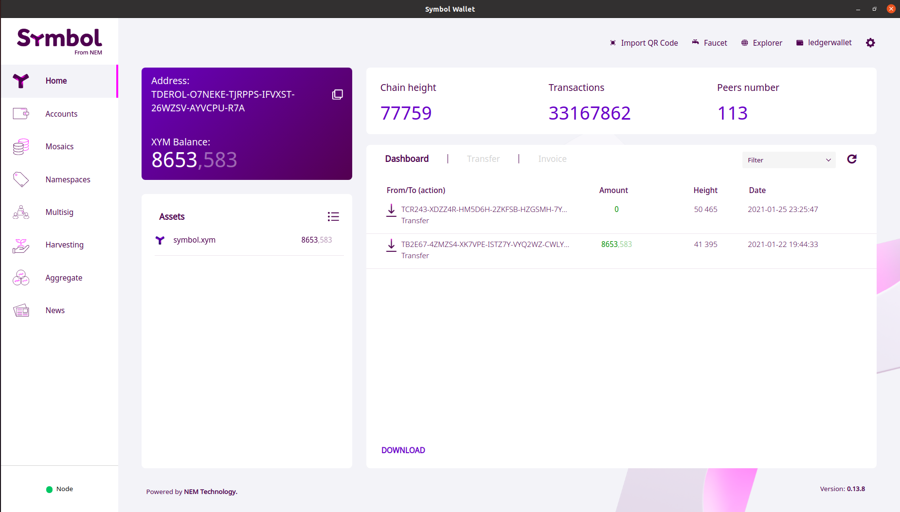

**IMPORTANT**: When initializing a transaction in your Symbol Wallet, always verify if the data (e.g. Symbol address, XYM amount) matches with the corresponding data displayed on your Ledger device. If the two data match, you can proceed with the transaction; otherwise, you should NOT continue.

******************
How to receive XYM
******************

1. Click **Accounts** in the left side panel.

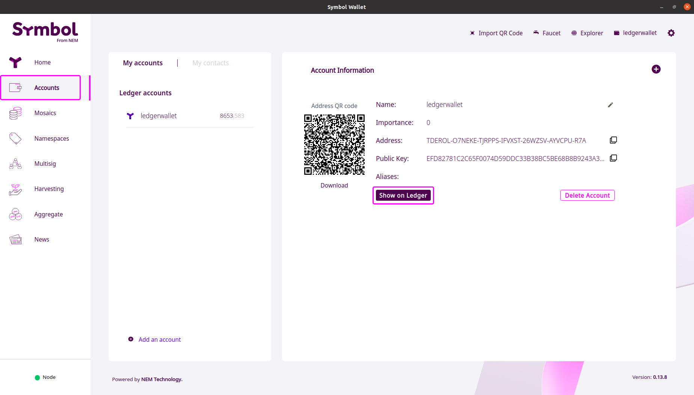

2. Click the **Show on Ledger** button to verify your Symbol address. If the address in your Symbol Wallet matches with the address in your Ledger device, you can rest assured that it is true and genuine.

3. Once verified, you can now share your Symbol address with the sender.

***************
How to send XYM
***************

1. Click **Transfer**.

2. Fill out the required fields.

- **To** - the receiver’s XYM address.
- **Amount of XYM** - the amount you are sending to the receiver.

**IMPORTANT**: If you are sending XYM to an exchange, you might need to add an unencrypted message. Please read carefully the instructions provided by the exchange.

3. Click the **Send** button. Note that there will be a fee for every transaction made.

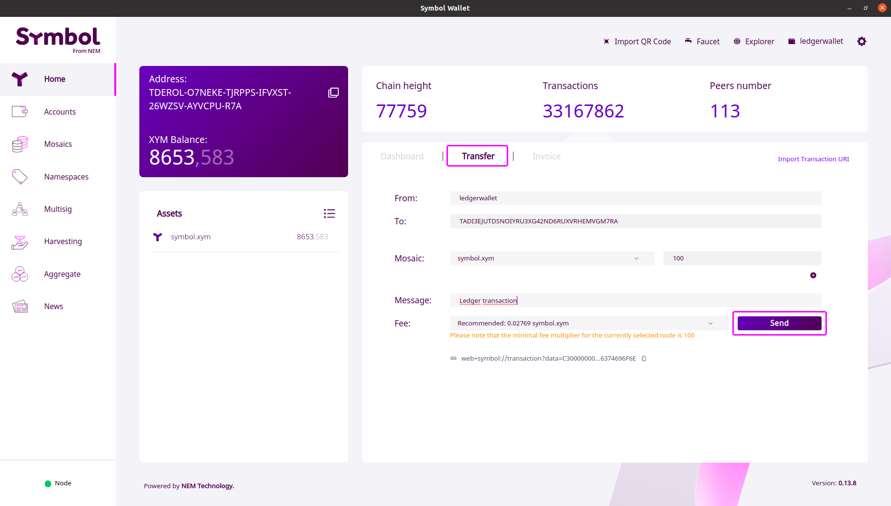

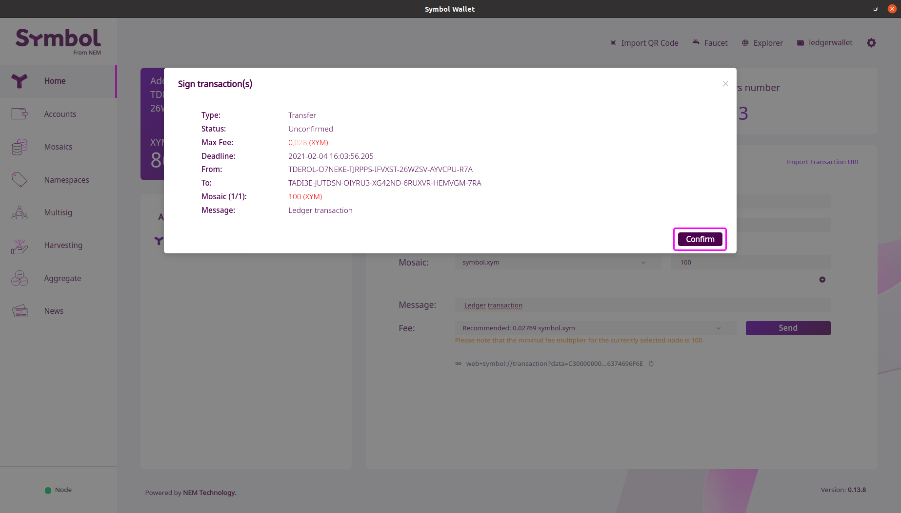

4. Review each transaction detail in your Ledger device and press the right button to continue.

* Recipient’s Symbol address

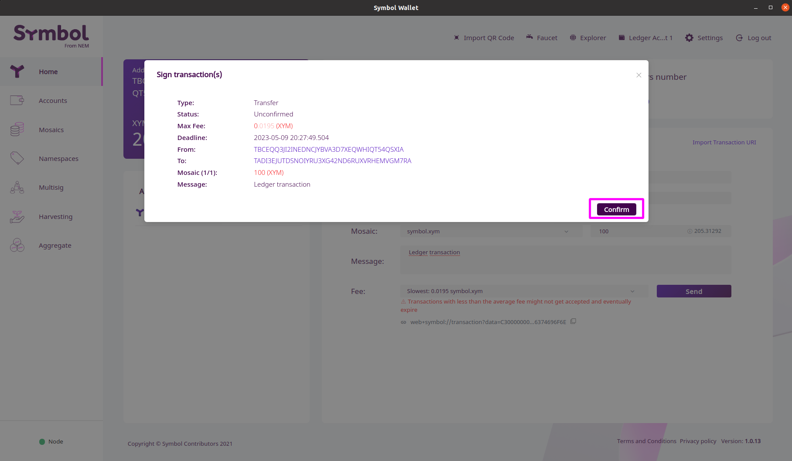

* Transaction Type

.. figure:: ../../resources/images/screenshots/ledger-guide-14.png
  :align: center
  :width: 100%
  :class: with-shadow
  :target: /_images/ledger-guide-14.png

* Amount

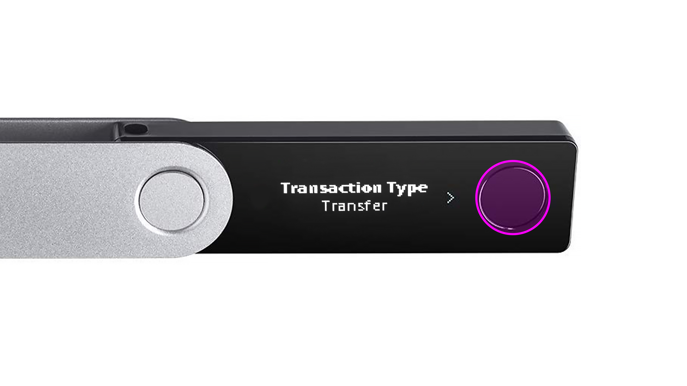

* Message

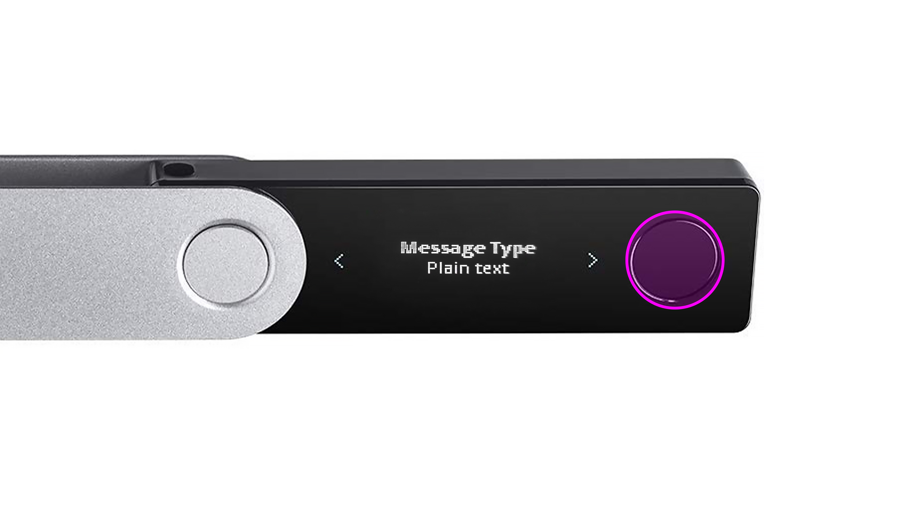

* Fee

.. figure:: ../../resources/images/screenshots/ledger-guide-18.png
  :align: center
  :width: 100%
  :class: with-shadow
  :target: /_images/ledger-guide-18.png

5. If all data are correct, press both left and right buttons simultaneously to approve and sign the transaction.

.. figure:: ../../resources/images/screenshots/ledger-guide-19.png
  :align: center
  :width: 100%
  :class: with-shadow
  :target: /_images/ledger-guide-19.png

*******************************
How to view transaction details
*******************************

As mentioned above, you can view all the transactions coming in and out of your Ledger device through the Symbol Wallet dashboard.

1. Go to **Dashboard**.

.. figure:: ../../resources/images/screenshots/ledger-guide-20.png
  :align: center
  :width: 100%
  :class: with-shadow
  :target: /_images/ledger-guide-20.png

2. Click the transaction you want to view.

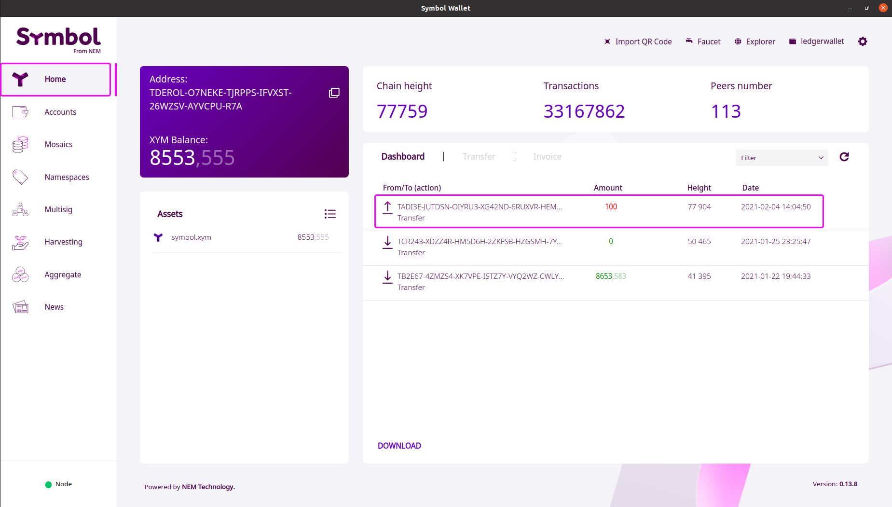

3. You can also view the transaction details in the `Symbol Blockchain Explorer <https://symbol.fyi/>`_ by using the Hash data.

********
Features
********

Ledger device integration supports all features available via Symbol Wallet, e.g.:

- Send transactions

- Sign/Send multisignature transactions

- Create/Edit multisignature accounts

- Create/Edit namespaces

- Create/Edit mosaics

- Enable delegated harvesting

- Add/Remove aliases for account and mosaics

- Add metadata to account/mosaic/namespace

- Add/Remove account restrictions

***************
Contact Support
***************

For technical support, you may reach us at:

- Discord: https://discord.com/invite/xymcity

- Telegram: @nemhelpdesk