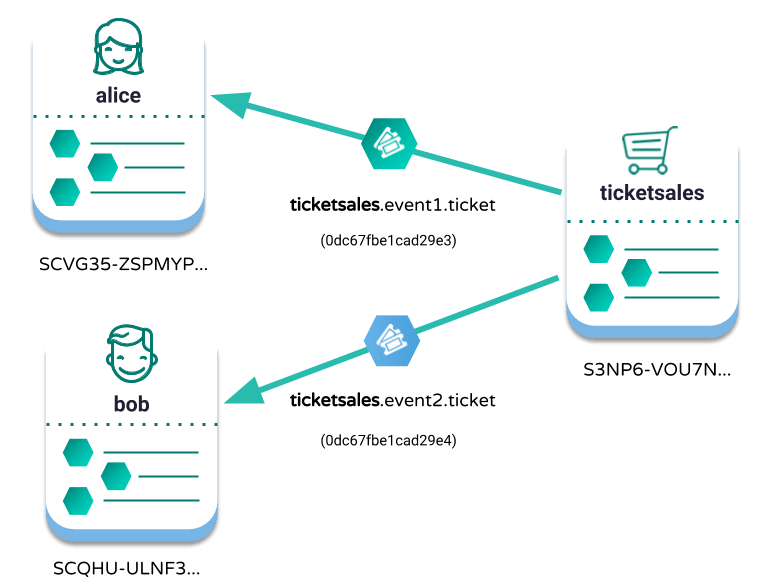

#############################################################
Getting the asset identifier behind a namespace with receipts
#############################################################

.. post:: 11 Jul, 2019
    :category: Receipt
    :tags: SDK
    :excerpt: 1
    :nocomments:

Get the resolution for a given alias and transaction using receipts.

********
Use case
********

|codename| accounts can link registered namespaces to other accounts or mosaics by announcing an :ref:`mosaicaliastransaction`.
This feature allows you to replace long and complex identifiers with short and familiar names for your accounts and mosaics.

Imagine a ticket vendor sending tickets to their customers on |codename|'s public chain.
The company needs to send 1 ``0dc67fbe1cad29e3`` to ``SCVG35-ZSPMYP-L2POZQ-JGSVEG-RYOJ3V-BNIU3U-N2E6``.
With aliases, the ticket vendor can define the same transaction as sending 1 ``ticketsales.event1.ticket`` to ``@alice`` instead.

    Recognizable mosaics and addresses

To ensure the transactions are being sent to the correct place with the correct mosaic, you can directly query the network about the **current mosaic identifier behind a namespace** by running the following snippet:

.. example-code::

    .. viewsource:: ../../resources/examples/typescript/blockchain/GettingTheCurrentMosaicIdentifierBehindANamespace.ts
        :language: typescript
        :start-after:  /* start block 01 */
        :end-before: /* end block 01 */

    .. viewsource:: ../../resources/examples/typescript/blockchain/GettingTheCurrentMosaicIdentifierBehindANamespace.js
        :language: javascript
        :start-after:  /* start block 01 */
        :end-before: /* end block 01 */

    .. viewsource:: ../../resources/examples/java/src/test/java/symbol/guides/examples/blockchain/GettingTheCurrentMosaicIdentifierBehindANamespace.java
        :language: java
        :start-after:  /* start block 01 */
        :end-before: /* end block 01 */

However, the same method **cannot be used to verify transactions of the past**.
This is due to the facts that:

* Transactions using aliased mosaics or accounts are stored on the blockchain using the namespace identifier, not the real address or mosaic id behind it.
* Links are editable. The namespace creator can link its namespace to another asset.
* Namespaces expire. The namespace link could be deleted.

At this point, you might be wondering: how then can we get the accurate relation between a namespace and its real identifier for a past transaction? The answer lies with :doc:`receipts <../../concepts/receipt>`.
For each block, |codename| nodes store receipts that contain every **invisible state change** that cannot be retrieved directly from the transaction or block header.

*************
Prerequisites
*************

- Complete the :doc:`getting started section <../../getting-started/setup-workstation>`.
- Create a new :ref:`account <setup-creating-a-test-account>`.
- Load the account with enough |networkcurrency| to pay for transaction fees.

**********************
Getting into some code
**********************

In this example, we are going to announce a **TransferTransaction** using |networkcurrency| instead of the native currency mosaic id.
Once the network confirms the transaction, we will get the **block height** where the transaction has been recorded. With this information, we will then get the namespace-mosaic relation by looking into the block receipts’.

1. Define the mosaic you want to send. Use a **linked namespace identifier** (e.g. |networkcurrency|) instead of the mosaic identifier.

.. example-code::

    .. viewsource:: ../../resources/examples/typescript/blockchain/GettingTheMosaicIdentifierBehindANamespaceWithReceipts.ts
        :language: typescript
        :start-after:  /* start block 01 */
        :end-before: /* end block 01 */

    .. viewsource:: ../../resources/examples/typescript/blockchain/GettingTheMosaicIdentifierBehindANamespaceWithReceipts.js
        :language: javascript
        :start-after:  /* start block 01 */
        :end-before: /* end block 01 */

2. Attach the mosaic to a **TransferTransaction**.

.. example-code::

    .. viewsource:: ../../resources/examples/typescript/blockchain/GettingTheMosaicIdentifierBehindANamespaceWithReceipts.ts
        :language: typescript
        :start-after:  /* start block 02 */
        :end-before: /* end block 02 */

    .. viewsource:: ../../resources/examples/typescript/blockchain/GettingTheMosaicIdentifierBehindANamespaceWithReceipts.js
        :language: javascript
        :start-after:  /* start block 02 */
        :end-before: /* end block 02 */

3. Announce the **TransferTransaction**.
Once the transaction is confirmed, retrieve the receipts attached to the block and find for the namespace resolution.

.. example-code::

    .. viewsource:: ../../resources/examples/typescript/blockchain/GettingTheMosaicIdentifierBehindANamespaceWithReceipts.ts
        :language: typescript
        :start-after:  /* start block 03 */
        :end-before: /* end block 03 */

    .. viewsource:: ../../resources/examples/typescript/blockchain/GettingTheMosaicIdentifierBehindANamespaceWithReceipts.js
        :language: javascript
        :start-after:  /* start block 03 */
        :end-before: /* end block 03 */

*************
What is next?
*************

Receipts do not only store resolutions for aliases, but also every invisible state change that is not directly retrievable from transactions or the block header.
You can check under the :doc:`receipts documentation <../../concepts/receipt>` the **complete list of changes logged**.
