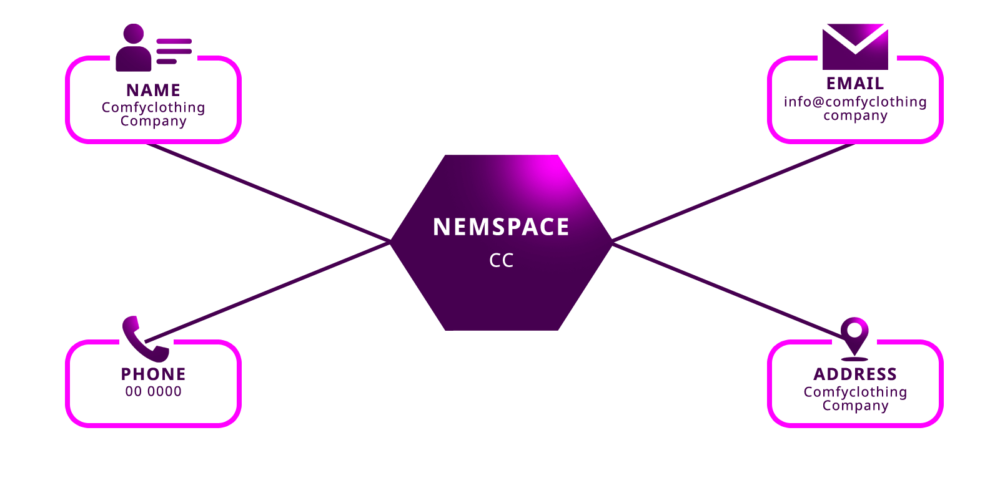

:orphan:

.. post:: 01 Oct, 2019
    :category: Metadata
    :excerpt: 1
    :nocomments:

#################################
Assigning metadata to a namespace
#################################

Add custom data to a namespace.

*************
Prerequisites
*************

- Finish the :doc:`getting started section <../../getting-started/setup-workstation>`
- Have one :ref:`account with network currency <setup-creating-a-test-account>`
- Finish :doc:`registering a namespace guide <../namespace/registering-a-namespace>`

**********
Background
**********

:doc:`Metadata <../../concepts/metadata>` can be attached to :doc:`namespaces <../../concepts/namespace>` to help users **verify domain ownership**.
The contained data could include information such as registrant, administrative, or technical contact information.

In this guide, you are going to implement a program to add contact details to a namespace.

*************
Prerequisites
*************

- Finish the :doc:`getting started section <../../getting-started/setup-workstation>`
- Have one :ref:`account with network currency <setup-creating-a-test-account>`
- Finish :doc:`registering a namespace guide <../namespace/registering-a-namespace>`

**********************
Creating the namespace
**********************

1. Create a new namespace ``cc`` with the **ComfyClothingCompany's account**.

.. code-block:: bash

    symbol-cli transaction namespace --sync

    Introduce namespace name: cc
    Do you want to create a root namespace? [y/n]: y
    Introduce the namespace rental duration: 1000
    Introduce max_fee (absolute amount): 0
    Transaction confirmed.

*************************
Method #01: Using the SDK
*************************

1. Define the following :ref:`namespace metadata transactions <namespace-metadata-transaction>`.

.. csv-table::
    :header: "Key", "Value"
    :delim: ;

    NAME; ComfyClothingCompany
    EMAIL; info@comfyclothingcompany
    ADDRESS; ComfyClothingCompany HQ
    PHONE; 000-0000

.. example-code::

    .. viewsource:: ../../resources/examples/typescript/metadata/AssigningMetadataToANamespace.ts
        :language: typescript
        :start-after:  /* start block 01 */
        :end-before: /* end block 01 */

    .. viewsource:: ../../resources/examples/typescript/metadata/AssigningMetadataToANamespace.js
        :language: javascript
        :start-after:  /* start block 01 */
        :end-before: /* end block 01 */

2. All metadata is attached only with the consent of the namespace creator through Aggregate Transactions.
Wrap the **metadata transactions** inside an :ref:`AggregateCompleteTransaction <aggregate-complete>` and sign the aggregate with the company's account.

.. example-code::

    .. viewsource:: ../../resources/examples/typescript/metadata/AssigningMetadataToANamespace.ts
        :language: typescript
        :start-after:  /* start block 02 */
        :end-before: /* end block 02 */

    .. viewsource:: ../../resources/examples/typescript/metadata/AssigningMetadataToANamespace.js
        :language: javascript
        :start-after:  /* start block 02 */
        :end-before: /* end block 02 */

.. note:: If a namespace was owned by a different account, you would need to set the :ref:`aggregate as bonded <aggregate-bonded>`. Then, the namespace creator needs to accept the metadata request by :doc:`cosigning the transaction <../aggregate/signing-announced-aggregate-bonded-transactions>`.

3. Sign and announce the **AggregateTransaction** to the network.

.. example-code::

    .. viewsource:: ../../resources/examples/typescript/metadata/AssigningMetadataToANamespace.ts
        :language: typescript
        :start-after:  /* start block 03 */
        :end-before: /* end block 03 */

    .. viewsource:: ../../resources/examples/typescript/metadata/AssigningMetadataToANamespace.js
        :language: javascript
        :start-after:  /* start block 03 */
        :end-before: /* end block 03 */

4. When the transaction gets confirmed, try to :doc:`fetch the namespace's metadata entries <getting-metadata-entries-attached-to-a-namespace>`.

*************************
Method #02: Using the CLI
*************************

.. viewsource:: ../../resources/examples/bash/metadata/AssigningMetadataToANamespace.sh
    :language: bash
    :start-after: #!/bin/sh
