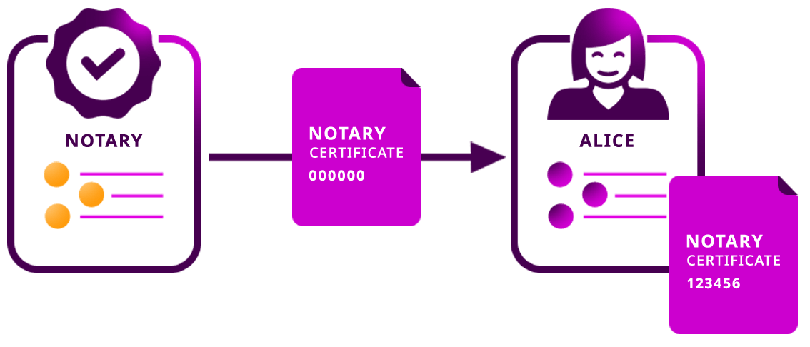

.. post:: 08 Oct, 2019
    :category: Metadata
    :tags: SDK, CLI
    :excerpt: 1
    :nocomments:

#########################
Updating metadata entries
#########################

Update any existent metadata entry.

********
Use case
********

:doc:`Metadata <../../concepts/metadata>`  transactions are stored on the blockchain.
Once a transaction is included in a block—and the block receives enough confirmations—it is not possible to modify the record without invalidating the whole chain.

What we can do to update a metadata entry is to announce a second metadata transaction. This action will record a new transaction while keeping the history immutable.
However, how can we retrieve the latest metadata value assigned to an asset without querying the whole chain? |codename| makes this possible by keeping a copy of the **newest value** assigned to a metadata entry as a **state**.

This guide shows you how to **update a metadata entry** attached to an account.
However, you could follow a similar approach to update namespace and mosaic metadata entries.

*************
Prerequisites
*************

- Complete the :doc:`getting started section <../../getting-started/setup-workstation>`.
- Complete :doc:`assigning metadata entries to an account <assigning-metadata-entries-to-an-account>` guide.

*************************
Method #01: Using the SDK
*************************

Bob—the notary from the :doc:`assigning metadata entries to an account guide <assigning-metadata-entries-to-an-account>`— is requested to remove Alice's account ``CERT`` metadata entry because the certificate has expired.

1. Define a new **AccountMetadataTransaction** setting Alice's account as the metadata target.
To indicate that the certificate has expired, Bob decides to add the new value ``000000`` to the metadata entry with key ``CERT``.
However, you need to pass an extra parameter that was not necessary when assigning a metadata entry for the first time.

By definition, :ref:`blockchains can rollback <rollbacks>` up to a certain pre-established depth to resolve forks.
In case that the state needs to be reverted, you need to indicate the difference of size between the ``previousValue`` assigned to the metadata entry and the ``newValue`` .

A) Retrieve the previous metadata value and calculate the difference of size with the newest value.
Then, return the AccountMetadataTransaction object.

.. example-code::

    .. viewsource:: ../../resources/examples/typescript/metadata/UpdatingMetadataEntriesRetrievePreviousValue.ts
        :language: typescript
        :start-after:  /* start block 01 */
        :end-before: /* end block 01 */

    .. viewsource:: ../../resources/examples/typescript/metadata/UpdatingMetadataEntriesRetrievePreviousValue.js
        :language: javascript
        :start-after:  /* start block 01 */
        :end-before: /* end block 01 */

B)  You can achieve the same result with less effort using the ``MetadataService``.
Behind the scenes, the |sdk| handles the complexity of updating metadata entries.

.. example-code::

    .. viewsource:: ../../resources/examples/typescript/metadata/UpdatingMetadataEntriesService.ts
        :language: typescript
        :start-after:  /* start block 01 */
        :end-before: /* end block 01 */

2. To avoid spamming the account with invalid metadata, all metadata is attached only with the consent of the account owner through Aggregate Transactions.
Thus, Alice will have to **opt-in** if she wants the metadata to be updated. Wrap the **AccountMetadataTransaction** inside an :ref:`AggregateBondedTransaction <aggregate-bonded>` and sign the transaction using Bob's account.

.. example-code::

    .. viewsource:: ../../resources/examples/typescript/metadata/UpdatingMetadataEntriesService.ts
        :language: typescript
        :start-after:  /* start block 02 */
        :end-before: /* end block 02 */

3. Before sending an aggregate transaction to the network, Bob has to lock 10 |networkcurrency|.
Define a new :ref:`hashlocktransaction` and sign it with Bob's account, locking the amount of |networkcurrency| required to announce the aggregate transaction.

.. example-code::

    .. viewsource:: ../../resources/examples/typescript/metadata/UpdatingMetadataEntriesService.ts
        :language: typescript
        :start-after:  /* start block 03 */
        :end-before: /* end block 03 */

.. note:: Bob will receive the locked funds back if Alice cosigns the aggregate during the next ``480`` blocks.

4. Announce the **HashLockTransaction**.
Monitor the network until the transaction gets confirmed, and then announce the **AggregateTransaction** containing the AccountMetadataTransaction.

.. example-code::

    .. viewsource:: ../../resources/examples/typescript/metadata/UpdatingMetadataEntriesService.ts
        :language: typescript
        :start-after:  /* start block 04 */
        :end-before: /* end block 04 */

5. Once the transaction gets confirmed, cosign the hash obtained in the third step using Alice's profile.

.. code-block:: bash

    symbol-cli transaction cosign --hash <transaction-hash> --profile alice

6. Retrieve the metadata entries assigned to Alice's account following :doc:`the next guide <getting-metadata-entries-attached-to-an-account>`.
