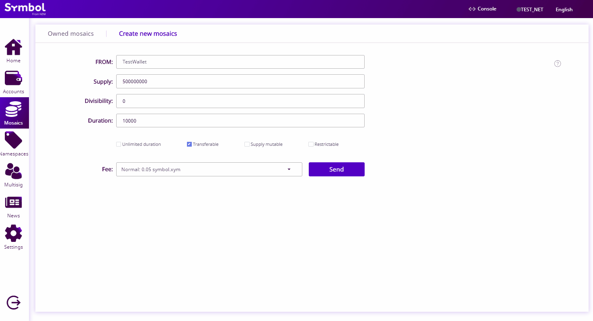

:orphan:

.. post:: 16 Aug, 2018
    :category: Mosaic
    :tags: wallet, SDK, CLI
    :excerpt: 1
    :nocomments:

#################
Creating a mosaic
#################

Tokenize an asset using mosaics.

**********
Background
**********

Imagine that a private company, ComfyClothingCompany, decides that it wants to go public.
Instead of a traditional IPO, the company decides to do an STO to issue tokens through the |codename| platform.

In this guide, we are going to help this company to create the tokens for their STO.

*************
Prerequisites
*************

- Complete the :doc:`getting started section <../../getting-started/setup-workstation>`.
- Create a new :ref:`account <setup-creating-a-test-account>`.
- Load the account with enough |networkcurrency| to pay for transaction fees.

******************************
Defining the mosaic properties
******************************

ComfyClothingCompany decides to create their STO mosaic with the following configuration:

.. csv-table::
    :header: "Property", "Value", "Description"
    :delim: ;

    Divisibility; 0 ; Although brokerages and investment firms can fractionalize shares, the traditional minimum number of shares an investor can purchase from the open market is 1.
    Duration; 0; Shares of the company should exist as long as the company is in business. The ComfyClothingCompany sets this property to 0, creating a non-expiring mosaic.
    Supply mutable; True; ComfyClothingCompany sets the initial supply of the mosaic to a typical startup amount of 10,000,000 authorized shares. As the company grows, it could choose to increase the number of shares, so the supply mutable is set to ``true``.
    Transferable; True; Once the initial shares are distributed, the shares will be on the market to be traded in public. Thus, the transferability property needs to be set to true.
    Restrictable; True; Since STOs are regulated, the mosaic creator should be able to restrict which accounts can transact with the mosaic.

************************************
Method #01: Using the Desktop Wallet
************************************

1. Click on the "**Mosaics**" tab from the left side menu.

2. Click on the "**Create new mosaics**" tab on the top of the page.

.. figure:: ../../resources/images/screenshots/desktop-create-mosaic-1.gif
    :align: center
    :width: 800px

3. Determine the properties of the mosaic you desire to create. Click "**Send**".

4. Verify the information on the popup and enter your wallet password. Click "**Confirm**". This should send the transaction to the network.

.. figure:: ../../resources/images/screenshots/desktop-create-mosaic-3.gif
    :align: center
    :width: 800px

5. When the transaction becomes confirmed, you can check to see that the mosaic has been created by going back to the "**Owned mosaics**" tab.

*************************
Method #02: Using the SDK
*************************

1. Open a new file and define a :ref:`MosaicDefinitionTransaction <mosaic-definition-transaction>` and determined the desired **mosaic properties** .

.. example-code::

    .. viewsource:: ../../resources/examples/typescript/mosaic/CreatingAMosaic.ts
        :language: typescript
        :start-after:  /* start block 01 */
        :end-before: /* end block 01 */

    .. viewsource:: ../../resources/examples/typescript/mosaic/CreatingAMosaic.js
        :language: javascript
        :start-after:  /* start block 01 */
        :end-before: /* end block 01 */

    .. viewsource:: ../../resources/examples/java/src/test/java/symbol/guides/examples/mosaic/CreatingAMosaic.java
        :language: java
        :start-after:  /* start block 01 */
        :end-before: /* end block 01 */

2. Define a :ref:`MosaicSupplyChangeTransaction <mosaic-supply-change-transaction>` to set the **initial supply**. For instance, we can set it to **1,000,000** mosaic units.

.. example-code::

    .. viewsource:: ../../resources/examples/typescript/mosaic/CreatingAMosaic.ts
        :language: typescript
        :start-after:  /* start block 02 */
        :end-before: /* end block 02 */

    .. viewsource:: ../../resources/examples/typescript/mosaic/CreatingAMosaic.js
        :language: javascript
        :start-after:  /* start block 02 */
        :end-before: /* end block 02 */

    .. viewsource:: ../../resources/examples/java/src/test/java/symbol/guides/examples/mosaic/CreatingAMosaic.java
        :language: java
        :start-after:  /* start block 02 */
        :end-before: /* end block 02 */

.. note:: |codename| works with **absolute amounts**. To get an absolute amount, multiply the number of assets you want to create by 10\ :sup:`divisibility`.  For example, if the mosaic has **divisibility** 2, to create 10 units (relative) you should define 1000 (absolute) instead.

3. Announce both transactions together using an :ref:`AggregateTransaction <aggregate-transaction>`.
Include the network generation hash to make the transaction only valid for your network.
Open ``nodeUrl + '/node/info'`` in a new browser tab and copy the ``meta.networkGenerationHash`` value.

.. example-code::

    .. viewsource:: ../../resources/examples/typescript/mosaic/CreatingAMosaic.ts
        :language: typescript
        :start-after:  /* start block 03 */
        :end-before: /* end block 03 */

    .. viewsource:: ../../resources/examples/typescript/mosaic/CreatingAMosaic.js
        :language: javascript
        :start-after:  /* start block 03 */
        :end-before: /* end block 03 */

    .. viewsource:: ../../resources/examples/java/src/test/java/symbol/guides/examples/mosaic/CreatingAMosaic.java
        :language: java
        :start-after:  /* start block 03 */
        :end-before: /* end block 03 */

Once the transaction gets confirmed, you can try to :doc:`transfer <../transfer/sending-a-transfer-transaction>` one unit of the created mosaic to another account, :doc:`modify the mosaic properties <modifying-mosaic-supply>` or :doc:`link a namespace to the mosaic <creating-a-mosaic>`.

*************************
Method #03: Using the CLI
*************************

Open a terminal window and run the following command to create a new mosaic.

.. viewsource:: ../../resources/examples/bash/mosaic/CreatingAMosaic.sh
    :language: bash
    :start-after: #!/bin/sh
