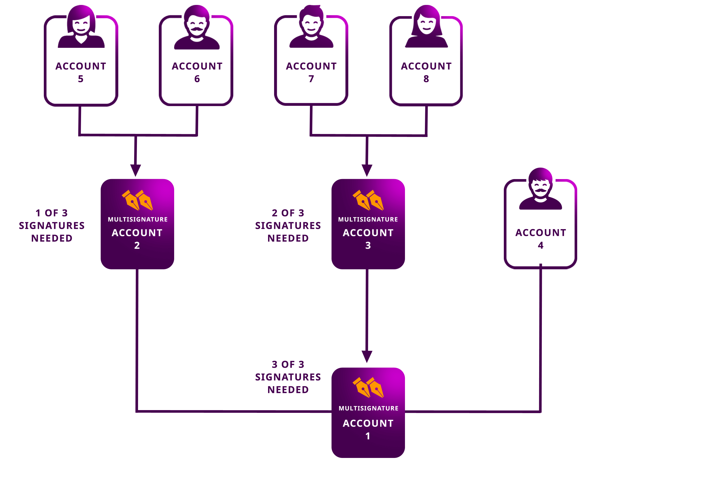
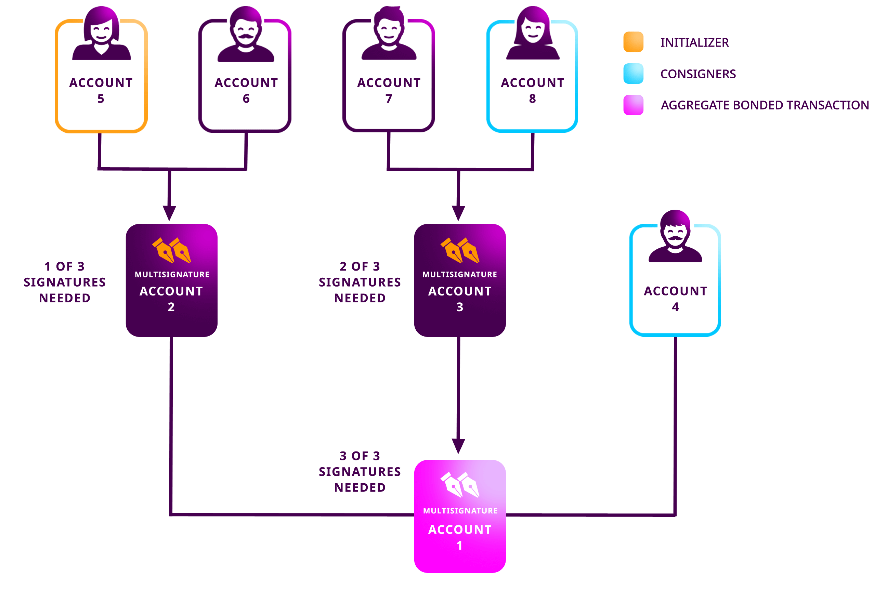

.. post:: 18 Aug, 2018
    :category: Multisig Account
    :tags: SDK
    :excerpt: 1
    :nocomments:

#######################################
Creating a multi-level multisig account
#######################################

This guide will show you how to connect multiple multisig accounts to achieve advanced on-chain authorization logic.

********
Use case
********

:doc:`Multisig accounts <../../concepts/multisig-account>` can have as cosignatories other multisig accounts and add “AND/OR” logic to multi-signature transactions.

In this guide, we are going to create a complex **3-level multisig account**.

    3-level multisig account example

For example, if the **account #5** initiates an **AggregateBondedTransaction** involving the **account #1**, the accounts **#7 or #8** and **#4** should cosign the transaction in order to be included in a block.

    Sending an AggregateBondedTransaction from a MLMA

*************
Prerequisites
*************

- Complete :doc:`converting an account to multisig <creating-a-multisig-account>` guide.
- Create :doc:`accounts <../account/creating-an-account>` for every multisig level.
- Load the root multisig account with enough |networkcurrency| to pay for the transaction fee.

************************
Method #1: Using the SDK
************************

1. Define the **multisig account #2**.

.. example-code::

    .. viewsource:: ../../resources/examples/typescript/multisig/CreatingAMultilevelMultisigAccount.ts
        :language: typescript
        :start-after:  /* start block 01 */
        :end-before: /* end block 01 */

    .. viewsource:: ../../resources/examples/typescript/multisig/CreatingAMultilevelMultisigAccount.js
        :language: javascript
        :start-after:  /* start block 01 */
        :end-before: /* end block 01 */

2. Define the **multisig account #3**.

.. example-code::

    .. viewsource:: ../../resources/examples/typescript/multisig/CreatingAMultilevelMultisigAccount.ts
        :language: typescript
        :start-after:  /* start block 02 */
        :end-before: /* end block 02 */

    .. viewsource:: ../../resources/examples/typescript/multisig/CreatingAMultilevelMultisigAccount.js
        :language: javascript
        :start-after:  /* start block 02 */
        :end-before: /* end block 02 */

3. Define the **multisig account #1**.

.. example-code::

    .. viewsource:: ../../resources/examples/typescript/multisig/CreatingAMultilevelMultisigAccount.ts
        :language: typescript
        :start-after:  /* start block 03 */
        :end-before: /* end block 03 */

    .. viewsource:: ../../resources/examples/typescript/multisig/CreatingAMultilevelMultisigAccount.js
        :language: javascript
        :start-after:  /* start block 03 */
        :end-before: /* end block 03 */

4. Announce the transactions together using an :ref:`aggregatebondedtransaction`.
The **account #1** must lock ``10`` |networkcurrency| to announce the transaction.

.. example-code::

    .. viewsource:: ../../resources/examples/typescript/multisig/CreatingAMultilevelMultisigAccount.ts
        :language: typescript
        :start-after:  /* start block 04 */
        :end-before: /* end block 04 */

    .. viewsource:: ../../resources/examples/typescript/multisig/CreatingAMultilevelMultisigAccount.js
        :language: javascript
        :start-after:  /* start block 04 */
        :end-before: /* end block 04 */

5. The potential cosignatories must opt-in to become cosignatories.
:doc:`Cosign the announced AggregateTransaction <../aggregate/signing-announced-aggregate-bonded-transactions>` with the accounts **#5**, **#6**, **#7**, **#8,** and **#4**.

.. code-block:: bash

    symbol-cli transaction cosign --hash A6A374E66B32A3D5133018EFA9CD6E3169C8EEA339F7CCBE29C47D07086E068C --profile <account>
