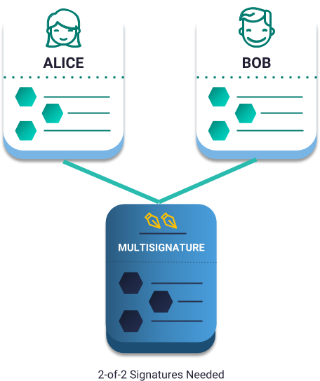
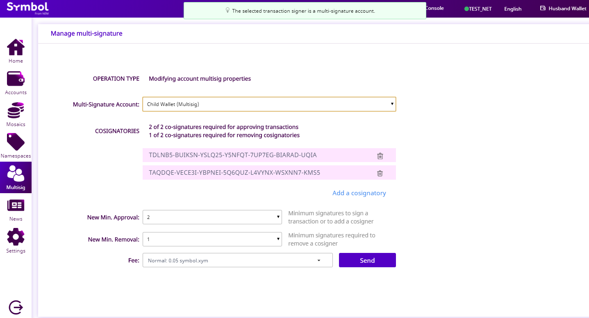

.. post:: 17 Aug, 2018
    :category: Multisig Account
    :tags: SDK
    :excerpt: 1
    :nocomments:

#########################################
Modifying a multisig account min approval
#########################################

This guide will show you how to increase and decrease the minimum number of signatures needed to execute a multisig transaction.

.. _guide-modify-a-multisig-account-min-approval:

********
Use case
********

Imagine that Alice and Bob are cosignatories of a 1-of-2 multisig account.
This means that at least one of their account's signatures is required to authorize multisig transactions.
In other words, we can say that the ``minApproval`` property of the multisig is currently set to 1.

In this case, we want to make both cosignatories required, shifting to a **2-of-2 multisig** instead.
To achieve this, we will be increasing **minApproval** by one unit.

    2-of-2 multisig account example

*************
Prerequisites
*************

- Complete :doc:`converting an account to multisig <creating-a-multisig-account>` guide.

************************************
Method #01: Using the Desktop Wallet
************************************

1. Log in to an account that is a cosignatory (Alice or Bob) of the account you want to modify.

2. Click on the “**Multisig**” tab on the left-side of the wallet.

3. Select the multisig wallet you want to modify from the dropdown menu from the top field. This will convert the “**Operation Type**” to “**Modifying account multisig properties**”.

.. figure:: ../../resources/images/screenshots/modify-multisig-1.gif
    :align: center
    :width: 800px

4. Select the new “**Min. Approval**” number. In this case, we want to change it to "**2**". Click “**Send**”. Review the information on the popup. Enter your wallet password and click “**Confirm**”.

.. figure:: ../../resources/images/screenshots/modify-multisig-2.gif
    :align: center
    :width: 800px

5. If the multisig account has the "**minimum approval**" set to a number greater than 1, log in to another cosignatory account and :doc:`cosign the transaction <../aggregate/signing-announced-aggregate-bonded-transactions>`. Repeat this step until the minimum approval number is satisfied.

.. figure:: ../../resources/images/screenshots/add-signer-2.gif
    :align: center
    :width: 800px

6. Once the Aggregate Transaction is confirmed, you can check its new properties in the “**Multisig**” menu.

*************************
Method #02: Using the SDK
*************************

One of the cosignatory accounts, for example Alice's, will announce a :ref:`multisigaccountmodificationtransaction` to increase ``minApprovalDelta``.

1. Open a new file. Then, define Alice's account public key and the multisig account private key into new variables.

.. example-code::

    .. viewsource:: ../../resources/examples/typescript/multisig/ModifyingAMultisigAccountIncreaseMinApproval.ts
        :language: typescript
        :start-after:  /* start block 01 */
        :end-before: /* end block 01 */

    .. viewsource:: ../../resources/examples/typescript/multisig/ModifyingAMultisigAccountIncreaseMinApproval.js
        :language: javascript
        :start-after:  /* start block 01 */
        :end-before: /* end block 01 */

2. Define a **MultisigAccountModificationTransaction** to increase the ``minAprovalDelta`` by one unit.

.. example-code::

    .. viewsource:: ../../resources/examples/typescript/multisig/ModifyingAMultisigAccountIncreaseMinApproval.ts
        :language: typescript
        :start-after:  /* start block 02 */
        :end-before: /* end block 02 */

    .. viewsource:: ../../resources/examples/typescript/multisig/ModifyingAMultisigAccountIncreaseMinApproval.js
        :language: javascript
        :start-after:  /* start block 02 */
        :end-before: /* end block 02 */

.. note:: If you want to decrease the ``minApproval`` property, set ``minApprovalDelta`` with a negative value. For example, to reduce the number of required signers by one unit, you should set ``minApprovalDelta`` to ``-1``.

3. Wrap the **MultisigAccountModificationTransaction** in an **AggregateTransaction**, attaching the multisig public key as the signer.

An AggregateTransaction is *complete* if, before announcing it to the network, all required cosignatories have signed it.
If valid, it will be included in a block.
As only one cosignature is required (1-of-2), Alice can sign define the aggregate as **complete**, sign the transaction, and announce it to the network.

.. example-code::

    .. viewsource:: ../../resources/examples/typescript/multisig/ModifyingAMultisigAccountIncreaseMinApproval.ts
        :language: typescript
        :start-after:  /* start block 03 */
        :end-before: /* end block 03 */

    .. viewsource:: ../../resources/examples/typescript/multisig/ModifyingAMultisigAccountIncreaseMinApproval.js
        :language: javascript
        :start-after:  /* start block 03 */
        :end-before: /* end block 03 */

4. Once confirmed, the ``minApproval`` value of the multisig will be set to 2, having our **2-of-2** multisig.

.. note:: If more than one cosignature is required to announce the transaction (e.g., the multisig is a **2-of-2** account), the transaction must be defined as aggregate **bonded**, and all other required multisig participants should cosign it in order to be confirmed. Follow the :doc:`next guide <../aggregate/sending-a-multisig-transaction>` to announce aggregate bonded transactions involving a multisig account.

Follow :doc:`the next guide <adding-a-new-signer-to-a-multisig-account>` to add a new signer to the multisig account.
