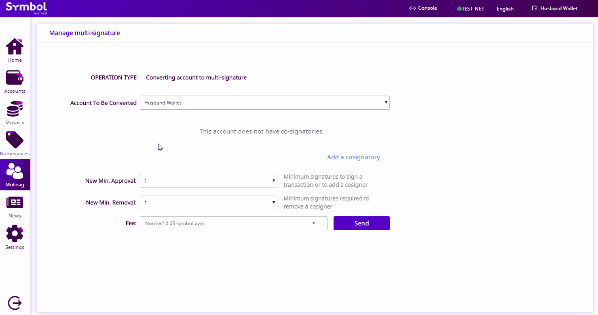

.. post:: 17 Aug, 2018
    :category: Multisig Account
    :tags: SDK
    :excerpt: 1
    :nocomments:

#########################################
Removing a signer from a multisig account
#########################################

This guide will show you how to remove a cosignatory from a multisig account.

.. _guide-modify-a-multisig-account-removing-a-cosignatory:

*************
Prerequisites
*************

- Complete :doc:`converting an account to multisig <creating-a-multisig-account>` guide.

************************************
Method #01: Using the Desktop Wallet
************************************

1. Log in to one of the cosignatory accounts of the multisig account.

2. Click on “**Multisig**” on the left-side menu.

3. Select the multisig account in the dropdown menu.

4. Find the cosignatory address that you want to remove in the cosignatories listed. Click the trash icon - this should highlight the account you want to remove. Then click “**Send**”. Review the information in the popup and enter your wallet password. Finally, click “**Confirm**”.

5. If the multisig account has the "**minimum approval**" set to a number greater than 1, log in to another cosignatory account and :doc:`cosign the transaction <../aggregate/signing-announced-aggregate-bonded-transactions>`. Repeat this step until the minimum approval number is satisfied.

.. figure:: ../../resources/images/screenshots/add-signer-2.gif
    :align: center
    :width: 800px

6. You can check that the signer has been removed by going back to the “**multisig**” page.

.. figure:: ../../resources/images/screenshots/remove-signer-screenshot.png
    :align: center
    :width: 800px

*************************
Method #02: Using the SDK
*************************

The following code shows how to remove a cosignatory from a **2-of-3** multisig account with ``minRemoval`` set to 1.

.. example-code::

    .. viewsource:: ../../resources/examples/typescript/multisig/ModifyingAMultisigAccountRemoveCosignatory.ts
        :language: typescript
        :start-after:  /* start block 01 */
        :end-before: /* end block 01 */

    .. viewsource:: ../../resources/examples/typescript/multisig/ModifyingAMultisigAccountRemoveCosignatory.js
        :language: javascript
        :start-after:  /* start block 01 */
        :end-before: /* end block 01 */

The **minRemoval property** indicates the number of required signatures to delete an account from the multisig. This value can be increased or decreased in the same way as the :doc:`minApproval property <modifying-a-multisig-account-min-approval>` is modified.

This time, the MultisigModificationTransaction is wrapped in an **AggregateCompleteTransaction** because just one account is required to delete others from the multisig.

.. note:: If more than one cosignature is required to announce the transaction (e.g., ``minRemoval`` is set to 2), the transaction must be defined as aggregate **bonded**, and all other required multisig participants should cosign it in order to be confirmed. Follow the :doc:`next guide <../aggregate/sending-a-multisig-transaction>` to announce aggregate bonded transactions involving a multisig account.

Follow :doc:`the next guide <creating-a-multi-level-multisig-account>` to create a multi-level multisig account.
