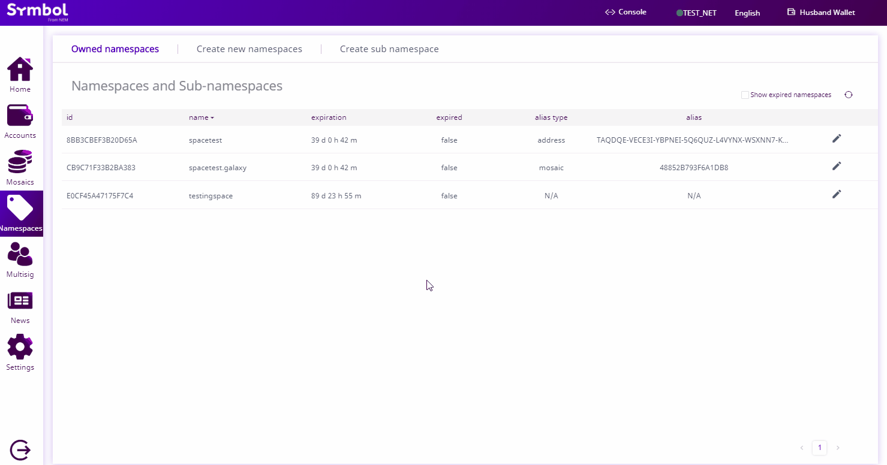

.. post:: 19 Jun, 2019
    :category: Namespace
    :tags: wallet, SDK, CLI
    :excerpt: 1
    :nocomments:

#########################################
Extending a namespace registration period
#########################################

This guide shows you how to extend the rental period of a namespace.

*************
Prerequisites
*************

- Complete :doc:`registering a namespace <registering-a-namespace>` guide.
- Have an account with a namespace.
- Have an account with enough |networkcurrency| to pay for the transaction and renewal fees.

************************************
Method #01: Using the Desktop Wallet
************************************

1. Click on the “**Namespaces**” on the left-side menu.

2. Click on the  “**Edit**” button (pen symbol) for the namespace you desire to extend the duration of. Then click on “**Extend duration**”.

3. Enter the amount of blocks to extend the duration of the namespace. Select the amount of fees you are willing to spend. Click “**Send**”.

4. Review the information, enter your wallet password, and click “**Confirm**”.

.. figure:: ../../resources/images/screenshots/extend-namespace-2.gif
    :align: center
    :width: 800px

*************************
Method #02: Using the SDK
*************************

1. Get your namespace information, and inspect the value of the property ``endHeight``.
The guide uses the namespace ``foo``, but you should follow along with the :doc:`namespace name you have registered <registering-a-namespace>` and want to extend its duration.

.. code-block:: bash

    symbol-cli namespace info --name foo

    Namespace: foo
    --------------

    hexadecimal:    82a9d1ac587ec054
    uint:           [ 1484701780, 2192167340 ]
    type:           Root namespace
    owner:          TBULEA...IPS4
    startHeight:    52000
    endHeight:      53000

The CLI returns that the namespace will become inactive at height ``5300``.
The next step is to figure out the current height of the chain, and calculate the number of blocks remaining before your namespace becomes inactive.

2. Check the current blockchain height.

.. code-block:: bash

    symbol-cli blockchain height

    52500

As you can see, the namespace is going to expire in ``500`` blocks (53000-52500).
To avoid losing all the subnamespaces and aliases linked to foo, we are going to extend the namespace duration.

3. Extend the namespace duration for ``172800`` more blocks.

.. example-code::

    .. viewsource:: ../../resources/examples/typescript/namespace/RegisteringANamespace.ts
        :language: typescript
        :start-after:  /* start block 01 */
        :end-before: /* end block 01 */

    .. viewsource:: ../../resources/examples/typescript/namespace/RegisteringANamespace.js
        :language: javascript
        :start-after:  /* start block 01 */
        :end-before: /* end block 01 */

.. note:: Use the following formula to convert approximately days to blocks ``duration ≈ numberOfDays * 86400 / blockGenerationTargetTime``.

Once the **RegisterNamespaceTransaction** gets confirmed, double-check that the namespace duration has been extended.

4. Validate that ``endHeight`` has increased by ``172800`` block units.

.. code-block:: bash

    symbol-cli namespace info --namespace-name foo

    Namespace: foo
    --------------

    hexadecimal:    82a9d1ac587ec054
    uint:           [ 1484701780, 2192167340 ]
    type:           Root namespace
    owner:          TCHBDE...32I
    startHeight:    52000
    endHeight:      225800

*************************
Method #03: Using the CLI
*************************

Open a terminal window and run the following command.

Replace ``foo`` with the namespace name and ``172800`` with the number of blocks to extend.

.. viewsource:: ../../resources/examples/bash/namespace/RegisteringANamespace.sh
    :language: bash
    :start-after: #!/bin/sh
