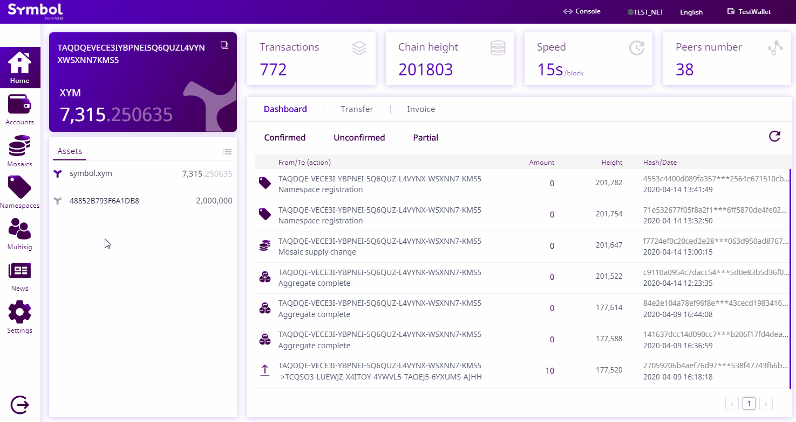

.. post:: 04 March, 2019
    :category: Namespace
    :tags: wallet, SDK, CLI
    :excerpt: 1
    :nocomments:

###############################
Linking a namespace to a mosaic
###############################

Alias an mosaic with a namespace so that others can reference it in a more friendly way when issuing transactions.

*************
Prerequisites
*************

- Complete the :doc:`getting started section <../../getting-started/setup-workstation>`.
- Create a new :ref:`account <setup-creating-a-test-account>`.
- Load the account with enough |networkcurrency| to pay for transaction fees.
- Create a :doc:`mosaic <../../concepts/mosaic>` with the account.
- Register a :doc:`namespace <../../concepts/namespace>` with the account.

************************************
Method #01: Using the Desktop Wallet
************************************

1. Click on "**Namespace**" on the left-side menu.

2. Click on the edit icon of the namespace you desire to link to a mosaic. Click "**Link**".

3. Select "**Link a mosaic**" as the alias type. Select the ID of the mosaic you desire to connect to the namespace. Click "**Send**". Verify the information on the next page and enter your wallet password. Click "**Confirm**".

.. figure:: ../../resources/images/screenshots/desktop-link-mosaic-2.gif
    :align: center
    :width: 800px

4. You can check that the mosaic has been linked by going to the "**Mosaic**" page. The name displayed for the mosaic should be the linked namespace.

.. figure:: ../../resources/images/screenshots/desktop-link-mosaic-3.gif
    :align: center
    :width: 800px

*************************
Method #02: Using the SDK
*************************

1. Open a new file and define the namespace identifier and the mosaic identifier you want to alias.

.. note:: The account signing the transaction must own the namespace and mosaic being aliased.

.. example-code::

    .. viewsource:: ../../resources/examples/typescript/namespace/LinkingANamespaceToAMosaic.ts
        :language: typescript
        :start-after:  /* start block 01 */
        :end-before: /* end block 01 */

    .. viewsource:: ../../resources/examples/typescript/namespace/LinkingANamespaceToAMosaic.js
        :language: javascript
        :start-after:  /* start block 01 */
        :end-before: /* end block 01 */

2. Then, announce the **AliasTransaction** that links the namespace and the mosaic.

.. example-code::

    .. viewsource:: ../../resources/examples/typescript/namespace/LinkingANamespaceToAMosaic.ts
        :language: typescript
        :start-after:  /* start block 02 */
        :end-before: /* end block 02 */

    .. viewsource:: ../../resources/examples/typescript/namespace/LinkingANamespaceToAMosaic.js
        :language: javascript
        :start-after:  /* start block 02 */
        :end-before: /* end block 02 */

.. note:: If you want to unlink the alias, change alias action type to ``AliasActionType.Unlink``.

.. _sending-a-transfer-transaction-with-an-aliased-mosaic:

3. Now you can send transactions using the namespace linked to the mosaic instead of defining the complete MosaicId.

.. example-code::

    .. viewsource:: ../../resources/examples/typescript/transfer/SendingATransferTransactionMosaicAlias.ts
        :language: typescript
        :start-after:  /* start block 01 */
        :end-before: /* end block 01 */

    .. viewsource:: ../../resources/examples/typescript/transfer/SendingATransferTransactionMosaicAlias.js
        :language: javascript
        :start-after:  /* start block 01 */
        :end-before: /* end block 01 */

    .. viewsource:: ../../resources/examples/java/src/test/java/symbol/guides/examples/transfer/SendingATransferTransactionMosaicAlias.java
        :language: java
        :start-after:  /* start block 01 */
        :end-before: /* end block 01 */

*************************
Method #03: Using the CLI
*************************

To link a namespace and a mosaic, open a terminal window and run the following command.
Replace ``7cdf3b117a3c40cc`` with the mosaic identifier and ``foo`` with the namespace name to be linked.

.. viewsource:: ../../resources/examples/bash/namespace/LinkNamespaceMosaic.sh
    :language: bash
    :start-after: #!/bin/sh

