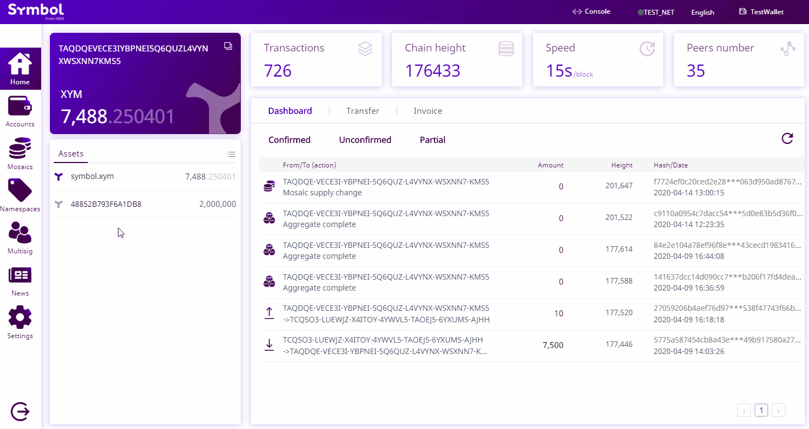
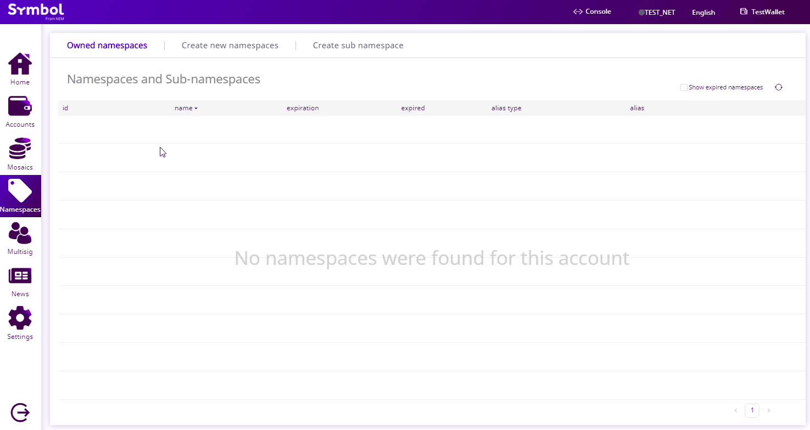
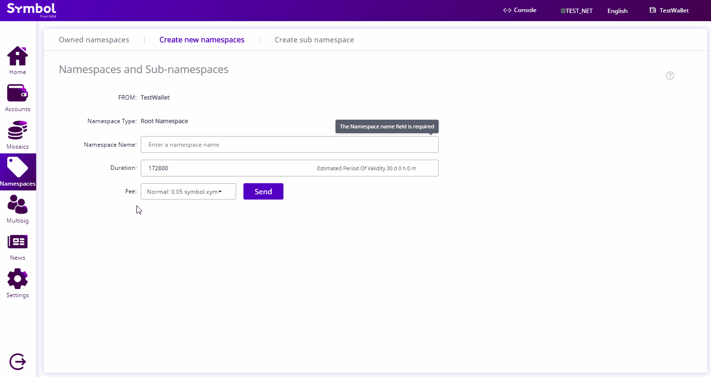

.. post:: 16 Aug, 2018
    :category: Namespace
    :tags: wallet, SDK, CLI
    :excerpt: 1
    :nocomments:

########################
Registering a namespace
########################

Create a unique name to identify your assets.

*************
Prerequisites
*************

- Complete the :doc:`getting started section <../../getting-started/setup-workstation>`.
- Create a new :ref:`account <setup-creating-a-test-account>`.
- Load the account with enough |networkcurrency| to pay for transaction fees.

************************************
Method #01: Using the Desktop Wallet
************************************

1. Click on "**Namespace**" on the left-side menu.

2. Click on the "**Create new namespaces**" tab.

3. Enter the information for your new namespace. Click "**Send**".
Verify the information on the popup and enter your wallet password. Click "**Confirm**".

.. note::  The name must be unique in the network, and may have a maximum length of 64 characters, and the allowed characters are a, b, c, …, z, 0, 1, 2, …, 9, _ , -.

4. You can check that the namespace has been created by going back to the "**Owned namespaces**" tab.
If you don’t see your namespace, try clicking on the update icon.

.. figure:: ../../resources/images/screenshots/desktop-register-namespace-4.gif
    :align: center
    :width: 800px

.. note:: To keep the ownership of your namespace, you will have to :doc:`extend its duration before it expires <extending-a-namespace-registration-period>`.

When the transaction is confirmed, you can :doc:`register a subnamespace <registering-a-subnamespace>` following the next guide.

*************************
Method #02: Using the SDK
*************************

1. Choose a **unique name** for your namespace. One common option is to use your company's or own name.

2. Check if the namespace name is **available**. For example, you can use the :ref:`Command-line Interface <wallet-cli>` to check if the namespace has been registered.

.. viewsource:: ../../resources/examples/bash/namespace/GettingNamespaceInformation.sh
    :language: bash
    :start-after: #!/bin/sh

3. Is the namespace available? Try to register it before someone else does it! Open a new file and announce a :ref:`namespaceregistrationtransaction` with the chosen name and renting duration expressed in blocks.

.. example-code::

    .. viewsource:: ../../resources/examples/typescript/namespace/RegisteringANamespace.ts
        :language: typescript
        :start-after:  /* start block 01 */
        :end-before: /* end block 01 */

    .. viewsource:: ../../resources/examples/typescript/namespace/RegisteringANamespace.js
        :language: javascript
        :start-after:  /* start block 01 */
        :end-before: /* end block 01 */

.. note:: To keep the ownership of your namespace, you will have to :doc:`extend its duration before it expires <extending-a-namespace-registration-period>`.

*************************
Method #03: Using the CLI
*************************

To create a new namespace, open a terminal window and run the following command.
Replace ``foo`` with the chosen namespace name and ``172800`` with the namespace duration expressed in blocks.

.. viewsource:: ../../resources/examples/bash/namespace/RegisteringANamespace.sh
    :language: bash
    :start-after: #!/bin/sh
