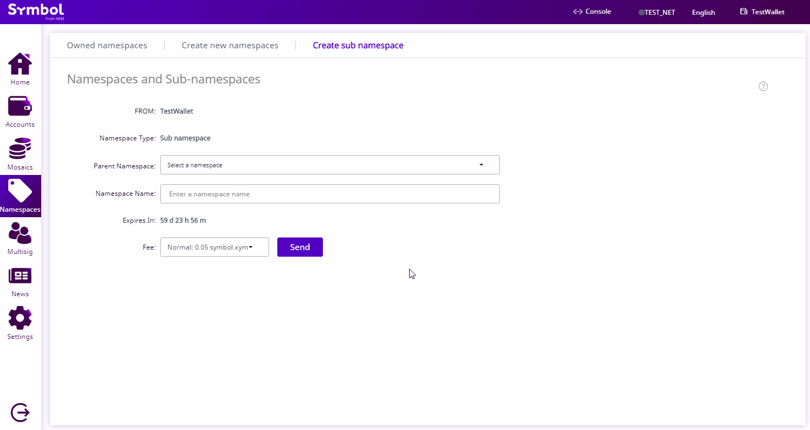

:orphan:

.. post:: 18 Aug, 2018
    :category: Namespace
    :tags: SDK, CLI
    :excerpt: 1
    :nocomments:

#######################
Creating a subnamespace
#######################

Create subnamespaces to organize your assets.

*************
Prerequisites
*************

- Complete :doc:`registering a namespace <registering-a-namespace>` guide.

************************************
Method #01: Using the Desktop Wallet
************************************

1. Click on “**Namespace**” on the left-side menu. Go to the “**Create sub namespaces**” tab.

.. figure:: ../../resources/images/screenshots/desktop-register-subnamespace-1.gif
    :align: center
    :width: 800px

2. Enter information for your sub namespace. Click “**Send**”. Verify the information on the popup and enter your wallet password. Click “**Confirm**”.

Note: you need a root namespace to create a sub namespace.

.. figure:: ../../resources/images/screenshots/desktop-register-subnamespace-2.gif
    :align: center
    :width: 800px

3. You can check that the sub namespace has been created by going back to the “**Owned namespaces**” tab. If the sub namespace does not show, try clicking on the update icon.

*************************
Method #02: Using the SDK
*************************

Once you have a registered root :doc:`namespace <../../concepts/namespace>`, you can create up to ``3`` levels of subnamespaces to **organize your assets**.

This code example creates a subnamespace called ``bar`` under the namespace ``foo``.

.. example-code::

    .. viewsource:: ../../resources/examples/typescript/namespace/RegisteringASubnamespace.ts
        :language: typescript
        :start-after:  /* start block 01 */
        :end-before: /* end block 01 */

    .. viewsource:: ../../resources/examples/typescript/namespace/RegisteringASubnamespace.js
        :language: javascript
        :start-after:  /* start block 01 */
        :end-before: /* end block 01 */

*************************
Method #03: Using the CLI
*************************

.. viewsource:: ../../resources/examples/bash/namespace/RegisteringASubnamespace.sh
    :language: bash
    :start-after: #!/bin/sh

************
What's next?
************

When the transaction is confirmed, link the subnamespace with a :doc:`mosaic <../namespace/link-a-namespace-to-a-mosaic>` or :doc:`address <../namespace/link-a-namespace-to-an-address>`.
