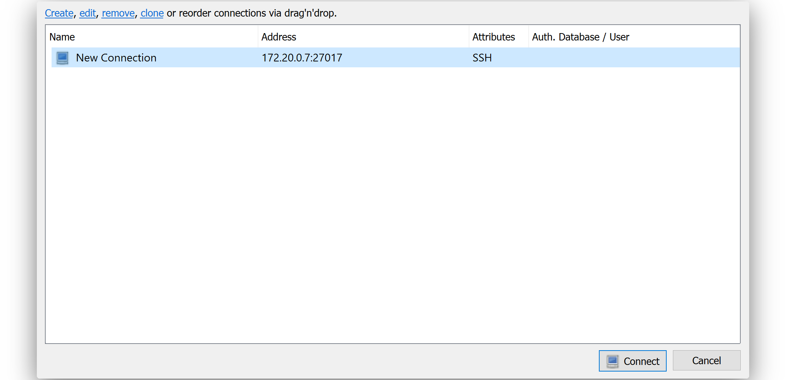
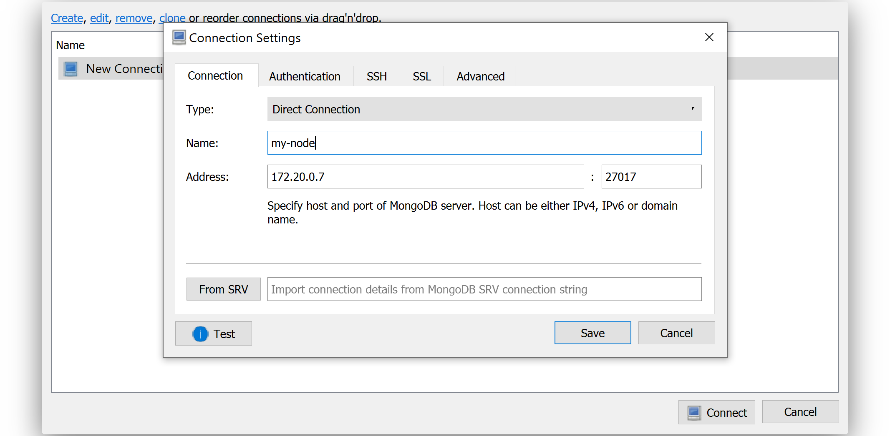

.. post:: 13 Feb, 2020
    :category: Network
    :excerpt: 1
    :nocomments:

#########################
How to connect to MongoDB
#########################

Learn how to access your API node's MongoDB instance.

.. note:: **This is an advanced feature**

  The :doc:`REST Gateway <../../api>` offers a broad range of endpoints so that you don't have to connect to an API node's internal database directly.

  However, if you are developing new plugins for Symbol, or analyzing extensive blockchain data, you might need to connect directly to MongoDB **for debugging purposes**.

By the end of this guide, you will be connected to your API node database instance and doing some basic queries.

*************
Prerequisites
*************

- Have an :doc:`API or Dual node running <running-a-symbol-node>` inside Docker **with an open port to the database** (See next section).

**********************
Open the database port
**********************

In the :doc:`running-a-symbol-node` guide you have used ``symbol-bootstrap`` to instantiate and run the necessary node services (catapult-client, API endpoints, databases, etc). For security reasons, all these services run inside Docker containers and, except the public endpoints, they are isolated from the exterior.

This means that the MongoDB database that API nodes use to cache the state of the blockchain is **inaccessible by default**. To forward its internal port to the host you need to give ``symbol-bootstrap`` a :ref:`custom preset file <symbol-bootstrap-presets>` containing the following lines:

.. code-block:: yaml

    databases:
      - openPort: true

And then use this file when configuring ``symbol-bootstrap``, for example:

.. code-block:: bash

    symbol-bootstrap start -p testnet -a dual -c custom_parameters.yml

This will make the database's TCP port ``27017`` accessible from the host so be careful, and only use this feature **for development purposes**.

***************
Install Robo 3T
***************

For this tutorial, we are going to use |Robo3T| (formerly RoboMongo), a cross-platform MongoDB management tool, to interact with the database.

1. Download Robo 3T `here <https://robomongo.org/download>`_.
2. Open the installer and follow the installation instructions.

In case of doubt, follow the `official installation docs <https://studio3t.com/knowledge-base/articles/installation/>`_.

***********************
Create a new connection
***********************

1. Launch Robo 3T and click on the **"Create"** link to add a new connection.

2. Enter the following details under the **"Connection"** tab:

* **Type**: Direct Connection
* **Name**: my-node
* **Address**: localhost
* **Port**: 27017

3. If the node is running locally, click **"Connect"** and move to the next section :ref:`Querying MongoDB <querying-mongodb>`.

4. Otherwise, if you are running the node in a **virtual private server** (VPS), create a tunnel first between your computer and the server.

Go to the **SSH tab** and add the server's details:

.. figure:: ../../resources/images/screenshots/robo3t-tunnel.png
    :align: center
    :width: 700px

Replace the **SSH Address**, **username**, and **authentication** method.

5. After you click "Connect", you should see the MongoDB collections under the database named **"catapult"**.

.. _querying-mongodb:

****************
Querying MongoDB
****************

.. note:: Only use this method to read from the database. Do not alter any document directly on MongoDB.

1. On the left sidebar, open the collection you want to query.

.. figure:: ../../resources/images/screenshots/robo3t-collection.png
    :align: center
    :width: 700px

2. In most cases, you may want to filter a set of entries by one of its attributes.
To filter, for example, a given transaction type, write a query with the following format on Robo 3T shell:

.. code-block:: bash

    db.getCollection('transactions').find( { "transaction.type": 16724})

For other advanced queries, check the `Robo3T <https://studio3t.com/knowledge-base/articles/query-mongodb/>`_ docs.

3. Click on the **"Play"** button to execute the query.

.. figure:: ../../resources/images/screenshots/robo3t-query.png
    :align: center
    :width: 700px

.. |Robo3T| raw:: html

   <a href="https://robomongo.org">Robo 3T</a>
