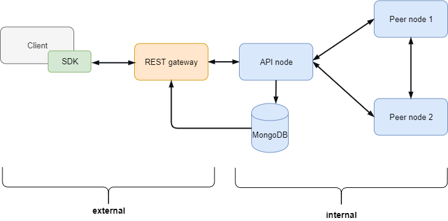

.. post:: 03 Oct, 2019
    :category: Network
    :excerpt: 1
    :nocomments:

#####################
Private test networks
#####################

This guide will walk you through the process of setting up your own private network using |codename|.

To run the network, we are going to use the package |symbol-bootstrap|. To better understand how this package works it is recommended to read the :doc:`Using Symbol Bootstrap<using-symbol-bootstrap>` guide.

************************
The ``bootstrap`` preset
************************

|symbol-bootstrap| has a preset called ``bootstrap`` which instantiates a network with multiple nodes with the following architecture:

    Bootstrap network architecture

The nodes labelled "Internal" are the ones created by |symbol-bootstrap|, and are accessible through the REST API:

* **peer-node (1 and 2)**: Peer nodes verify transactions once the API pushes them into the P2P network. They run the consensus algorithm, create new blocks, and propagate the changes through the network.
* **api-node**: The API node stores data in the MongoDB database once transactions are validated. They also identify and store partial aggregate bonded transactions.
* **rest-gateway**: Combines HTTP and WebSockets to perform read and write actions on the blockchain.

***********************
Instantiate the network
***********************

Use the ``start`` command (explained in the :ref:`Using Symbol Bootstrap <symbol-bootstrap-all-in-one>` guide) using the ``bootstrap`` preset:

.. code-block:: bash

    symbol-bootstrap start -p bootstrap

With a single command the network is created and booted. Now check that it is up and running by opening a new browser tab and going to:

``localhost:3000/chain/info``

You should get a response from the API node.

****************************
Retrieving the node accounts
****************************

|symbol-bootstrap| has created multiple nodes with corresponding accounts. To interact with any of these accounts (to transfer mosaics **to** it, for example) you need its address or its public key. To fully control an account (to transfer mosaics **from** it, for example) you need its private key.

All this information can be retrieved from a YAML file in the ``target`` folder:

``target/addresses.yml``

As an example:

.. code-block:: yaml

    networkType: 152
    nemesisGenerationHashSeed: 7BFC536990108CA923B2715DE6B8E47E6BB56C945293BF4FC22C5AF895F61E62
    nodes:
        -
            signing:
                # Keys for the account of the peer-node-0
                privateKey: ●●●●●●●●●●●●●●●●●●●●●●●●●●●●●●●●●●●●●●●●●●●●●●●●●●●●●●●●●●●●●●●●
                publicKey: C2BD21E4F9261247A4CBE75DA8683978E0F1FFF34AAB17BEBC21E7B9E0E17A9F
                address: TAMEGYVY6GVGXCLBIEH72XU4D2OSTH2MIOOY4QQ
            vrf:
                privateKey: ●●●●●●●●●●●●●●●●●●●●●●●●●●●●●●●●●●●●●●●●●●●●●●●●●●●●●●●●●●●●●●●●
                publicKey: D67601AC6767F8A3C97FFDB0D9D737A943FFFA6E69C2C6527B0ED32A4E41B443
                address: TCR6ZWX3UP3TKJK3BSE6ARJ4WAF3KHFFUWJ7EWI
            voting:
                privateKey: ●●●●●●●●●●●●●●●●●●●●●●●●●●●●●●●●●●●●●●●●●●●●●●●●●●●●●●●●●●●●●●●●
                publicKey: 921ED0839EA3C8590CA1D6562DDD3BFEDA44CCE05DD82DF8C79DED2A3F816A1B
                address: TA77BJJJMRXR2OLJKZNUFTRMLHLQ4T2PPHZRX5I
            ssl:
                privateKey: ●●●●●●●●●●●●●●●●●●●●●●●●●●●●●●●●●●●●●●●●●●●●●●●●●●●●●●●●●●●●●●●●
                publicKey: 3d68cdaa4e48a14bd875d4ca18e044522be5f602e8c4f37c1c65eafdfaa19110
            type: peer-node
            name: peer-node-0
            friendlyName: peer-node-0

.. note:: Keep your Secret Keys secret at all times!

You can now import any of these accounts using the |symbol-cli| command-line tool for ease of access (Read :doc:`the symbol-cli guide <../../cli>` for more details):

.. code-block:: bash

    symbol-cli profile import --private-key <PRIVATE_KEY> --network TEST_NET --url http://localhost:3000

After giving this new profile a name you will be ready to use it, for example, to retrieve the account's balance:

.. code-block:: bash

    symbol-cli account info --profile <PROFILE_NAME>

You should see that the nodes that |symbol-bootstrap| has created for you already contain some currency (in different :doc:`mosaics <../../concepts/mosaic>`) to start experimenting with them:

.. code-block:: text

    Balance Information
    ┌──────────────────┬──────────────────┬──────────────────┬───────────────────┐
    │ Mosaic Id        │ Relative Amount  │ Absolute Amount  │ Expiration Height │
    ├──────────────────┼──────────────────┼──────────────────┼───────────────────┤
    │ 3ECBB73A05A147BC │ 1,124,874,999.75 │ 1124874999750000 │ Never             │
    ├──────────────────┼──────────────────┼──────────────────┼───────────────────┤
    │ 2B19203C86F9A668 │ 3,000            │ 3000000          │ Never             │
    └──────────────────┴──────────────────┴──────────────────┴───────────────────┘

****************************
Retrieving the test accounts
****************************

|symbol-bootstrap| has also created several test accounts preloaded with :doc:`mosaics <../../concepts/mosaic>`. These accounts exist solely for development and learning purposes.

The keys to these accounts can be found in the ``target/addresses.yml`` file as described above, in the ``mosaics`` section:

.. code-block:: yaml

    mosaics:
        -
            id: 56631872BA6657A1
            name: currency
            type: currency
            # These are accounts containing the main currency
            accounts:
                -
                    privateKey: ●●●●●●●●●●●●●●●●●●●●●●●●●●●●●●●●●●●●●●●●●●●●●●●●●●●●●●●●●●●●●●●●
                    publicKey: 91A9513EBEB50DEFCD928032611B2FBC046FA894089D2ACED115D6EDEB0BFD2A
                    address: NBO3P2AM3A6242V2NFMUIG5RQ3ZFDRKS5QNRBJA
                -
                    privateKey: ●●●●●●●●●●●●●●●●●●●●●●●●●●●●●●●●●●●●●●●●●●●●●●●●●●●●●●●●●●●●●●●●
                    publicKey: 4E9CC90B45265691C2CF0C68785A06602D28DB50ACFB91F8389B976898239132
                    address: NCDFN3W2AP3E4I2XYITUJHHGVSYKOIR2IUTXKXY
        -
            id: 079C43E0DFC44B38
            name: harvest
            type: harvest
            # These are account containing the network currency used for harvesting
            accounts:
                -
                    privateKey: ●●●●●●●●●●●●●●●●●●●●●●●●●●●●●●●●●●●●●●●●●●●●●●●●●●●●●●●●●●●●●●●●
                    publicKey: D617FC0C746681849D93DBEB5FE0E390F26535E4EA76F02AB206AD053B72FAB8
                    address: NBFFJ3MNPMHP474KD7JLBJWAYSYSAUEW7L7262Q
                -
                    privateKey: ●●●●●●●●●●●●●●●●●●●●●●●●●●●●●●●●●●●●●●●●●●●●●●●●●●●●●●●●●●●●●●●●
                    publicKey: BBB04EC2CF67658B755F94FC347DDC4AAFFBFC24B84298AEF41CDA2485FA216E
                    address: NCQBYJE3U4Q36AA2E6HFTGKCUXIBUB2NMIGAFDA

Use the Private Keys to access these accounts, for example, using the |symbol-cli| command-line tool as described above.

************
Voting nodes
************

The :ref:`block finalization <finalization>` process requires that network nodes vote about the correctness of blocks before they are added to the blockchain. Each node can decide whether to register as a voter or not.

All nodes created by the ``bootstrap`` preset are voters by default. If you don't want this, provide a custom preset with these lines to disable voting for each node:

.. code-block:: yaml

    nodes:
    - voting: false # peer-node-0
    - voting: false # peer-node-1
    - voting: false # api-node-0

.. note:: Without ANY voting node no finalization can occur. By taking a look at ``localhost:3000/chain/info`` you will see you chain height grow but the ``latestFinalizedBlock``'s height will remain at zero.

******************************
Configuring network properties
******************************

Read the :doc:`Configuring network properties <configuring-network-properties>` guide for a list of network-related settings that can be customized.

**********
Next steps
**********

You now have a test network running and access to each node's account. You can also interact with it through the API node serving at ``localhost:3000``.

We recommend you continue reading the rest of :ref:`the guides <blog-categories>` to keep learning more |codename|'s features!

.. |symbol-cli| raw:: html

   <a href="https://github.com/symbol/symbol-cli" target="_blank">symbol-cli</a>
