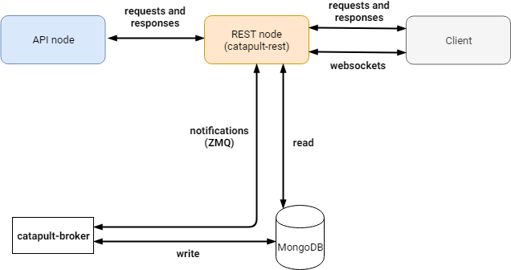

.. post:: 05 Mar, 2021
    :category: Network
    :excerpt: 1
    :nocomments:

#######################
Running a node manually
#######################

This guide walks you through the process of setting up a node to join |codename|'s network **without** using Symbol Bootstrap.

|symbol-bootstrap| is a very handy tool that allows the **quick deployment** of |codename| nodes. However, it relies on `Docker <http://docker.com>`__ and `node.js <http://nodejs.org>`__ technology which might not be available (or allowed) in all scenarios. **This guide takes the longer route** and explains how to setup a |codename| node **manually**. If you would like to use Symbol Bootstrap use :doc:`this guide <running-a-symbol-node>` instead.

The following section explains how to build a :ref:`peer-node` and the next one expands the node to convert it into an :ref:`api-node`.

.. note:: The following instructions have only been verified to work on **Linux**.

*****************
Build a Peer node
*****************

Build the client
================

Follow the `Catapult client <https://github.com/symbol/catapult-client>`__ instructions to **build** its binaries, either `manually <https://github.com/symbol/symbol/blob/main/client/catapult/docs/BUILD-manual.md>`__ or using `Conan <https://github.com/symbol/symbol/blob/main/client/catapult/docs/BUILD-conan.md>`__.

Generate keys
=============

A |codename| node requires a number of :ref:`keys <symbol-keys>` to function properly. These keys are generally **randomly generated** so you need to create a few ones to be used in the following steps.

**This step can be performed on an offline machine for added security.**

Main, Remote and VRF
--------------------

From within the ``_build`` directory you created in the previous section, run:

.. code-block:: bash

   ./bin/catapult.tools.addressgen --count 3 --network public

This will output 3 :ref:`key pairs <keypair>` similar to this one:

.. code-block:: text

   address (public): NDPPBHSMLVEU75DNUMFX6GWPTGB6PP6AFQU7WSY
      address decoded: 68DEF09E4C5D494FF46DA30B7F1ACF9983E7BFC02C29FB4B
         public key: 1E886BA00B4F85DBC0B31DBB78DADFAA29945DF7290DB7A4243D94864483C627
         private key: 3DDDC333029BC8ACDB460435BBC71041D460B911725B03D6F93805521AAD60CB

Each block is a key pair (there is one block shown above) composed of a ``private key``, a ``public key`` and an ``address``.

**Copy all of them to a temporary text file** for later use and label the key pairs **Main**, **Remote** and **VRF**.

.. note::

   If you **already have** any of these keys, you can use them instead of the randomly-generated ones.

   The most relevant scenario is when using a **main account opted-in from a NIS1 account**. In this case you can directly use the key obtained in the opt-in process as your **Main** key instead of the randomly-generated one.

Voting
------

If your node is to be a :ref:`voting node <finalization>` it must have linked a voting key for the period in which you intend to vote. This is interesting as voting nodes receive :ref:`voting rewards <voting-node-program>`.

The generation of the voting key, though, is a bit more complex than the previous ones:

1. Still from within the ``_build`` directory **create another directory** called ``votingkeys``.

.. sidebar:: Epochs

   :ref:`Voting <finalization>` occurs once every epoch. One voting epoch lasts **1440 blocks** or about **12h** (see ``votingSetGrouping`` in the :ref:`network properties <config-network-properties>`).

   The maximum voting key duration (End Epoch - Start Epoch) is **360 epochs** or about **6 months** (see ``maxVotingKeyLifetime``).

   You can find out the current epoch by dividing the `current blockchain height <https://symbol.fyi>`__ by 1440 and discarding the decimals.

2. **Create the voting key** (or keys):

   Voting keys are different from the other keys in that they have a **period of validity**, for example. They are only valid from a **Start Epoch** to an **End Epoch** (see side box).

   Nodes are only eligible as voters if they are linked to a **valid voting key** for the current blockchain epoch, so **remember to renew your voting key periodically.**

   To help you with that task, you can have **up to 3 linked voting keys**, with different periods, so you can easily renew one key while there's still another one active (you will need to **unlink** an older key to be able to link more than 3 keys).

   A voting key is created using ``catapult.tools.votingkey`` and providing its **period of validity** (note you do not use ``catapult.tools.addressgen`` as before):

   .. code-block:: bash

      bin/catapult.tools.votingkey --output votingkeys/private_key_tree1.dat \
                                   --startEpoch 100 --endEpoch 460

   This creates a file named ``votingkeys/private_key_tree1.dat`` and **prints the voting key on the terminal**. As your voting keys expire and you create new ones, **increase the number** on the file name.

   .. code-block:: text

      generating 361 keys, this might take a while
      votingkeys\private_key_tree1.dat generated
      verifying generated file
       saved voting public key: ****************
      loaded voting public key: ****************

   Copy the voting key public key into the temporary text file where you keep the rest of the keys, label it **Voting** and save it for later.

.. _manual-voting-key-renewal:

.. topic:: Voting key renewal

   If all your registered voting keys expire your node will not be eligible as a voter and its account will not receive any :ref:`voting rewards <voting-node-program>`.

   **Make sure you always have one voting key registered for the current epoch.**

   You can check your currently registered voting keys using the ``/accounts`` endpoint of the :doc:`REST API <../../api>` (Get Account Information), in the ``supplementalPublicKeys`` section.

   If you need to renew your keys, create new ones as explained above and then register them as explained in the :ref:`Link the keys <manual-enable-voting>` section below.

Configuration
=============

|codename| is **highly customizable** and this means there are a lot of parameters that can be adjusted to suit your node's needs. Some of these parameters are **network-related** and must match the rest of nodes in the network (for example ``currencyMosaicId``) whereas some others are **node-related** and you can set freely (for example ``friendlyName``).

You can edit these files manually (Take a look at `these templates <https://github.com/symbol/symbol/tree/main/client/catapult/resources>`__ to know how they look) but it is more convenient to use the `Symbol Node Configurator tool <https://github.com/symbol/symbol-node-configurator>`__ as shown next.

**The Configuration step can be performed on an offline machine for added security.**

0. **Prerequisites**.

   - Install `Python 3 <https://www.python.org/downloads/>`__.
   - Install `OpenSSL <https://wiki.openssl.org/index.php/Binaries>`__ (for example running ``sudo apt install openssl`` on Linux).

1. **Install symbol-node-configurator**.

   - Download and extract `symbol-node-configurator.zip <https://github.com/symbol/symbol-node-configurator/archive/refs/heads/main.zip>`__. Alternatively, clone the `GitHub repository <https://github.com/symbol/symbol-node-configurator>`__ if you know how to use Git.

   - Move into the ``symbol-node-configurator`` directory and install the tool's requirements by running:

     .. code-block:: bash

        python3 -m pip install -r requirements.txt

.. _manual-node-certificates:

2. **Create certificates**.

   - Create a folder named ``certificates`` and move into it.
   - Create a text file named ``private.main.txt`` and put the **Main account private key** inside.
   - Download and run this `certificate generation script </_static/bash/cert-generate.sh>`__.
   - Delete ``private.main.txt``.
   - Get back to the parent folder.

   You should now have at least the following files in the ``certificates`` folder: ``ca.pubkey.pem``, ``ca.crt.pem``, ``node.full.crt.pem``, ``node.crt.pem`` and ``node.key.pem``.

3. **Create harvester and VRF key files**.

   - Create a file named ``private.harvesting.txt`` and put the **Remote private key** inside.
   - Create a file named ``private.vrf.txt`` and put the **VRF private key** inside.

4. **Run the configurator tool**.

   The node configurator tool is called ``generator.py`` and it accepts a number of parameters depending on the kind of node you want:

   .. csv-table::
      :header: "Parameter", "Description"
      :delim: ;
      :widths: 30 70

      ``--mode``; (Mandatory) Type of node. Accepted values are ``api``, ``peer`` and ``dual``.
      ``--harvesting``; (Optional) To create a harvesting node. The **Remote** key will automatically be used so that :ref:`remote-harvesting` is enabled by default.
      ``--voting``; (Optional) To create a voting node. If you enable this copy the ``private_key_tree1.dat`` file you created above into this directory.
      ``--output``; (Optional) Folder where resulting configuration will be stored.

   For example:

   .. code-block:: text

      python3 generator.py --mode dual --harvesting --voting --output settings
        i     | extracting nemesis seed
        i     | preparing base settings
        i     | turning on harvesting
        i     | turning on voting
        i     | extracting mongo scripts
        i     | copying certificates
        i     | moving private_key_tree1.dat

   This command will produce all the required **node configuration** files in the ``settings`` directory and you need to copy them to ``_build``, in the machine where your node will run:

   - Copy ``settings/resources`` to ``_build/resources``.
   - Copy ``settings/certificates`` to ``_build/certificates``.
   - Copy ``settings/nemesis/seed`` to ``_build/seed`` (Omit the ``nemesis`` part).

5. **Edit config-user.properties**.

   - Go back to the ``_build`` directory.
   - Edit ``resources/config-user.properties`` so that it points to the right places:

     .. code-block:: ini

        [storage]

        seedDirectory = ../seed
        certificateDirectory = ../certificates
        dataDirectory = ../data
        pluginsDirectory = ../lib
        votingKeysDirectory = ../votingkeys

6. **Edit config-node.properties**.

   Edit ``resources/config-node.properties`` to customize the node. Learn more about the available properties in the :doc:`configuring-node-properties` guide.

   The most common ones are in the ``[localnode]`` section:

   .. csv-table::
      :header: "Property", "Description"
      :delim: ;
      :widths: 30 70

      ``host``; IP address or domain name of your node.
      ``friendlyName``; Name of your node for display purposes.
      ``version``; Version of catapult-client used by your node. Leave empty to use the current one.
      ``roles``; A comma-separated list of the following values: ``Peer``, ``Api``, ``Voting``, ``IPv4``, ``IPv6``.

   For example:

   .. code-block:: ini

      [localnode]
      host = <YOUR_NODE_IP>
      friendlyName = myPeerNode
      version = 1.0.0.0
      roles = IPv4,Peer

Run the client
==============

Create one last folder:

.. code-block:: bash

   mkdir data

And finally fire up the client!

.. code-block:: bash

   cd bin
   ./catapult.server

You should see a lot of debug output while the node starts synchronizing with the rest of the network:

.. code-block:: text

   ... peer returned 42 blocks (heights 2 - 43)

The node can be stopped by pressing :kbd:`Ctrl-C` and restarted simply by running ``catapult.server`` again.

If you see no error messages, your client is up and running and you can continue with this guide.

Link the keys
=============

The client is now running but it will not be able **harvest** because a number of :ref:`keys <symbol-keys>` need to be **linked** to it. These links are created through **transactions announced to the network**.

**These transactions can be announced from ANY machine**. In particular, this can be done from a machine other than the one running your node so your main account's private key is never stored on the node.

You will use the :doc:`symbol-cli <../../cli>` tool for this. **Install** ``symbol-cli`` by running:

.. code-block:: bash

   npm install --global symbol-cli

All transactions will be sent from (and the :doc:`../../concepts/fees` paid by) your **main** account, so you need to tell ``symbol-cli`` about it by creating a **profile**.

.. note::

   This profile will contain your **main account's private key** in **encrypted** form. A password will be requested every time it is accessed.

   The profile is stored in ``~/symbol-cli.config.json``. You can remove this file once you are done using symbol-cli.

Your node's API server is not running yet (this will be done later) so you cannot use it to announce transactions. Fortunately, you have a **list of available API nodes** in the network in ``../resources/peers-api.json``.

- Open this file and pick any of the hosts listed in the lines starting with ``"host":``. You will use this in the next command instead of ``HOST``.

Run:

.. code-block:: symbol-cli

   $ symbol-cli profile import --network MAIN_NET --url http://HOST:3000 --default
   ✔ Enter a profile name: ... Main
   ✔ Enter your wallet password: ... *********
   ✔ Select an import type: › PrivateKey
   ✔ Enter your account private key: ... ********************************

- Enter a name for your profile (for example, ``Main``).
- Enter a password to protect the profile.
- Select ``PrivateKey`` as the import type.
- Enter your **Main** private key.

The profile information is stored (encrypted) in ``~/symbol-cli.config.json`` and ``symbol-cli`` is now ready to use.

.. note:: All the key links created in the next subsections can be **undone** at any time by announcing an equivalent **unlink** transaction (``--action Unlink``). Therefore you can always mend any mistake or change your node configuration (Each transaction has a :doc:`fee <../../concepts/fees>`, though).

Remote key
----------

You configured the node to sign created blocks using the **Remote** key, but the harvesting fees should go to your **Main** account. This is accomplished by announcing an :ref:`accountkeylinktransaction`:

.. code-block:: symbol-cli

   symbol-cli transaction accountkeylink --sync --action Link \
              --max-fee 1000000 --mode normal
   ✔ Enter your wallet password: ... *********
   ✔ Enter the public key of the remote account:  ********************************

- Enter your profile password.
- Enter your **Remote public** key.

.. code-block:: symbol-cli

   ...
   ✔ Do you want to announce this transaction? ... yes
   SUCCESS Transaction announced
   SUCCESS Transaction confirmed

VRF key
-------

In order to be :ref:`eligible for harvesting <account_eligibility>` an account must have linked a VRF key. This is accomplished by announcing a :ref:`vrfkeylinktransaction`:

.. code-block:: symbol-cli

   symbol-cli transaction vrfkeylink --sync --action Link \
                          --max-fee 1000000 --mode normal
   ✔ Enter your wallet password: ... *********
   ✔ Enter the public key to link: ... ********************************

- Enter your **VRF public** key.

.. _manual-enable-voting:

Voting key
----------

If your node is to be a :ref:`voting node <finalization>` it must link the voting key you generated above. The link is accomplished by announcing a :ref:`votingkeylinktransaction`:

.. code-block:: symbol-cli

   symbol-cli transaction votingkeylink --sync --action Link \
               --max-fee 1000000 --mode normal
   ✔ Enter your wallet password: ... *********
   ✔ Enter the public key of the voting key account:  ****************
   ✔ Enter the start point: ... 100
   ✔ Enter the end point: ... 460

- Enter your profile password.
- Enter the **voting public key** you obtained previously.
- Enter the Start and End epochs you used when creating the voting key.

.. code-block:: symbol-cli

   ...
   ✔ Do you want to announce this transaction? ... yes
   SUCCESS Transaction announced
   SUCCESS Transaction confirmed

When the next epoch starts, if it is inside the Start and End epochs of one of your registered keys, your node should participate in the :ref:`finalization process <finalization>` and collect :ref:`voting rewards <voting-node-program>`.

.. note::

   Every epoch, more than **67%** of all eligible voting nodes need to cast their votes or **finalization stalls**.

   Therefore, **if you are planning to take your node offline** for a long time it is important that you **unlink your voting keys** for that period so that finalization is not affected.

*****************
Build an API node
*****************

Once you have the Catapult client running, you can add **extra services** to turn it into an API node:

As shown in the diagram above, besides the **Catapult client** you will also need:

- A **Database** holding the REST data.
- A **Catapult Broker** serializing accesses to the database.
- A **REST gateway** accepting requests and turning them into Catapult client commands or database queries.

The following sections explain how to install each service. You will need all of them.

Move to the ``_build`` folder created while building the client and create any additional folders requested in the next steps inside ``_build``.

Run the database
=====================

1. **Install** `MongoDB <http://mongodb.com>`__ (at least version 4.4).

   It is recommended to follow the `program's own installation instructions <https://docs.mongodb.com/manual/administration/install-community/>`__, and NOT install from your distro's packages.

2. Create a directory to store the data files and **run the database**:

   .. code-block:: bash

      mkdir dbfiles
      mongod --dbpath=dbfiles --wiredTigerCacheSizeGB 2 --bind_ip 127.0.0.1

   Keep ``mongod`` running for as long as your node runs.

3. **Build indices** to optimize database accesses.

   The ``catapult-client`` repository you cloned to build the client in the first step contains `a folder with mongo scripts <https://github.com/symbol/symbol/blob/main/client/catapult/scripts/mongo>`__. Run this one:

   .. code-block:: bash

      mongo 127.0.0.1/catapult < ../scripts/mongo/mongoDbPrepare.js

   Without this step database performance will be unacceptably slow.

Run the broker
===================

4. **Edit** ``resources/config-database.properties`` and point ``databaseUri`` to ``127.0.0.1:27017``:

   .. code-block:: ini

      [database]

      databaseUri = mongodb://127.0.0.1:27017
      databaseName = catapult

5. **Run the broker**:

   Move into the ``bin`` directory and run:

   .. code-block:: bash

      ./catapult.broker ..

   Keep the broker running for as long as your node runs.

Build and run the REST gateway
==============================

6. **Clone** the ``catapult-rest`` repository and **install its dependencies**:

   (Going back to the ``_build`` directory first)

   .. code-block:: bash

      cd ..
      git clone https://github.com/symbol/catapult-rest.git
      cd catapult-rest
      npm install -g yarn
      ./yarn_setup.sh

7. **Build** the REST gateway:

   .. code-block:: bash

      cd rest
      yarn build

8. **Configure** the REST gateway:

   All configuration is stored in the ``resources/rest.json`` file.

   **Edit this file** to make sure that the following properties point to the right files:

   .. csv-table::
      :header: "Property", "File", "Default location"
      :widths: 35,35,30
      :delim: ;

      ``tlsClientCertificatePath``; ``node.crt.pem``; ``_build/certificate/``
      ``tlsClientKeyPath``; ``node.key.pem``; ``_build/certificate/``
      ``tlsCaCertificatePath``; ``ca.crt.pem``; ``_build/certificate/``
      ``networkPropertyFilePath``; ``config-network.properties``; ``_build/resources/``
      ``nodePropertyFilePath``; ``config-node.properties``; ``_build/resources/``

   **Use absolute paths**. For example:

   .. code-block:: json

      {
         "host": "127.0.0.1",
         "port": 7900,
         "timeout": 1000,
         "tlsClientCertificatePath":
               "/home/symbol/catapult-client/_build/certificate/node.crt.pem",
         "tlsClientKeyPath":
               "/home/symbol/catapult-client/_build/certificate/node.key.pem",
         "tlsCaCertificatePath":
               "/home/symbol/catapult-client/_build/certificate/ca.crt.pem",
         "networkPropertyFilePath":
               "/home/symbol/catapult-client/_build/resources/config-network.properties",
         "nodePropertyFilePath":
               "/home/symbol/catapult-client/_build/resources/config-node.properties"
      }

9. **Run the REST gateway**:

   .. code-block:: bash

      node _build/index.js resources/rest.json

   Keep the REST gateway running for as long as your node runs.

Verification
============

If the REST gateway is working correctly, you can now make queries at port 3000. If the Catapult client, Broker and MongoDB are working correctly, the values returned by REST will be correctly synchronized with the rest of the blockchain.

Point a browser to the following URLs and check that the returned values are similar to the expected ones:

* `http://localhost:3000/node/info <http://localhost:3000/node/info>`__: Services status.

  .. code-block:: json

     {
        "status":{
           "apiNode":"up",
           "db":"up"
        }
     }

* `http://localhost:3000/chain/info <http://localhost:3000/chain/info>`__: Node's connection to the network.

  .. code-block:: json

     {
        "scoreHigh": "0",
        "scoreLow": "11485261672816562840",
        "height": "161138",
        "latestFinalizedBlock": {
           "finalizationEpoch": 224,
           "finalizationPoint": 44,
           "height": "160560",
           "hash": "52D3B01920C695B9194FABD869804E4D2A18D9B5509E47B2C70B0E6C3E275E33"
        }
     }

  The ``height`` field should match the actual height of the blockchain, but, upon first starting the node, it might take a while to synchronize.

Finally, go to the `Symbol Explorer page <https://symbol.fyi/nodes>`__ and check that your node appears in the list (It refreshes every 30 seconds).

**********
Next steps
**********

Now that your node is up and running, you can take a look at the following guides:

* :doc:`maintaining-a-symbol-node`
* :ref:`Categorized list of Symbol guides <blog-categories>`
