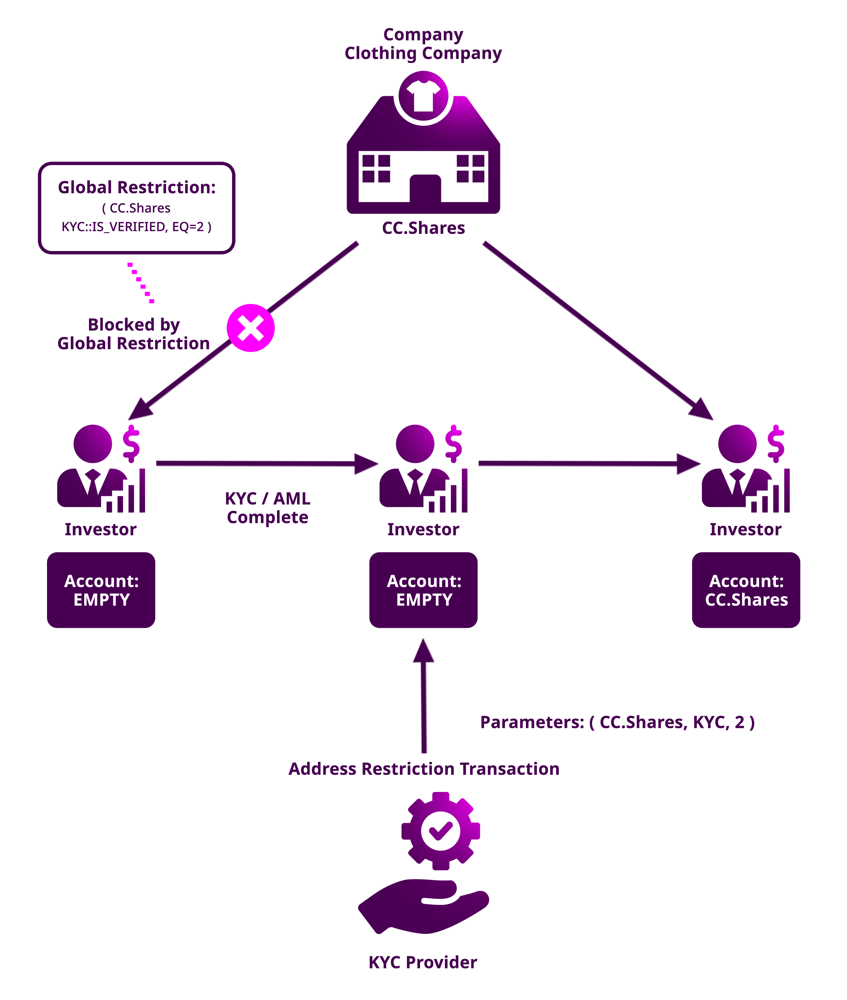

:orphan:

.. post:: 20 Sep, 2019
    :category: Mosaic Restriction
    :excerpt: 1
    :nocomments:

###################################################
Delegating the mosaic restrictions to a third party
###################################################

Take the restrictions rules from a third party mosaic.

**********
Background
**********

Another company, **ComfyClothingCompany** wants to conduct an STO. In this case, they want to **delegate the KYC process** to a company specialized in KYC & AML.

If you have followed the previous guide (:doc:`restricting mosaics transfers  <restricting-mosaics-transfers>`),
you know how to restrict accounts from transacting a given mosaic by combining different key-values to match the global :doc:`mosaic restriction <../../concepts/mosaic-restriction>`.

    Use case diagram

In this guide, we will be restricting accounts to trade with ``cc.shares`` ⁠— mosaic created by ComfyClothingCompany — if the KYC provider does not allow them.

*************
Prerequisites
*************

- Finish :doc:`creating a mosaic guide <../mosaic/creating-a-mosaic>`
- Finish :doc:`restricting mosaics transfers <restricting-mosaics-transfers>`

**********************
Getting into some code
**********************

1. Start by registering a new ``restrictable`` mosaic with the :doc:`ComfyClothingCompany account <../account/creating-and-opening-an-account>` account. We will refer to this mosaic from now on as ``cc.shares``.

.. code-block:: bash

    nem2-cli transaction mosaic --amount 1000000 --transferable --supply-mutable --restrictable --divisibility 0 --non-expiring --profile cccompany

2. The KYC provider registers a new mosaic named ``kyc`` and adds the mosaic global restriction ``{ kyc, Is_Verified, EQ, 1}`` to the mosaic.

.. example-code::

    .. viewsource:: ../../resources/examples/typescript/restriction/RestrictingMosaicsTransfersDelegatedMosaicGlobalRestriction2.ts
        :language: typescript
        :start-after:  /* start block 01 */
        :end-before: /* end block 01 */

The KYC provider defines the following permission tiers:

.. csv-table::
    :header: "Key", "Operator", "Value", "Description"
    :delim: ;

    Is_Verified; EQ; 1; The client has issued a valid passport.
    Is_Verified; EQ; 2; The client has issued a valid proof of address and passport.

ComfyClothingCompany decides that only accounts with the restriction ``{cc.shares, kyc::Is_Verified, EQ = 2}`` should be enabled to transfer shares. For this reason, the company adds the mosaic global restriction ``{ kyc::Is_Verified, EQ, 2}`` to the mosaic  ``ccf.shares``. To implement the restriction from another mosaic, we are going to use the field ``referenceId``.

3. Announce a **MosaicGlobalRestrictionTransaction**, setting ``cc.shares`` as the ``targetMosaicId``, ``kyc`` as the ``referenceMosaicId``, and ``Is_Verified`` as the key.

.. example-code::

    .. viewsource:: ../../resources/examples/typescript/restriction/RestrictingMosaicsTransfersDelegatedMosaicGlobalRestriction.ts
        :language: typescript
        :start-after:  /* start block 01 */
        :end-before: /* end block 01 */

4. The KYC provider has encounters three potential investors:

* Alice provides a valid passport but no proof of address. The KYC provider awards Alice's account with the mosaic restriction ``{kyc, Is_Verified, 1}``.
* Bob provides a valid passport and proof of address. The KYC provider awards Bob's account with the mosaic restriction ``{kyc, Is_Verified, 2}``.
* Carol provides a valid passport and proof of address. The KYC provider awards Carol's account with the mosaic restriction ``{kyc, Is_Verified, 2}``.

The KYC provider has to tag the accounts accordingly sending mosaic address restrictions.

.. example-code::

    .. viewsource:: ../../resources/examples/typescript/restriction/RestrictingMosaicsTransfersDelegatedMosaicAddressRestriction.ts
        :language: typescript
        :start-after:  /* start block 01 */
        :end-before: /* end block 01 */

5. After the restrictions get confirmed, Bob and Carol will be able to buy and send the ``cc.shares`` units to each other. But Alice ⁠— who has not provided valid proof of address ⁠— will not be able to receive shares.
