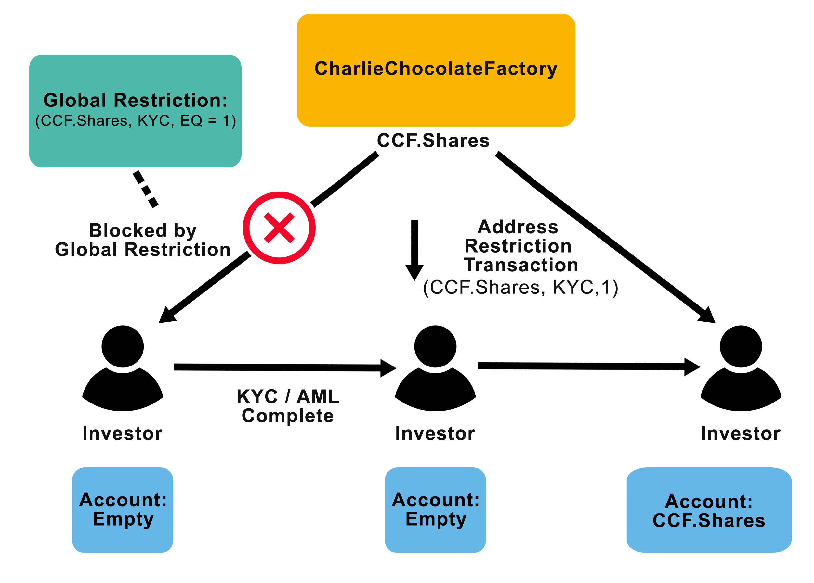

:orphan:

.. post:: 13 Sep, 2019
    :category: Mosaic
    :excerpt: 1
    :nocomments:

############################
Restricting mosaic transfers
############################

Limit how accounts can transact with Mosaic Restrictions.

**********
Background
**********

Let's say a company, CharlieChocolateFactory, wants to go public by tokenizing their shares and conducting an STO. They create a mosaic ``ccf.shares`` and configure it to be **restrictable**. To comply with regulations, the company wants only the participants that have passed the **KYC/AML** process to buy and transact their stock.

In this guide, we are going to use Catapult's :doc:`Mosaic Restriction <../../concepts/mosaic-restriction>` feature to define rules that determine which participants can transact with ``ccf.shares``.

*************
Prerequisites
*************

- Finish :doc:`creating a mosaic guide <../mosaic/creating-a-mosaic>`

******************************
Creating a restrictable mosaic
******************************

Before starting to work with Mosaic Restrictions, we need to have created a restrictable mosaic. Only mosaics with the ``restrictable`` :ref:`property <mosaic-properties>` set to true at the moment of their creation can accept mosaic restrictions.

1. Start creating a new restrictable mosaic with NEM2-CLI using the :doc:`CharlieChocolateFactory account <../account/creating-an-account>`.

.. code-block:: bash

    nem2-cli transaction mosaic --profile ccfactory

    Do you want an eternal mosaic? [y/n]: y
    Introduce mosaic divisibility: 0
    Do you want mosaic to have supply mutable? [y/n]: y
    Do you want mosaic to be transferable? [y/n]: y
    Do you want mosaic to be restrictable? [y/n]: y
    Introduce amount of tokens: 1000
    Transaction announced correctly

    Your mosaic id is: 634a8ac3fc2b65b3

2. Then, copy and save the mosaic identifier. We will need it later to define restrictions.

*************************
Method #01: Using the SDK
*************************

Setting a Mosaic Global Restriction
===================================

The company wants to add a restriction to only permit accounts with elevated statuses to interact with the asset. To achieve this, the company will add a mosaic global restriction as ``{ccf.shares, KYC, EQ = 1}``, which can be read as "only allow accounts to transact with the ``ccf.shares`` mosaic if their ``KYC`` restriction key for it has a value equal to 1".



    Use case diagram

1. Open a new TypeScript file. Then, place the mosaic identifier value you got while creating the mosaic in a variable named ``mosaicId``. Also, you should represent the key ``KYC`` with a numeric value encoded as a UInt64.

.. example-code::

    .. viewsource:: ../../resources/examples/typescript/restriction/RestrictingMosaicsTransfersMosaicGlobalRestriction.ts
        :language: typescript
        :start-after:  /* start block 01 */
        :end-before: /* end block 01 */

    .. viewsource:: ../../resources/examples/typescript/restriction/RestrictingMosaicsTransfersMosaicGlobalRestriction.js
        :language: javascript
        :start-after:  /* start block 01 */
        :end-before: /* end block 01 */

2. Then, define a new **MosaicGlobalRestrictionTransaction**. Pass the mosaicId and keys you have defined in the previous step as arguments.

The SDK will also request the previous mosaic restriction value and type for this key and mosaic. As it is the first global restriction we are announcing, set the ```previousRestrictionValue`` to ``0`` and the ``mosaicRestrictionType`` to ``None``.

.. example-code::

    .. viewsource:: ../../resources/examples/typescript/restriction/RestrictingMosaicsTransfersMosaicGlobalRestriction.ts
        :language: typescript
        :start-after:  /* start block 02 */
        :end-before: /* end block 02 */

    .. viewsource:: ../../resources/examples/typescript/restriction/RestrictingMosaicsTransfersMosaicGlobalRestriction.js
        :language: javascript
        :start-after:  /* start block 02 */
        :end-before: /* end block 02 */

3. After defining the global restriction, sign the transaction with the mosaic owner's account—CharlieChocolateFactory—and announce it to the network.

.. example-code::

    .. viewsource:: ../../resources/examples/typescript/restriction/RestrictingMosaicsTransfersMosaicGlobalRestriction.ts
        :language: typescript
        :start-after:  /* start block 03 */
        :end-before: /* end block 03 */

    .. viewsource:: ../../resources/examples/typescript/restriction/RestrictingMosaicsTransfersMosaicGlobalRestriction.js
        :language: javascript
        :start-after:  /* start block 03 */
        :end-before: /* end block 03 */

Assigning Mosaic Address Restrictions
=====================================

When investors complete the KYC/AML process, the CharlieChocolateFactory alters their accounts with a **MosaicAddressRestrictionTransaction** with parameters ``ccf.shares, KYC, 1``, allowing certified investors to participate in the STO. Others who have not provided the necessary information will not be able to receive or trade the asset.

Alice, a potential investor, passes the KYC process. Once Alice has been verified, the company tags Alice's account with the mosaic address restriction ``{ccf.shares, Alice, KYC, 1}``. On the other hand, Bob, another interested investor, did not pass the KYC process. Bob’s account is not eligible to receive ``ccf.shares`` as it does not meet the mosaic global restriction requirements. Nevertheless, CharlieCholocalteFatory decides to tag the account with the **mosaic address restriction** ``{ccf.shares, Bob, KYC, 0}``. Doing so, they know that Bob has attempted and failed the KYC process.


1. Define both **MosaicAddressRestrictionTransaction** for Alice and Bob accounts as follows:

* Alice: ``{ccf.shares, Alice, KYC, 1}``
* Bob:  ``{ccf.shares, Bob, KYC, 0}``

.. example-code::

    .. viewsource:: ../../resources/examples/typescript/restriction/RestrictingMosaicsTransfersMosaicAddressRestriction.ts
        :language: typescript
        :start-after:  /* start block 01 */
        :end-before: /* end block 01 */

    .. viewsource:: ../../resources/examples/typescript/restriction/RestrictingMosaicsTransfersMosaicAddressRestriction.js
        :language: javascript
        :start-after:  /* start block 01 */
        :end-before: /* end block 01 */

2. Now, you can announce the transactions to the network. To do so, try to announce both transactions together using an :doc:`aggregate transaction <../../concepts/aggregate-transaction>`. Remember that you will have to announce the transactions from the mosaic's owner account.

.. example-code::

    .. viewsource:: ../../resources/examples/typescript/restriction/RestrictingMosaicsTransfersMosaicAddressRestriction.ts
        :language: typescript
        :start-after:  /* start block 02 */
        :end-before: /* end block 02 */

    .. viewsource:: ../../resources/examples/typescript/restriction/RestrictingMosaicsTransfersMosaicAddressRestriction.js
        :language: javascript
        :start-after:  /* start block 02 */
        :end-before: /* end block 02 */

3. Once the transaction gets confirmed, try to send mosaics to Alice's and Bob's accounts.

You should be able to send ``ccf.shares`` to Alice without any problems. Additionally, Alice will be able to transfer mosaics with other accounts with restrictions set to ``{ccf.shares, KYC, 1}``.

.. code-block:: bash

     nem2-cli transaction transfer --recipient SD5DT3-CH4BLA-BL5HIM-EKP2TA-PUKF4N-Y3L5HR-IR54 --mosaics 634a8ac3fc2b65b3::1

However, when you send the same mosaic to Bob's account, you should get the error ``Failure_RestrictionMosaic_Account_Unauthorized`` through the :ref:`status error channel <status-errors>` as he is not allowed to transact with ``ccf.shares``.
