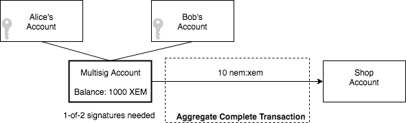
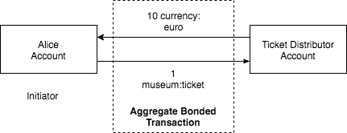
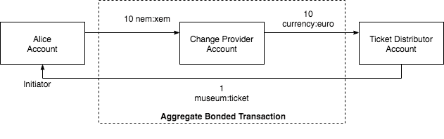
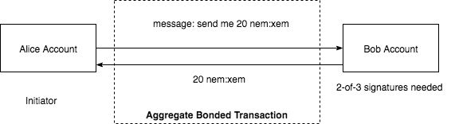

####################
Sending transactions
####################

.. _guide-sending-a-transfer-transaction:

******************************
Sending a transfer transaction
******************************

The goal of this announce a :ref:`transfer transaction <transfer-transaction>`, one of the most commonly used actions in NEM.

Prerequisites
=============

- Finish the :doc:`getting started section <../getting-started/setup-workstation>`
- NEM2-SDK or CLI
- A text editor or IDE
- An account with XEM

Background
==========

.. figure:: ../resources/images/guides-transactions-transfer.png
    :align: center
    :width: 450px

    Sending a transfer Transaction

Alice wants to send 10 XEM to Bob, who just created the following NEM account with address ``SD5DT3-CH4BLA-BL5HIM-EKP2TA-PUKF4N-Y3L5HR-IR54``.

**Monitoring the transaction**

Once an account announces a transaction, if properly formed, the server will return an OK response.

Receiving an OK response doesn't mean the transaction is valid, hence not included in a block. A good practice is to monitor transactions before being announced.

We suggest opening three new terminals. The first terminal :ref:`monitors announced transactions<guide-debugging-transactions>` validation errors.

.. code-block:: bash

    $> nem2-cli monitor status

Monitoring ``unconfirmed`` shows you which transactions have reached the network, but not yet included in a block.

.. code-block:: bash

    $> nem2-cli monitor unconfirmed

Once a transaction is included, you will see it under the ``confirmed`` terminal.

.. code-block:: bash

    $> nem2-cli monitor confirmed

Let’s get into some code
=========================

Alice sends ``10 XEM`` to Bob. She can also include a message, for example ``Welcome to NEM``.

.. example-code::

    .. literalinclude:: ../resources/examples/typescript/transaction/SendingATransferTransaction.ts
        :language: typescript
        :lines:  26-34

    .. literalinclude:: ../resources/examples/java/src/test/java/nem2/guides/examples/transaction/SendingATransferTransaction.java
        :language: java
        :lines:  45-53

    .. literalinclude:: ../resources/examples/javascript/transaction/SendingATransferTransaction.js
        :language: javascript
        :lines:  31-39

Although the transaction is created, it has not been announced to the network yet.

To announce it, Alice shall sign the transaction with her account first so that the network can verify its authenticity.

.. example-code::

    .. literalinclude:: ../resources/examples/typescript/transaction/SendingATransferTransaction.ts
        :language: typescript
        :lines:  38-44

    .. literalinclude:: ../resources/examples/java/src/test/java/nem2/guides/examples/transaction/SendingATransferTransaction.java
        :language: java
        :lines:  55-60

    .. literalinclude:: ../resources/examples/javascript/transaction/SendingATransferTransaction.js
        :language: javascript
        :lines:  43-48

Once signed, Alice can :doc:`announce the transaction <../api/announce-transaction>` to the network.

.. example-code::

    .. literalinclude:: ../resources/examples/typescript/transaction/SendingATransferTransaction.ts
        :language: typescript
        :lines:  47-

    .. literalinclude:: ../resources/examples/java/src/test/java/nem2/guides/examples/transaction/SendingATransferTransaction.java
        :language: java
        :lines:  63-66

    .. literalinclude:: ../resources/examples/javascript/transaction/SendingATransferTransaction.js
        :language: javascript
        :lines:  52-

    .. literalinclude:: ../resources/examples/cli/transaction/SendingATransferTransaction.sh
        :language: bash
        :start-after: #!/bin/sh

Open the terminal where you are monitoring account transactions ``status``, it should be empty. If you see an error, check :doc:`HTTP Error Codes <../api/errors>` and their meaning.

A new transaction should have appeared in the terminal where you are monitoring ``unconfirmed``. At this point, the transaction has reached the network, but it is not clear if it will get included in a block.

If it is included in a block, the transaction gets processed, and the amount stated in the transaction gets transferred from the sender's account to the recipient's account.

What's next?
============

Send a new transfer transactions by altering your code to send multiple mosaics in the same transaction.

**Adding multiple mosaics**

.. figure:: ../resources/images/guides-transactions-transfer-multiple.png
    :align: center
    :width: 450px

    Sending multiple mosaics in the same transaction

As you may have noticed, transfer transactions require an array of mosaics as a parameter, allowing to create transfer transactions with multiple mosaics at a time.

If you own more than one mosaic, try to send them together in the same transaction:

.. example-code::

    .. literalinclude:: ../resources/examples/typescript/transaction/SendingATransferTransactionWithMultipleMosaics.ts
        :language: typescript
        :lines:  36-39

    .. literalinclude:: ../resources/examples/java/src/test/java/nem2/guides/examples/transaction/SendingATransferTransactionWithMultipleMosaics.java
        :language: java
        :lines:  54-57

    .. literalinclude:: ../resources/examples/javascript/transaction/SendingATransferTransactionWithMultipleMosaics.js
        :language: javascript
        :lines:  42-45

    .. literalinclude:: ../resources/examples/cli/transaction/SendingATransferTransactionWithMultipleMosaics.sh
        :language: bash
        :start-after: #!/bin/sh

.. _guide-sending-a-multisig-transaction:

******************************
Sending a multisig transaction
******************************

Send a transaction involving a :doc:`multisig <../concepts/multisig-account>`, learning how :ref:`aggregate bonded transaction <aggregate-transaction>` works.

Background
==========

    Sending an aggregate complete transaction

Alice and Bob live together and have separate accounts. They also have a shared account so that if Bob is out shopping, he can buy groceries for both him and Alice.

This shared account is in NEM translated as 1-of-2 multisig, meaning that one cosignatory needs to cosign the transaction to be included in a block.

Remember that a multisig account has cosignatories accounts, and it cannot start transactions itself. Only the cosignatories can initiate transactions.

Prerequisites
=============

- Finish :ref:`sending a transfer transaction guide <guide-sending-a-transfer-transaction>`
- Finish :ref:`converting an account to multisig guide <guide-converting-an-account-to-multisig>`
- NEM2-SDK
- A text editor or IDE
- An multisig account with XEM
- An cosignatory account with XEM

Let’s get into some code
=========================

Bob has finished filling his basket, and he is ready to pay. The cashier's screen indicates that the cost of the purchase is 10 XEM.

Bob needs to know which is the public key of the multisig account that he shares with Alice, and his private key to start announcing the transaction.

.. example-code::

    .. literalinclude:: ../resources/examples/typescript/transaction/SendingAMultisigTransactionAggregateComplete.ts
        :language: typescript
        :lines: 24-36

    .. literalinclude:: ../resources/examples/java/src/test/java/nem2/guides/examples/transaction/SendingAMultisigTransactionAggregateComplete.java
        :language: java
        :lines: 43-55

    .. literalinclude:: ../resources/examples/javascript/transaction/SendingAMultisigTransactionAggregateComplete.js
        :language: javascript
        :lines: 30-41

As he wants to pay the groceries with the multisig account, he defines a :ref:`transfer transaction <transfer-transaction>`.

* Recipient: Grocery's address
* Message: Grocery payment
* Mosaics: [10 XEM]

.. example-code::

    .. literalinclude:: ../resources/examples/typescript/transaction/SendingAMultisigTransactionAggregateComplete.ts
        :language: typescript
        :lines:  37-43

    .. literalinclude:: ../resources/examples/java/src/test/java/nem2/guides/examples/transaction/SendingAMultisigTransactionAggregateComplete.java
        :language: java
        :lines:  56-63

    .. literalinclude:: ../resources/examples/javascript/transaction/SendingAMultisigTransactionAggregateComplete.js
        :language: javascript
        :lines:  43-49

Wrap the transfer transaction under an :ref:`aggregate transaction <aggregate-transaction>`, attaching multisig public key as the signer.

An aggregate transaction is **complete** if before announcing it to the network, all required cosigners have signed it. If valid, it will be included in a block.

Remember that we are using a 1-of-2 multisig account? As Bob has one private key to sign the transaction, consider an *aggregate complete transaction*.

.. example-code::

    .. literalinclude:: ../resources/examples/typescript/transaction/SendingAMultisigTransactionAggregateComplete.ts
        :language: typescript
        :lines:  45-52

    .. literalinclude:: ../resources/examples/java/src/test/java/nem2/guides/examples/transaction/SendingAMultisigTransactionAggregateComplete.java
        :language: java
        :lines:  64-71

    .. literalinclude:: ../resources/examples/javascript/transaction/SendingAMultisigTransactionAggregateComplete.js
        :language: javascript
        :lines:  51-58

Then, he signs and announces the transaction.

.. example-code::

    .. literalinclude:: ../resources/examples/typescript/transaction/SendingAMultisigTransactionAggregateComplete.ts
        :language: typescript
        :lines:  54-

    .. literalinclude:: ../resources/examples/java/src/test/java/nem2/guides/examples/transaction/SendingAMultisigTransactionAggregateComplete.java
        :language: java
        :lines:  72-78

    .. literalinclude:: ../resources/examples/javascript/transaction/SendingAMultisigTransactionAggregateComplete.js
        :language: javascript
        :lines:  60-

What's next?
============

What would have happened if the account were a 2-of-2 multisig instead of a 1-of-2?

As all required cosigners didn't sign the transaction, it should be announced as :ref:`aggregate bonded <aggregate-transaction>`.

.. figure:: ../resources/images/guides-transactions-multisig-2.png
    :align: center
    :width: 600px

    Sending an aggregate bonded transaction

.. example-code::

    .. literalinclude:: ../resources/examples/typescript/transaction/SendingAMultisigTransactionAggregateBonded.ts
        :language: typescript
        :lines:  45-51

    .. literalinclude:: ../resources/examples/java/src/test/java/nem2/guides/examples/transaction/SendingAMultisigTransactionAggregateBonded.java
        :language: java
        :lines:  62-70

    .. literalinclude:: ../resources/examples/javascript/transaction/SendingAMultisigTransactionAggregateBonded.js
        :language: javascript
        :lines:  55-61

Open a new terminal for :ref:`monitoring<guide-debugging-transactions>` the aggregate bonded transaction.

.. code-block:: bash

    $> nem2-cli monitor aggregatebonded --address <your-address-here>

When an aggregate transaction is bonded, Bob needs to lock at least 10 XEM to avoid network spamming. Once all cosigners sign the transaction, the amount of XEM becomes available again on Bob's account.

After :ref:`locks fund transaction <lock-funds-transaction>` has been confirmed, :doc:`announce the aggregate bonded transaction <../api/announce-transaction>`.

.. example-code::

    .. literalinclude:: ../resources/examples/typescript/transaction/SendingAMultisigTransactionAggregateBonded.ts
        :language: typescript
        :lines:  53-

    .. literalinclude:: ../resources/examples/java/src/test/java/nem2/guides/examples/transaction/SendingAMultisigTransactionAggregateBonded.java
        :language: java
        :lines:  70-99

    .. literalinclude:: ../resources/examples/javascript/transaction/SendingAMultisigTransactionAggregateBonded.js
        :language: javascript
        :lines:  63-

Alice should :ref:`cosign the transaction <guide-signing-announced-aggregate-bonded-transactions>` to be confirmed!

.. _guide-sending-payouts-with-aggregate-complete-transaction:

***************************************************
Sending payouts with aggregate complete transaction
***************************************************

Send transactions to different accounts atomically, using an :ref:`aggregate complete transaction <aggregate-transaction>`.

Background
==========

It is Christmas, and uncle Dan wants to send money to their nephews Alice and Bob.

.. figure:: ../resources/images/guides-transactions-sending-payouts.png
    :align: center
    :width: 450px

    Sending transactions to different recipients atomically

He chooses to send an aggregate complete transaction, so both of them will receive the funds at the same time.

Prerequisites
=============

- Finish :ref:`sending a transfer transaction guide <guide-sending-a-transfer-transaction>`
- NEM2-SDK
- A text editor or IDE
- An account with XEM

Let's get into some code?
=========================

First, Dan creates two :ref:`transfer transaction <transfer-transaction>` with two different recipients, and wrap them in an :ref:`aggregate transaction <aggregate-transaction>`.

.. example-code::

    .. literalinclude:: ../resources/examples/typescript/transaction/SendingPayoutsWithAggregateCompleteTransaction.ts
        :language: typescript
        :lines:  22-46

    .. literalinclude:: ../resources/examples/java/src/test/java/nem2/guides/examples/transaction/SendingPayoutsWithAggregateCompleteTransaction.java
        :language: java
        :lines:  40-74

    .. literalinclude:: ../resources/examples/javascript/transaction/SendingPayoutsWithAggregateCompleteTransaction.js
        :language: javascript
        :lines:  28-52

Do you know the difference between aggregate complete and aggregate bonded? In this case, one private key can sign all the transactions in the aggregate, so it is *aggregate complete*.

That means that there is no need to lock funds to send the transaction. If valid, it will be accepted by the network.

Just sign it and announce it!

.. example-code::

    .. literalinclude:: ../resources/examples/typescript/transaction/SendingPayoutsWithAggregateCompleteTransaction.ts
        :language: typescript
        :lines:  47-

    .. literalinclude:: ../resources/examples/java/src/test/java/nem2/guides/examples/transaction/SendingPayoutsWithAggregateCompleteTransaction.java
        :language: java
        :lines:  75-80

    .. literalinclude:: ../resources/examples/javascript/transaction/SendingPayoutsWithAggregateCompleteTransaction.js
        :language: javascript
        :lines:  53-
        
What's next?
============

Try to send an aggregate bonded transaction by following :ref:`creating an escrow with aggregate bonded transaction <guide-creating-an-escrow-with-aggregate-bonded-transaction>` guide.

.. _guide-creating-an-escrow-with-aggregate-bonded-transaction:

****************************************************
Creating an escrow with aggregate bonded transaction
****************************************************

This guide will run you through NEM general concepts, and precisely :ref:`aggregate bonded transaction <aggregate-transaction>`, by creating an escrow.

Background
==========

An **escrow** is a ``contractual arrangement`` in which a ``third party receives and disburses money`` or documents for the ``primary transacting parties``, with the disbursement dependent on ``conditions agreed to by the transacting parties``, or an ``account established by a broker for holding funds`` on behalf of the broker's principal or some other person ``until the consummation or termination of a transaction``; or, a trust account held in the borrower's name to pay obligations such as property taxes and insurance premiums.

See full description at |escrow_wikipedia|.

In this example, imagine the two parties agree in a virtual service, implying that the **escrow can be immediate**.

**How does it work?**

1. Buyer and seller agree to terms
2. Buyer submits payment to escrow
3. Seller delivers goods or service to Buyer
4. Buyer approves goods or service
5. Escrow releases payment to the seller

**How is it applied to NEM?**

Normalizing the language into NEM related concepts:

**contractual arrangement**
    Aggregate Transaction

**third party receives and disburses money**
    No third party

**primary transacting parties**
    Accounts

**conditions agreed to by the transacting parties**
    Sign transaction

**account established by a broker for holding funds**
    No account, just an atomic swap

**until the consummation or termination of a transaction**
    The transaction included in a block

Prerequisites
=============

- Finish :ref:`creating a mosaic guide <guide-creating-a-mosaic>`
- Finish :ref:`sending payouts with aggregate complete transactions <guide-sending-payouts-with-aggregate-complete-transaction>`
- NEM2-SDK
- A text editor or IDE

Let's get into some code?
=========================

    Multi-Asset Escrowed Transactions

**Setting up the required accounts and mosaics**

In this example, Alice and a ticket distributor want to swap the following mosaics.

.. csv-table::
        :header: "Owner", "Mosaic Name", "Amount"

        Alice, nem:xem, 100
        Ticket distributor, museum:ticket, 1

Before continuing, practise by setting up set up the namespaces and mosaics required.

**Mosaics swap**

Alice will send a transaction to the ticket distributor exchanging 100 nem:xem with 1 museum:ticket.

Create two  :ref:`transfer transaction <transfer-transaction>`:

1. From Alice to the ticket distributor sending 100 nem:xem
2. From the ticket distributor to Alice sending 1 museum:ticket.

Add them as ``innerTransactions`` under an :ref:`aggregate transaction <aggregate-transaction>`.

An aggregate Transaction is *complete* if before announcing it to the network, all required cosigners have signed it. If valid, it will be included in a block.

In case that requires signatures from other participants but announced to the network, then the transaction is considered *aggregate bonded*.

.. example-code::

    .. literalinclude:: ../resources/examples/typescript/transaction/CreatingAnEscrowWithAggregateBondedTransaction.ts
        :language: typescript
        :lines:  26-61

    .. literalinclude:: ../resources/examples/java/src/test/java/nem2/guides/examples/transaction/CreatingAnEscrowWithAggregateBondedTransaction.java
        :language: java
        :lines:  44-80

    .. literalinclude:: ../resources/examples/javascript/transaction/CreatingAnEscrowWithAggregateBondedTransaction.js
        :language: javascript
        :lines:  34-67

When an aggregate transaction is bonded, Alice will need to lock at least 10 XEM.

Once the ticket distributor signs the aggregate transaction, the amount of locked XEM becomes available again on Alice's account, and the exchange will get through.

.. example-code::

    .. literalinclude:: ../resources/examples/typescript/transaction/CreatingAnEscrowWithAggregateBondedTransaction.ts
        :language: typescript
        :lines:  62-

    .. literalinclude:: ../resources/examples/java/src/test/java/nem2/guides/examples/transaction/CreatingAnEscrowWithAggregateBondedTransaction.java
        :language: java
        :lines:  80-105

    .. literalinclude:: ../resources/examples/javascript/transaction/CreatingAnEscrowWithAggregateBondedTransaction.js
        :language: javascript
        :lines:  69-

Is it possible without aggregate transactions?
==============================================

**It is not secure**, since something of the next list could happen:

- The buyer doesn't pay.
- The seller doesn't send the virtual goods.

.. |escrow_wikipedia| raw:: html

   <a href="https://en.wikipedia.org/wiki/Escrow" target="_blank">Wikipedia</a>

What's next?
============

The distributor didn't sign the aggregate bonded transaction yet, so exchange has not been completed. Consider reading :ref:`signing announced aggregate bonded transactions guide <guide-signing-announced-aggregate-bonded-transactions>`.

Afterwards, swap mosaics between multiple participants.

    Multi-Asset Escrowed Transactions

.. _guide-asking-for-mosaics-with-aggregate-bonded-transaction:

****************************************************
Asking for mosaics with aggregate bonded transaction
****************************************************

Ask an account to send you funds using an :ref:`aggregate bonded transaction <aggregate-transaction>`.

Prerequisites
=============

- Finish :ref:`creating an escrow with aggregate bonded transaction guide <guide-creating-an-escrow-with-aggregate-bonded-transaction>`
- A text editor or IDE
- An account with XEM

Let’s get into some code
=========================

    Asking for mosaics with an aggregate bonded transaction

Alice wants to ask Bob for 20 XEM.

Alice creates an aggregate bonded transaction with two inner transactions:

Inner :ref:`transfer transaction <transfer-transaction>` 1:

* message: "message reason" (custom, but not empty)
* receiver: Bob address
* signer: Alice

.. example-code::

    .. literalinclude:: ../resources/examples/typescript/transaction/AskingForMosaicsWithAggregateBondedTransaction.ts
        :language: typescript
        :lines:  34-40

    .. literalinclude:: ../resources/examples/java/src/test/java/nem2/guides/examples/transaction/AskingForMosaicsWithAggregateBondedTransaction.java
        :language: java
        :lines:  52-59

    .. literalinclude:: ../resources/examples/javascript/transaction/AskingForMosaicsWithAggregateBondedTransaction.js
        :language: javascript
        :lines:  43-49

Inner transfer transaction 2:

* message: empty
* receiver: Alice address
* mosaics: 20 XEM
* signer: Bob

.. example-code::

    .. literalinclude:: ../resources/examples/typescript/transaction/AskingForMosaicsWithAggregateBondedTransaction.ts
        :language: typescript
        :lines: 42-48

    .. literalinclude:: ../resources/examples/java/src/test/java/nem2/guides/examples/transaction/AskingForMosaicsWithAggregateBondedTransaction.java
        :language: java
        :lines:  60-67

    .. literalinclude:: ../resources/examples/javascript/transaction/AskingForMosaicsWithAggregateBondedTransaction.js
        :language: javascript
        :lines:  51-57

Aggregate transaction:

.. example-code::

    .. literalinclude:: ../resources/examples/typescript/transaction/AskingForMosaicsWithAggregateBondedTransaction.ts
        :language: typescript
        :lines:  50-57

    .. literalinclude:: ../resources/examples/java/src/test/java/nem2/guides/examples/transaction/AskingForMosaicsWithAggregateBondedTransaction.java
        :language: java
        :lines:  68-76

    .. literalinclude:: ../resources/examples/javascript/transaction/AskingForMosaicsWithAggregateBondedTransaction.js
        :language: javascript
        :lines:  59-66

Alice signs the aggregate bonded transaction and announces it to the network, locking first 10 XEM.

.. example-code::

    .. literalinclude:: ../resources/examples/typescript/transaction/AskingForMosaicsWithAggregateBondedTransaction.ts
        :language: typescript
        :lines:  59-

    .. literalinclude:: ../resources/examples/java/src/test/java/nem2/guides/examples/transaction/AskingForMosaicsWithAggregateBondedTransaction.java
        :language: java
        :lines:  77-103

    .. literalinclude:: ../resources/examples/javascript/transaction/AskingForMosaicsWithAggregateBondedTransaction.js
        :language: javascript
        :lines:  68-

If all goes well, Bob receives a notification via :ref:`WebSocket <guide-debugging-transactions>` (or fetched via :ref:`API Http request <guide-receiving-transactions-of-an-account>`).

What's next?
============

Bob didn't cosign the transaction yet. Consider reading :ref:`signing announced aggregate bonded transactions guide <guide-signing-announced-aggregate-bonded-transactions>`.

After receiving the transaction, Bob signs the ``transaction hash`` and announces the cosignature signed transaction.

As the aggregate bonded transaction has all the cosignatures required, it will be included in a block.

.. _guide-signing-announced-aggregate-bonded-transactions:

***********************************************
Signing announced aggregate bonded transactions
***********************************************

You probably have announced an :ref:`aggregate bonded transaction <aggregate-transaction>`, but all cosigners have not signed it yet.

This guide will show you how to cosign aggregate bonded transactions that require being signed by your account.

Prerequisites
=============

- Finish :ref:`creating an escrow with aggregate bonded transaction guide <guide-creating-an-escrow-with-aggregate-bonded-transaction>`
- Received some aggregate bonded transaction
- NEM2-SDK
- A text editor or IDE
- An account with XEM

Let’s get into some code
=========================

Create a function to cosign any aggregate bonded transaction.

.. example-code::

    .. literalinclude:: ../resources/examples/typescript/transaction/SigningAnnouncedAggregateBondedTransactions.ts
        :language: typescript
        :lines: 24-27

    .. literalinclude:: ../resources/examples/javascript/transaction/SigningAnnouncedAggregateBondedTransactions.js
        :language: javascript
        :lines:  26-30

Fetch all aggregate bonded transactions pending to be signed by your account.

.. note:: To fetch aggregate bonded transactions that should be signed by multisig cosignatories, refer to the multisig public key instead. See :ref:`how to get multisig accounts where an account is cosignatory<guide-get-multisig-account-info>`.

For each transaction, check if you have not already signed it. Cosign each pending transaction using the previously created function.

Did you realise that we are using RxJS operators intensively? Announce ``CosignatureSignedTransaction`` to the network using the ``TransactionHttp`` repository.

.. example-code::

    .. literalinclude:: ../resources/examples/typescript/transaction/SigningAnnouncedAggregateBondedTransactions.ts
        :language: typescript
        :lines: 28-

    .. literalinclude:: ../resources/examples/java/src/test/java/nem2/guides/examples/transaction/SigningAnnouncedAggregateBondedTransactions.java
        :language: java
        :lines:  37-57

    .. literalinclude:: ../resources/examples/javascript/transaction/SigningAnnouncedAggregateBondedTransactions.js
        :language: javascript
        :lines:  31-

.. _guide-signing-announced-aggregate-bonded-transactions-automatically:

*************************************************************
Signing announced aggregate bonded transactions automatically
*************************************************************

Following this guide, you will create an application that is notified every time your account receives a transaction pending to be cosigned.

Automatically, the app will cosign the transaction and announce it to the network.

Prerequisites
=============

- Finish :ref:`creating an escrow with aggregate bonded transaction guide <guide-creating-an-escrow-with-aggregate-bonded-transaction>`
- Received some aggregate bonded transaction
- NEM2-SDK
- A text editor or IDE
- An account with XEM

Let’s get into some code
=========================

Create a function to cosign any aggregate bonded transaction.

.. example-code::

    .. literalinclude:: ../resources/examples/typescript/transaction/SigningAnnouncedAggregateBondedTransactions.ts
        :language: typescript
        :lines: 24-27

    .. literalinclude:: ../resources/examples/javascript/transaction/SigningAnnouncedAggregateBondedTransactions.js
        :language: javascript
        :lines:  26-30

Create a new listener to get notified every time a new aggregate bonded transaction requires the signature of your account.

Open the connection. You only need to open the connection once and then connect to all desired channels.

Start listening for new transactions, subscribing to the ``aggregateBondedAdded`` channel using your account's address.

.. note:: To sign automatically aggregate bonded transactions that should be signed by multisig cosignatories, refer to the multisig address instead. See :ref:`how to get multisig accounts where an account is cosignatory<guide-get-multisig-account-info>`.

For each received transaction, check if you have not already signed it.  Cosign each pending aggregate bonded transaction using the previously created function.

Did you realise that we are using RxJS operators intensively? Announce ``CosignatureSignedTransaction`` to the network using the ``TransactionHttp`` repository.

.. example-code::

    .. literalinclude:: ../resources/examples/typescript/transaction/SigningAnnouncedAggregateBondedTransactionsAutomatically.ts
        :language: typescript
        :lines: 29-

    .. literalinclude:: ../resources/examples/java/src/test/java/nem2/guides/examples/transaction/SigningAnnouncedAggregateBondedTransactionsAutomatically.java
        :language: java
        :lines:  39-61

    .. literalinclude:: ../resources/examples/javascript/transaction/SigningAnnouncedAggregateBondedTransactionsAutomatically.js
        :language: javascript
        :lines:  31-

What's next?
============

In this guide, you have seen how to create an automatic signature for an account aggregate bonded transactions. Now that you know some general concepts, you could extend it by filtering transactions matching some constraints.

* Aggregate transactions with two inner transactions.
* Two inner transactions must be transfer transactions.
* The transaction sending funds must have yourself as the signer.
* The transaction sending funds should have only one mosaic being this less than 100 XEM.

Try it yourself! Here you have the implementation:

.. example-code::

    .. literalinclude:: ../resources/examples/typescript/transaction/SigningAnnouncedAggregateBondedTransactionsAutomaticallyWithConstraints.ts
        :language: typescript
        :lines:  25-

    .. literalinclude:: ../resources/examples/java/src/test/java/nem2/guides/examples/transaction/SigningAnnouncedAggregateBondedTransactionsAutomaticallyWithConstraints.java
        :language: java
        :lines:  40-72

    .. literalinclude:: ../resources/examples/javascript/transaction/SigningAnnouncedAggregateBondedTransactionsAutomaticallyWithConstraints.js
        :language: javascript
        :lines:  26-

.. _guide-using-secret-lock-for-atomic-cross-chain-swap:

**********************************************************
Using secret lock for atomic cross-chain swap transactions
**********************************************************

Exchange tokens between different blockchains atomically using :ref:`secret lock <secret-lock-transaction>` and :ref:`secret proof transactions <secret-proof-transaction>`.

Background
==========
Alice and Bob want to exchange 10 alice:token for 10 bob:token. The problem is that they are not in the same blockchain: Alice uses NEM public network, whereas Bob is using MIJIN private network.

One non-atomic solution could be:

1) Alice sends to Bob 10 alice:token in PUBLIC chain
2) Bob receives the transaction
3) Bob sends to Alice 10 bob:token in PRIVATE chain
4) Alice receives the transaction

But they don't trust each other that much. Ideally, they want to exchange their tokens between different blockchains atomically.

Following this guide, you will swap tokens between different blockchain platforms atomically using secret lock transaction.

.. figure:: ../resources/images/guides-transactions-atomic-cross-chain-swap.png
    :align: center
    :width: 700px

    Atomic cross-chain trading between public and private network

.. note:: Mijin and NEM share SDK. The example will work with other blockchain platforms if implements Secret Lock / Secret Proof transactions mechanism.

Prerequisites
=============
- Finish :ref:`creating an escrow with aggregate bonded transaction guide <guide-creating-an-escrow-with-aggregate-bonded-transaction>`
- NEM2-SDK
- A text editor or IDE

Let's get into some code?
=========================

Alice picks a random number, which we call ``proof``. Applies SHA512 hash algorithm to it, obtaining the ``secret``.

.. example-code::

    .. literalinclude:: ../resources/examples/typescript/transaction/UsingSecretLockForAtomicCrosschainSwapTransactions.ts
        :language: typescript
        :lines:  28-36

    .. literalinclude:: ../resources/examples/java/src/test/java/nem2/guides/examples/transaction/UsingSecretLockForAtomicCrosschainSwapTransactions.java
        :language: java
        :lines:  46-55

    .. literalinclude:: ../resources/examples/javascript/transaction/UsingSecretLockForAtomicCrosschainSwapTransactions.js
        :language: javascript
        :lines:  32-41

Now, Alice creates a secret lock transaction, which contains:

* The mosaic and amount to be sent: 10 alice:token
* A recipient address: Bob's address in public chain
* The secret: Hashed proof.
* The amount of time while funds can be unlocked: 96h

.. example-code::

    .. literalinclude:: ../resources/examples/typescript/transaction/UsingSecretLockForAtomicCrosschainSwapTransactions.ts
        :language: typescript
        :lines:  38-47

    .. literalinclude:: ../resources/examples/java/src/test/java/nem2/guides/examples/transaction/UsingSecretLockForAtomicCrosschainSwapTransactions.java
        :language: java
        :lines:  57-66

    .. literalinclude:: ../resources/examples/javascript/transaction/UsingSecretLockForAtomicCrosschainSwapTransactions.js
        :language: javascript
        :lines:  43-52

Alice signs and announces TX1 to NEM network.

.. example-code::

    .. literalinclude:: ../resources/examples/typescript/transaction/UsingSecretLockForAtomicCrosschainSwapTransactions.ts
        :language: typescript
        :lines:  49-55

    .. literalinclude:: ../resources/examples/java/src/test/java/nem2/guides/examples/transaction/UsingSecretLockForAtomicCrosschainSwapTransactions.java
        :language: java
        :lines:  68-71

    .. literalinclude:: ../resources/examples/javascript/transaction/UsingSecretLockForAtomicCrosschainSwapTransactions.js
        :language: javascript
        :lines:  54-60

Alice can tell Bob the secret, or he can retrieve it directly from the recently announced transaction.

Bob creates a secret lock transaction TX2, which contains:

* The mosaic and amount to be sent: 10 bob:token
* A recipient address: Alice's address in private chain
* The secret that should be achieved to unlock the funds.
* The amount of time while funds can be unlocked: 84h

.. note::  The amount of time while funds can be unlocked should be smaller time frame than TX1's. Alice knows the secret, so Bob must be sure, he’ll have some time left after Alice will release the secret.

.. example-code::

    .. literalinclude:: ../resources/examples/typescript/transaction/UsingSecretLockForAtomicCrosschainSwapTransactions.ts
        :language: typescript
        :lines:  58-72

    .. literalinclude:: ../resources/examples/java/src/test/java/nem2/guides/examples/transaction/UsingSecretLockForAtomicCrosschainSwapTransactions.java
        :language: java
        :lines:  73-86

    .. literalinclude:: ../resources/examples/javascript/transaction/UsingSecretLockForAtomicCrosschainSwapTransactions.js
        :language: javascript
        :lines:  63-77

Once signed, Bob announces TX2 to MIJIN network.

.. example-code::

    .. literalinclude:: ../resources/examples/typescript/transaction/UsingSecretLockForAtomicCrosschainSwapTransactions.ts
        :language: typescript
        :lines:  74-79

    .. literalinclude:: ../resources/examples/java/src/test/java/nem2/guides/examples/transaction/UsingSecretLockForAtomicCrosschainSwapTransactions.java
        :language: java
        :lines:  88-90

    .. literalinclude:: ../resources/examples/javascript/transaction/UsingSecretLockForAtomicCrosschainSwapTransactions.js
        :language: javascript
        :lines:  79-84

Now, Alice can announce a secret proof transaction in MIJIN network, selecting encrypting algorithm, the original proof and secret used.

.. example-code::

    .. literalinclude:: ../resources/examples/typescript/transaction/UsingSecretLockForAtomicCrosschainSwapTransactions.ts
        :language: typescript
        :lines:  81-95

    .. literalinclude:: ../resources/examples/java/src/test/java/nem2/guides/examples/transaction/UsingSecretLockForAtomicCrosschainSwapTransactions.java
        :language: java
        :lines:  92-102

    .. literalinclude:: ../resources/examples/javascript/transaction/UsingSecretLockForAtomicCrosschainSwapTransactions.js
        :language: javascript
        :lines:  86-100

If all goes well, Alice unlocks TX2 funds, and the proof is revealed. Bob does the same by announcing a secret proof transaction TX4  in NEM blockchain.

.. example-code::

    .. literalinclude:: ../resources/examples/typescript/transaction/UsingSecretLockForAtomicCrosschainSwapTransactions.ts
        :language: typescript
        :lines:  97-

    .. literalinclude:: ../resources/examples/java/src/test/java/nem2/guides/examples/transaction/UsingSecretLockForAtomicCrosschainSwapTransactions.java
        :language: java
        :lines:  104-

    .. literalinclude:: ../resources/examples/javascript/transaction/UsingSecretLockForAtomicCrosschainSwapTransactions.js
        :language: javascript
        :lines:  102-

At that moment, Bob unlocks TX1 funds, and the atomic cross-chain swap concludes.

Is it atomic?
=============
Consider the following scenarios:

A) Bob doesn't want to announce Tx2. Alice will receive his funds back after 94 hours.
B) Alice does not want to swap tokens by signing Tx3. Bob will receive his refund after 84h. Alice will unlock as well her funds after 94 hours.
C) Alice signs and announces Tx3, receiving Bob's funds. Bob will have time to sign Tx4, as Tx1 validity is longer than Tx2.

The process is atomic but should be completed with lots of time before the deadlines.