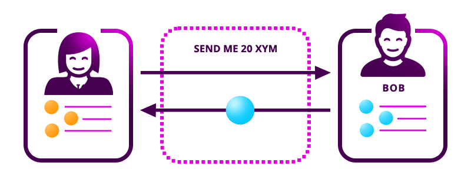

:orphan:

.. post:: 13 Aug, 2018
    :category: Aggregate Transaction
    :excerpt: 1
    :nocomments:

####################################################
Asking for mosaics with aggregate bonded transaction
####################################################

Ask an account to send you funds using an :ref:`aggregate bonded transaction <aggregate-transaction>`.

*************
Prerequisites
*************

- Finish the :doc:`getting started section <../../getting-started/setup-workstation>`
- Have one :ref:`account with cat.currency <setup-getting-a-test-account>`
- Know how to :doc:`create accounts <../account/creating-and-opening-an-account>`

**********************
Getting into some code
**********************

    Asking for mosaics with an aggregate bonded transaction

Alice wants to ask Bob for ``20 cat.currency``.

1. Set up both Alice's and Bob's accounts.

.. example-code::

    .. viewsource:: ../../resources/examples/typescript/transaction/AskingForMosaicsWithAggregateBondedTransaction.ts
        :language: typescript
        :start-after:  /* start block 01 */
        :end-before: /* end block 01 */

    .. viewsource:: ../../resources/examples/javascript/transaction/AskingForMosaicsWithAggregateBondedTransaction.js
        :language: javascript
        :start-after:  /* start block 01 */
        :end-before: /* end block 01 */

2. Create an aggregate bonded transaction with two inner transactions:

A. From Alice to Bob with the message ``send me 20 cat.currency``.

.. example-code::

    .. viewsource:: ../../resources/examples/typescript/transaction/AskingForMosaicsWithAggregateBondedTransaction.ts
        :language: typescript
        :start-after:  /* start block 02 */
        :end-before: /* end block 02 */

    .. viewsource:: ../../resources/examples/javascript/transaction/AskingForMosaicsWithAggregateBondedTransaction.js
        :language: javascript
        :start-after:  /* start block 02 */
        :end-before: /* end block 02 */

B. From Bob to Alice sending ``20 cat.currency``.

.. example-code::

    .. viewsource:: ../../resources/examples/typescript/transaction/AskingForMosaicsWithAggregateBondedTransaction.ts
        :language: typescript
        :start-after:  /* start block 03 */
        :end-before: /* end block 03 */

    .. viewsource:: ../../resources/examples/javascript/transaction/AskingForMosaicsWithAggregateBondedTransaction.js
        :language: javascript
        :start-after:  /* start block 03 */
        :end-before: /* end block 03 */

3. Wrap the previous transactions in an :ref:`aggregate bonded transaction <aggregate-transaction>`.

.. example-code::

    .. viewsource:: ../../resources/examples/typescript/transaction/AskingForMosaicsWithAggregateBondedTransaction.ts
        :language: typescript
        :start-after:  /* start block 04 */
        :end-before: /* end block 04 */

    .. viewsource:: ../../resources/examples/javascript/transaction/AskingForMosaicsWithAggregateBondedTransaction.js
        :language: javascript
        :start-after:  /* start block 04 */
        :end-before: /* end block 04 */

4. Sign the aggregate bonded transaction with Alice's account and announce it to the network. Remember to :ref:`lock 10 cat.currency <hash-lock-transaction>` first. Alice will recover the locked mosaics if the aggregate transaction completes.

.. example-code::

    .. viewsource:: ../../resources/examples/typescript/transaction/AskingForMosaicsWithAggregateBondedTransaction.ts
        :language: typescript
        :start-after:  /* start block 05 */
        :end-before: /* end block 05 */

    .. viewsource:: ../../resources/examples/javascript/transaction/AskingForMosaicsWithAggregateBondedTransaction.js
        :language: javascript
        :start-after:  /* start block 05 */
        :end-before: /* end block 05 */

.. note:: The :ref:`listener implementation changes <monitoring-transactions-client-side>` when used on the client side (e.g., Angular, React, Vue).

5. If all goes well, :doc:`Bob receives a notification to cosign the transaction<../transaction/monitoring-a-transaction-status>`. Check how to :doc:`cosign the transaction <signing-announced-aggregate-bonded-transactions>` with Bob's account in the following guide.
