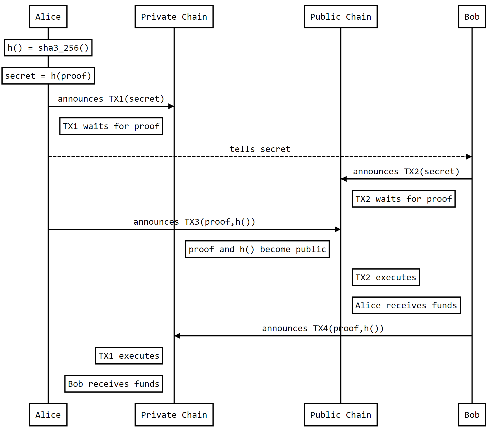

:orphan:

.. post:: 18 Aug, 2018
    :category: Cross-Chain Swaps
    :excerpt: 1
    :nocomments:

############################################################
Atomic cross-chain swap between NEM public and private chain
############################################################

:doc:`Cross-chain swaps <../../concepts/cross-chain-swaps>` enable trading tokens between different blockchains, without using an intermediary party in the process.

This exchange of tokens will succeed atomically. If some of the actors do not agree, each of them will receive the locked tokens back after a determined amount of time.

When talking about tokens in NEM, we are actually referring to :doc:`mosaics <../../concepts/mosaic>`. Catapult enables atomic swaps through :ref:`secret lock <secret-lock-transaction>` / :ref:`secret proof transaction <secret-proof-transaction>` mechanism.

**********
Background
**********

Alice and Bob want to exchange **10 alice tokens for 10 bob tokens**. The problem is that they are not in the same blockchain: alice token is defined in NEM public chain, whereas bob token is only present in a private chain using Catapult technology.

One non-atomic solution could be:

1) Alice sends 10 alice tokens to Bob (private chain)
2) Bob receives the transaction
3) Bob sends 10 bob tokens to Alice (public chain)
4) Alice receives the transaction

However, they do not trust each other that much. Bob could decide his mosaics to Alice. Following this guide, you will see how to make this swap possible, trusting technology.

*************
Prerequisites
*************

- Finish the :doc:`getting started section <../../getting-started/setup-workstation>`
- Know how to :doc:`create mosaics <../mosaic/creating-a-mosaic>`

************************
Let's get into some code
************************

Trading tokens directly from one blockchain to the other is not possible, due to the technological differences between them.

In case of NEM public and private chain, the same mosaic name could have a different definition and distribution, or even not exist. Between Bitcoin and NEM, the difference is even more evident, as each blockchain uses an entirely different technology.

Instead of transferring tokens between different chains, the trade will be performed inside each chain. The Secret proof / secret lock mechanism guarantees the token swap occurs atomically.

    Atomic cross-chain swap between public and private network

For that reason, each actor involved should have at least one account in each blockchain.

.. example-code::

   .. viewsource:: ../../resources/examples/typescript/transaction/UsingSecretLockForAtomicCrosschainSwapTransactions.ts
        :language: typescript
        :start-after:  /* start block 01 */
        :end-before: /* end block 01 */

1. Alice picks a random number, called ``proof``. Then, applies a Sha3-256 algorithm to it, obtaining the ``secret``.

.. example-code::

    .. viewsource:: ../../resources/examples/typescript/transaction/UsingSecretLockForAtomicCrosschainSwapTransactions.ts
        :language: typescript
        :start-after:  /* start block 02 */
        :end-before: /* end block 02 */

2. Alice creates a secret lock transaction TX1, including:

* Mosaic: ``10`` `10 [520597229,83226871]`` alice token
* Recipient: Bob's address (Private Chain)
* Algorithm: Sha3-256
* Secret:  Sha3-256(proof)
* Duration: 96h
* Network: Private Chain

.. example-code::

    .. viewsource:: ../../resources/examples/typescript/transaction/UsingSecretLockForAtomicCrosschainSwapTransactions.ts
        :language: typescript
        :start-after:  /* start block 03 */
        :end-before: /* end block 03 */

Once announced, this transaction will remain locked until someone discovers the proof that matches the secret. If after a determined period of time no one proved it, the locked funds will be returned to Alice.

3. Alice signs and announces TX1 to the private chain.

.. example-code::

    .. viewsource:: ../../resources/examples/typescript/transaction/UsingSecretLockForAtomicCrosschainSwapTransactions.ts
        :language: typescript
        :start-after:  /* start block 04 */
        :end-before: /* end block 04 */

4. Alice can tell Bob the secret. Also, he could retrieve it directly from the chain.

5. Bob creates a secret lock transaction TX2, which contains:

* Mosaic: ``10 [2061634929,1373884888]`` bob token
* Recipient: Alice's address (Public Chain)
* Algorithm: Sha3-256
* Secret:  Sha3-256(proof)
* Duration: 84h
* Network: Public Chain

.. example-code::

    .. viewsource:: ../../resources/examples/typescript/transaction/UsingSecretLockForAtomicCrosschainSwapTransactions.ts
        :language: typescript
        :start-after:  /* start block 05 */
        :end-before: /* end block 05 */

.. note::  The amount of time in which funds can be unlocked should be a smaller time frame than TX1's. Alice knows the secret, so Bob must be sure he will have some time left after Alice releases the secret.

6. Once signed, Bob announces TX2 to the public chain.

.. example-code::

    .. viewsource:: ../../resources/examples/typescript/transaction/UsingSecretLockForAtomicCrosschainSwapTransactions.ts
        :language: typescript
        :start-after:  /* start block 06 */
        :end-before: /* end block 06 */

7. Alice can announce the secret proof transaction TX3 to the public network. This transaction defines the encrypting algorithm used, the original proof and the secret. It will unlock TX2 transaction.

.. example-code::

    .. viewsource:: ../../resources/examples/typescript/transaction/UsingSecretLockForAtomicCrosschainSwapTransactions.ts
        :language: typescript
        :start-after:  /* start block 07 */
        :end-before: /* end block 07 */

8. The proof is revealed in the public chain. Bob picks the proof and announces the :ref:`secret proof transaction <secret-proof-transaction>` TX4 to the private chain.

.. example-code::

    .. viewsource:: ../../resources/examples/typescript/transaction/UsingSecretLockForAtomicCrosschainSwapTransactions.ts
        :language: typescript
        :start-after:  /* start block 08 */
        :end-before: /* end block 08 */

Bob receives TX1 funds, and the atomic cross-chain swap concludes.

*************
Is it atomic?
*************

Consider the following scenarios:

✅ Bob does not want to announce TX2: Alice will receive her funds back after 94 hours.

✅ Alice does not want to swap tokens by signing TX3: Bob will receive his refund after 84h. Alice will unlock her funds as well after 94 hours.

⚠️ Alice signs and announces TX3, receiving Bob's funds: Bob will have time to sign TX4, as TX1 validity is longer than TX2.

The process is atomic but should be completed with lots of time before the deadlines.
