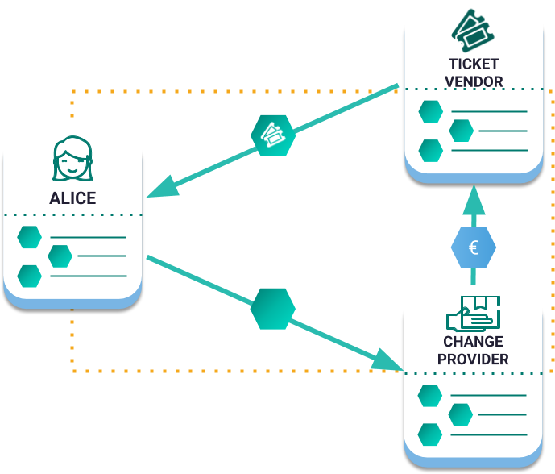

:orphan:

.. post:: 12 Aug, 2018
    :category: aggregate-transaction
    :excerpt: 1
    :nocomments:

####################################################
Creating an escrow with aggregate bonded transaction
####################################################

Learn about :ref:`aggregate bonded transactions <aggregate-transaction>`, by creating an escrow.

**********
Background
**********

An **escrow** is a ``contractual arrangement`` in which a ``third party receives and disburses money`` or documents for the ``primary transacting parties``, with the disbursement dependent on ``conditions agreed to by the transacting parties``, or an ``account established by a broker for holding funds`` on behalf of the broker's principal or some other person ``until the consummation or termination of a transaction``; or, a trust account held in the borrower's name to pay obligations such as property taxes and insurance premiums.

See full description at |escrow_wikipedia|.

In this example, imagine the two parties agree on a virtual service, implying that the **escrow can be immediate**.

**How does it work?**

1. Buyer and seller agree on terms
2. Buyer submits payment to escrow
3. Seller delivers goods or service to Buyer
4. Buyer approves goods or service
5. Escrow releases payment to the seller

**How is it applied to NEM?**

Normalizing the language into NEM related concepts:

**contractual arrangement**
    Aggregate Transaction

**third party receives and disburses money**
    No third party

**primary transacting parties**
    Accounts

**conditions agreed to by the transacting parties**
    Sign transaction

**account established by a broker for holding funds**
    No account, it will happen atomically using an aggregate transaction

**until the consummation or termination of a transaction**
    The transaction gets included in a block

*************
Prerequisites
*************

- Finish :doc:`creating a mosaic guide <../mosaic/creating-a-mosaic>`
- Finish :doc:`sending payouts with aggregate complete transactions <sending-payouts-with-aggregate-complete-transaction>`
- NEM2-SDK
- A text editor or IDE

*************************
Let's get into some code
*************************

.. figure:: ../../resources/images/examples/aggregate-escrow-1.png
    :align: center
    :width: 450px

    Multi-Asset Escrowed Transactions

**Setting up the required accounts and mosaics**

In this example, Alice and a ticket distributor want to swap the following mosaics.

.. csv-table::
        :header: "Owner", "Mosaic Name", "Amount"

        Alice, nem:xem, 100
        Ticket distributor, museum:ticket, 1

Before continuing, practise by setting up the namespaces and mosaics required.

**Mosaics swap**

Alice will send a transaction to the ticket distributor exchanging 100 nem:xem with 1 museum:ticket.

1. Create two  :ref:`transfer transaction <transfer-transaction>`:

A. From Alice to the ticket distributor sending 100 nem:xem
B. From the ticket distributor to Alice sending 1 museum:ticket.

2. Add them as ``innerTransactions`` under an :ref:`aggregate transaction <aggregate-transaction>`.

An aggregate Transaction is *complete* if before announcing it to the network, all required cosigners have signed it. If valid, it will be included in a block.

In case that signatures are required from other participants and the transaction is announced to the network, it is considered an aggregate bonded.

.. example-code::

    .. literalinclude:: ../../resources/examples/typescript/transaction/CreatingAnEscrowWithAggregateBondedTransaction.ts
        :caption: |creating-an-escrow-with-aggregate-bonded-transaction-ts|
        :language: typescript
        :lines:  40-62

    .. literalinclude:: ../../resources/examples/java/src/test/java/nem2/guides/examples/transaction/CreatingAnEscrowWithAggregateBondedTransaction.java
        :caption: |creating-an-escrow-with-aggregate-bonded-transaction-java|
        :language: java
        :lines:  44-80

    .. literalinclude:: ../../resources/examples/javascript/transaction/CreatingAnEscrowWithAggregateBondedTransaction.js
        :caption: |creating-an-escrow-with-aggregate-bonded-transaction-js|
        :language: javascript
        :lines:  40-62

3. When an aggregate transaction is bonded, Alice will need to lock at least 10 XEM. Once the ticket distributor signs the aggregate transaction, the amount of locked XEM becomes available again on Alice's account, and the exchange will get through.

.. example-code::

    .. literalinclude:: ../../resources/examples/typescript/transaction/CreatingAnEscrowWithAggregateBondedTransaction.ts
        :caption: |creating-an-escrow-with-aggregate-bonded-transaction-ts|
        :language: typescript
        :lines:  65-

    .. literalinclude:: ../../resources/examples/java/src/test/java/nem2/guides/examples/transaction/CreatingAnEscrowWithAggregateBondedTransaction.java
        :caption: |creating-an-escrow-with-aggregate-bonded-transaction-java|
        :language: java
        :lines:  80-105

    .. literalinclude:: ../../resources/examples/javascript/transaction/CreatingAnEscrowWithAggregateBondedTransaction.js
        :caption: |creating-an-escrow-with-aggregate-bonded-transaction-js|
        :language: javascript
        :lines:  65-

.. note:: The :ref:`listener implementation changes <monitoring-transactions-client-side>` when used on the client side (e.g., Angular, React, Vue).

**********************************************
Is it possible without aggregate transactions?
**********************************************

**It is not secure**, since any event of the next list may happen:

- The buyer does not pay.
- The seller does not send the virtual goods.

************
What's next?
************

The distributor has not signed the aggregate bonded transaction yet, so exchange has not been completed. Consider reading :doc:`signing announced aggregate bonded transactions guide <signing-announced-aggregate-bonded-transactions>`.

Afterwards, try to swap mosaics between multiple participants.

    Multi-Asset Escrowed Transactions

.. |escrow_wikipedia| raw:: html

   <a href="https://en.wikipedia.org/wiki/Escrow" target="_blank">Wikipedia</a>

.. |creating-an-escrow-with-aggregate-bonded-transaction-ts| raw:: html

   <a href="https://github.com/nemtech/nem2-docs/blob/master/source/resources/examples/typescript/transaction/CreatingAnEscrowWithAggregateBondedTransaction.ts" target="_blank">View Code</a>

.. |creating-an-escrow-with-aggregate-bonded-transaction-java| raw:: html

   <a href="https://github.com/nemtech/nem2-docs/blob/master/source/resources/examples/java/src/test/java/nem2/guides/examples/transaction/CreatingAnEscrowWithAggregateBondedTransaction.java" target="_blank">View Code</a>

.. |creating-an-escrow-with-aggregate-bonded-transaction-js| raw:: html

   <a href="https://github.com/nemtech/nem2-docs/blob/master/source/resources/examples/javascript/transaction/CreatingAnEscrowWithAggregateBondedTransaction.js" target="_blank">View Code</a>